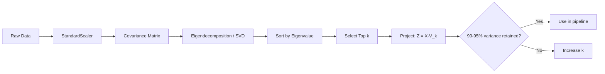

# Principal Component Analysis (PCA)

> *"Compress your data's story into its most important chapters — without losing the plot."*

---

## Table of Contents

1. [Summary](#summary)
2. [What is PCA?](#what-is-pca)
3. [Mathematical Idea](#mathematical-idea)
4. [SVD: How PCA Is Actually Computed](#svd-how-pca-is-actually-computed)
5. [Step-by-Step Walkthrough](#step-by-step-walkthrough)
6. [Worked Numerical Example](#worked-numerical-example)
7. [Key Assumptions](#key-assumptions)
8. [Common Mistakes](#common-mistakes)
9. [Advanced Variants](#advanced-variants)
10. [Real-World Applications](#real-world-applications)
11. [When to Use / Not Use](#when-to-use--not-use)
12. [PCA vs Other Methods](#pca-vs-other-methods)
13. [Limitations](#limitations)
14. [Implementation Guide](#implementation-guide)
15. [Production Best Practices](#production-best-practices)
16. [Interview Questions](#interview-questions)
17. [Quick Reference](#quick-reference)
18. [References](#references)

---

## Summary

PCA is an **unsupervised dimensionality reduction technique** that transforms a high-dimensional dataset into a smaller set of uncorrelated variables called **principal components**, while retaining as much original variance as possible. It is widely used for visualization, noise reduction, multicollinearity removal, and as a preprocessing step before model training.

The core insight: most real-world datasets contain **redundant features** — multiple columns that essentially say the same thing in different units. PCA mathematically identifies and merges this redundancy into compact, uncorrelated axes. Two carefully chosen components can often represent 90%+ of a 50-feature dataset without meaningful information loss.

---

## What is PCA?

### The Simple Idea

Imagine you're a photographer trying to capture a 3D sculpture. You walk around it and realize that **one particular angle captures the most detail** — the shape, the shadows, the texture — far better than any other angle. You take that shot. PCA does exactly this with data: it finds the "angle" from which your dataset shows the most variation, then projects everything onto that view.

More precisely, PCA takes possibly correlated features and creates a new coordinate system. The **first principal component** (PC1) points in the direction of greatest variance. The second (PC2) is perpendicular (orthogonal) to PC1 and captures the next most variance, and so on. Each new axis is uncorrelated with all the others — which is the whole point.

### A Concrete Analogy

Think of a shadow on a wall. If you hold a 3D object in front of a light source and rotate it, the shadow changes shape dramatically. Some orientations produce a rich, informative silhouette. Others produce a shapeless blob. **PCA finds the orientation that produces the most informative shadow** — and uses that as your new reduced-dimension space. The shadow (2D projection) loses some depth information, but if chosen well, it captures what matters most.

### What Does "Orthogonal" Mean? (Beginner)

In PCA, each principal component is **orthogonal** (perpendicular) to all others. Think of a room's corner: the floor length, floor width, and wall height are all perpendicular. Changing one doesn't affect the others. PCA's components are like axes of a rotated room — each measures a distinct, independent "direction" of variation in your data.

### Why It Matters in Practice

In a typical ML pipeline, you might have 50–500 features. Many of these are correlated — "number of rooms" and "total area" in a housing dataset, for example, or "temperature" and "heat index" in a weather dataset. Training models on correlated features adds noise, slows computation, and can cause overfitting. PCA resolves this by collapsing correlated groups into a single, clean component — reducing dimensionality while preserving structure.

---

## Mathematical Idea

### Step 1 — Mean Centering

Before finding directions of variance, we reframe all data around the origin:

$$X_{\text{centered}} = X - \bar{X}$$

**Intuition:** We're repositioning the coordinate system at the data's center of gravity so PCA focuses on *spread* and *shape*, not *location*.

---

### Step 2 — Covariance Matrix

We measure how each pair of features varies together:

$$\Sigma = \frac{1}{n-1} \, X_{\text{centered}}^T X_{\text{centered}}$$

| Entry | Meaning |
|---|---|
| **Diagonal** (e.g., $\sigma_{11}$) | Variance of individual feature |
| **Off-diagonal** (e.g., $\sigma_{12}$) | Covariance between two features |
| **High off-diagonal value** | Features are redundant — carry the same signal |

**Intuition:** A high off-diagonal value means two features rise and fall together — they're saying the same thing. PCA rotates the axes to eliminate this cross-talk.

---

### Step 3 — Eigenvalues and Eigenvectors

We decompose the covariance matrix to find its "natural axes":

$$\Sigma \mathbf{v} = \lambda \mathbf{v}$$

- **v (eigenvector):** A direction in the original feature space → becomes a principal component
- **λ (eigenvalue):** The variance captured along that direction → larger means more important
- Eigenvectors are sorted by decreasing eigenvalue: PC1 has the largest λ, PC2 the next, and so on

**Intuition:** Eigenvectors are the axes along which your data cloud is most *stretched*. Eigenvalues measure *how much* stretching occurs in each direction.

**Why does this work?** PCA finds the direction $w$ that maximizes $\text{Var}(Xw) = w^T \Sigma w$ subject to $\|w\| = 1$. Using a Lagrange multiplier, the solution is $\Sigma w = \lambda w$ — an eigenproblem. The eigenvector with the largest eigenvalue is PC1. Proof:

$$\max_{\|w\|=1} w^T \Sigma w \quad \Rightarrow \quad \mathcal{L} = w^T \Sigma w - \lambda(w^T w - 1)$$

$$\frac{\partial \mathcal{L}}{\partial w} = 2\Sigma w - 2\lambda w = 0 \quad \Rightarrow \quad \Sigma w = \lambda w$$

---

### Step 4 — Data Projection

Select the top $k$ eigenvectors and project the centered data:

$$X_{\text{reduced}} = X_{\text{centered}} \cdot V_k$$

| Symbol | Meaning |
|---|---|
| **V_k** | Matrix of top $k$ eigenvectors — shape: $(d \times k)$ |
| **X_reduced** | New compressed dataset — shape: $(n \times k)$ |
| **k** | Number of components you keep |

### Explained Variance Ratio

The proportion of total variance captured by component $i$:

$$\text{EV}_i = \frac{\lambda_i}{\sum_{j=1}^d \lambda_j}$$

Cumulative explained variance for $k$ components:

$$\text{EV}_{\text{cum}}(k) = \frac{\sum_{i=1}^k \lambda_i}{\sum_{j=1}^d \lambda_j}$$

**Rule of thumb:** Choose $k$ such that $\text{EV}_{\text{cum}}(k) \geq 0.90$ (or 0.95 for stricter retention).

---

## SVD: How PCA Is Actually Computed

### The SVD Connection

`sklearn.decomposition.PCA` uses **Singular Value Decomposition (SVD)** internally, not explicit eigendecomposition. Here's why and how.

The SVD factorizes the centered data matrix:

$$X_{\text{centered}} = U \Sigma V^T$$

Where:
- $U \in \mathbb{R}^{n \times n}$: Left singular vectors (orthonormal columns)
- $\Sigma \in \mathbb{R}^{n \times d}$: Diagonal matrix of singular values $\sigma_i$ (non-negative, decreasing)
- $V \in \mathbb{R}^{d \times d}$: Right singular vectors (orthonormal columns)

### Relationship to Eigenvectors/Eigenvalues

$$X^T X = (U \Sigma V^T)^T (U \Sigma V^T) = V \Sigma^T U^T U \Sigma V^T = V \Sigma^T \Sigma V^T$$

Since $\Sigma^T \Sigma = \text{diag}(\sigma_1^2, \dots, \sigma_d^2)$, we have:

$$X^T X = V \Lambda V^T \quad \text{where } \Lambda = \text{diag}(\sigma_i^2)$$

So:
- **Right singular vectors $V$** = eigenvectors of $X^T X$ = principal components
- **Singular values $\sigma_i$** = $\sqrt{\lambda_i \cdot (n-1)}$ (square roots of eigenvalues × (n-1))
- **Projected data (principal components scores):** $Z = X_{\text{centered}} V = U \Sigma$

### Why SVD Beats Eigendecomposition

| Reason | Explanation |
|--------|-------------|
| **Numerical stability** | $X^T X$ squares the condition number — small floating-point errors magnify. SVD works directly on $X$ |
| **No covariance matrix** | Computing $X^T X$ for $(d \times d)$ is expensive when $d$ is large. SVD works with the $n \times d$ matrix |
| **Handles wide matrices** | Eigendecomposition requires square matrices; SVD handles any shape |
| **Direct access to scores** | $U \Sigma$ gives the projected data without a second multiplication step |

### The Eckart-Young Theorem

> For any matrix $X$, the best rank-$k$ approximation (in Frobenius norm) is given by truncating the SVD:
> $$X_k = U_k \Sigma_k V_k^T$$
> PCA's reconstruction $\hat{X} = Z V_k^T$ is this optimal low-rank approximation.

This means PCA finds the geometrically optimal low-dimensional representation: among all $k$-dimensional linear projections, PCA minimizes the sum of squared reconstruction errors.

---

## Step-by-Step Walkthrough

| Step | Action | Why It Matters |
|---|---|---|
| **1. Standardize** | Scale features to mean=0, std=1 | Prevents large-scale features from dominating |
| **2. Covariance Matrix** | Compute $\Sigma$ from scaled data | Maps out all feature relationships |
| **3. Eigen/SVD Decomposition** | Find eigenvectors + eigenvalues of $\Sigma$ | Reveals the natural axes of the data's shape |
| **4. Rank Components** | Sort by eigenvalue (descending) | Biggest variance first |
| **5. Select k Components** | Keep enough to explain 90–95% variance | Reduce dimension while retaining signal |
| **6. Project Data** | Multiply centered data by $V_k$ | Create the new, smaller dataset |
| **7. (Optional) Inverse Transform** | $\hat{X} = Z V_k^T$ (add mean back) | Reconstruct approximation of original data |

---

## Worked Numerical Example

Let's walk through PCA on a tiny 2D dataset reduced to 1D.

```
Data: X = [[2, 3], [3, 4], [5, 6], [6, 7], [8, 9]]
```

**Step 1: Center the data**
- Mean of feature 1: (2+3+5+6+8)/5 = 4.8
- Mean of feature 2: (3+4+6+7+9)/5 = 5.8
- Centered: [[-2.8, -2.8], [-1.8, -1.8], [0.2, 0.2], [1.2, 1.2], [3.2, 3.2]]

**Step 2: Covariance matrix**
$$\Sigma = \begin{bmatrix} 5.7 & 5.7 \\ 5.7 & 5.7 \end{bmatrix}$$

The two features are perfectly correlated — lying on the line y = x + 1. All variance is along the diagonal direction.

**Step 3: Eigendecomposition**
- $\lambda_1 = 11.4$, $\lambda_2 = 0$
- $v_1 = [0.707, 0.707]^T$ (the 45° line), $v_2 = [-0.707, 0.707]^T$ (perpendicular)

**Step 4: Project to 1D**
$$Z = X_{\text{centered}} \cdot v_1 = [-3.96, -2.55, 0.28, 1.70, 4.53]$$

The 2D points have been collapsed onto a single axis along the 45° line — preserving 100% of the variance because the second eigenvalue was 0.

---

## Key Assumptions

Understanding these assumptions helps you know *when* PCA will work well and *when* it will fail silently.

| Assumption | What It Means | What Breaks It |
|---|---|---|
| **Linearity** | PCA captures linear combinations of features only | Non-linear manifolds (spiral, Swiss roll) — use Kernel PCA |
| **Variance = Signal** | High-variance directions carry meaningful information | Outliers can inflate variance in meaningless directions |
| **Feature Scaling** | All features must be on the same scale | Forgetting `StandardScaler` — the most common mistake |
| **Continuous Features** | PCA requires numerical, continuous input | Categorical features must be encoded first (risky) |
| **No missing values** | PCA cannot handle NaN entries natively | Must impute or drop missing values first |
| **Mean zero embedded** | PCA implicitly assumes data is centered around zero | Skewed or non-centered distributions can bias components |

---

## Common Mistakes

These are the most frequent errors made when applying PCA — even by experienced practitioners.

**1. Skipping StandardScaler**  
This is the single most common mistake. If `sepal_length` ranges 0–8 cm and some other feature ranges 0–1000, PCA will orient PC1 almost entirely along that large-scale feature. The result looks like PCA "worked" but is actually just reflecting measurement scale, not data structure. **Always scale first.**

**2. Choosing n_components Arbitrarily**  
Picking `n_components=2` just for visualization convenience without checking `explained_variance_ratio_` is a mistake. If those 2 components only explain 55% of variance, you've discarded nearly half the information. Use the scree plot to pick a principled threshold (typically 90–95%).

**3. Applying PCA Before Train/Test Split**  
Fitting the scaler *and* PCA on the full dataset (including test data) causes **data leakage**. The correct order: split first → fit scaler on train → transform both → fit PCA on train → transform both.

**4. Treating PCA Components as Interpretable Features**  
PC1, PC2, etc. are linear mixtures of *all* original features. They don't have clean names like "height" or "income." If a stakeholder needs to understand *what* drove a prediction, PCA is the wrong tool — use feature selection instead.

**5. Using PCA for Categorical or Sparse Data**  
PCA assumes continuous numerical data and dense matrices. For text data (high-dimensional, sparse), use **TruncatedSVD (LSA)**. For mixed data types, use **MCA** or **FactorAnalysis**.

**6. Assuming PCA Preserves Cluster Structure**  
PCA maximizes variance, not class separability. Two clusters that are distinguishable in high dimensions can overlap in PCA space if the separating direction is low-variance. Use LDA if labels exist.

**7. Ignoring Outliers**  
Outliers distort the covariance matrix and pull PC directions toward themselves. Always inspect for outliers before PCA.

---

## Advanced Variants

### Kernel PCA
Projects data into a higher-dimensional feature space via the kernel trick, then applies PCA in that space. Captures non-linear structure.

$$K_{ij} = k(x_i, x_j) \quad \text{(e.g., RBF kernel)}$$

Eigendecomposition of centered kernel matrix yields non-linear principal components.

**When to use:** Data has curved or non-linear structure; linear PCA would lose meaningful patterns.

**Limitation:** More expensive; kernel choice matters; less interpretable.

### Incremental PCA
Processes data in mini-batches, never loading the full dataset into memory. Useful when datasets are too large to fit in RAM.

```python
from sklearn.decomposition import IncrementalPCA

ipca = IncrementalPCA(n_components=10)
for batch in np.array_split(X, 100):
    ipca.partial_fit(batch)
X_reduced = ipca.transform(X)
```

### Sparse PCA
Finds principal components that are sparse linear combinations of original features (many zero coefficients). Improves interpretability at the cost of explained variance.

### Randomized PCA
Uses randomized SVD algorithm — significantly faster for large matrices while maintaining excellent approximation quality (see Halko, Martinsson & Tropp, 2011).

```python
PCA(n_components=10, svd_solver='randomized')
```

### Probabilistic PCA (PPCA)
Formulates PCA as a probabilistic latent variable model (Tipping & Bishop, 1999):

$$x = Wz + \mu + \epsilon, \quad z \sim \mathcal{N}(0, I), \quad \epsilon \sim \mathcal{N}(0, \sigma^2 I)$$

Maximum likelihood estimation of $W$ recovers the PCA solution when $\sigma \to 0$. PPCA permits:
- EM-based fitting when data has missing values
- Bayesian treatment (automatic dimensionality selection)
- Comparison of models via likelihood

---

## Real-World Applications

PCA is not just a classroom tool — it is used in production across many industries.

| Domain | How PCA Is Used |
|---|---|
| **Computer Vision** | Eigenfaces: compress face images from 10,000 pixels to ~100 components for face recognition |
| **Genomics** | Reduce gene expression matrices (20,000+ genes) to explore population structure and ancestry |
| **Finance** | Identify risk factors in asset return matrices; compress correlated stock movements |
| **NLP** | LSA (Latent Semantic Analysis) applies PCA/SVD to document-term matrices for topic modeling |
| **Sensor Data / IoT** | Compress multi-channel time series from industrial sensors for anomaly detection |
| **Medical Imaging** | Reduce fMRI, MRI, or EEG signal dimensions while preserving diagnostic structure |
| **Recommendation Systems** | Matrix factorization (which uses SVD, PCA's mathematical sibling) for collaborative filtering |
| **Manufacturing** | Monitor high-dimensional sensor streams — reconstruction error flags equipment anomalies |
| **Astronomy** | Compress spectroscopic data (thousands of wavelengths) into a few meaningful components for classification |

---

## When to Use / Not Use

### When to Use PCA

- You have **many correlated features** (multicollinearity is a known issue)
- You want to **visualize** high-dimensional data in 2D or 3D
- You need to **speed up** downstream model training
- You want to **reduce noise** by discarding very-low-variance components
- You are working on **image compression** or signal processing pipelines
- You need to **remove the curse of dimensionality** before applying distance-based models (KNN, clustering)
- You need a **fast, deterministic baseline** before trying non-linear methods

### When NOT to Use PCA

- **Interpretability is required** — components are mixtures, not named features
- **Data is non-linear** in structure — use Kernel PCA, t-SNE, or UMAP
- **Data is categorical** — PCA requires continuous numerical input
- **You need class-aware separation** — PCA ignores labels; use LDA instead
- **Very few features** (< 5–10) — PCA adds complexity without meaningful benefit
- **You haven't split train/test yet** — always split before fitting any preprocessor
- **Data has heavy outliers** — robust PCA or outlier removal needed first
- **Temporal structure matters** — consider time-aware methods (e.g., dynamic factor models)

---

## PCA vs Other Methods

| Method | Type | Captures | Best For | Limitation |
|---|---|---|---|---|
| **PCA** | Linear, Unsupervised | Global variance structure | Preprocessing, visualization, noise reduction | Linear only; components uninterpretable |
| **LDA** | Linear, Supervised | Class-discriminative directions | Classification preprocessing | Requires labels; max k = classes−1 |
| **Kernel PCA** | Non-linear, Unsupervised | Non-linear manifolds | Curved or complex data distributions | Computationally expensive; kernel choice matters |
| **t-SNE** | Non-linear, Unsupervised | Local neighborhood structure | 2D/3D visualization only | Non-deterministic; not for preprocessing |
| **UMAP** | Non-linear, Unsupervised | Local + global structure | Fast visualization of large datasets | More complex parameter tuning |
| **Autoencoders** | Non-linear, Unsupervised | Arbitrary complex patterns | High-dimensional image/text embeddings | Requires neural network training |
| **Factor Analysis** | Linear, Unsupervised | Shared variance (not total) | Psychometrics, latent variable modeling | Assumes underlying latent factors |

**Rule of thumb:**  
- Start with PCA. If variance structure is clear → use it.
- If classes need separating → use LDA.
- If structure is non-linear → use UMAP for exploration, Kernel PCA for preprocessing.

---

## Limitations

| Limitation | Explanation |
|---|---|
| **Linear only** | Cannot capture curves, clusters, or complex manifold geometry |
| **Information loss** | Dropping low-variance components always loses *some* data — this may matter for anomaly detection |
| **Not robust to outliers** | Outliers inflate variance and can pull principal components in misleading directions |
| **Components are uninterpretable** | PC1 = 0.52×f1 + 0.37×f2 + ... is not meaningful to a business stakeholder |
| **Assumes stationarity** | On time series, PCA ignores temporal ordering and autocorrelation |
| **Sensitive to scaling** | One unscaled feature ruins the entire decomposition |
| **Global structure only** | PCA captures global variance; local neighborhood structure may be lost |
| **No built-in feature selection** | All original features contribute to each component (unless using Sparse PCA) |

---

## Implementation Guide

### Correct Order of Operations

```
Raw Data
  → Train/Test Split
    → StandardScaler (fit on train, transform both)
      → PCA (fit on train, transform both)
        → Model Training
```

### Using sklearn (Basic)

```python
from sklearn.preprocessing import StandardScaler
from sklearn.decomposition import PCA

# Step 1: Split
X_train, X_test, y_train, y_test = train_test_split(X, y, test_size=0.2)

# Step 2: Scale
scaler = StandardScaler()
X_train_scaled = scaler.fit_transform(X_train)
X_test_scaled = scaler.transform(X_test)  # ← transform only, not fit!

# Step 3: Apply PCA
pca = PCA(n_components=0.95)  # Keep enough components for 95% variance
X_train_pca = pca.fit_transform(X_train_scaled)
X_test_pca = pca.transform(X_test_scaled)  # ← transform only, not fit!
```

### Code for Scree Plot (Choosing k)

```python
import matplotlib.pyplot as plt

pca_full = PCA().fit(X_train_scaled)
ev = pca_full.explained_variance_ratio_
cum_ev = ev.cumsum()

fig, (ax1, ax2) = plt.subplots(1, 2, figsize=(12, 4))

# Scree plot
ax1.bar(range(1, len(ev)+1), ev)
ax1.set_xlabel('Component')
ax1.set_ylabel('Explained Variance Ratio')

# Cumulative plot
ax2.plot(range(1, len(cum_ev)+1), cum_ev, 'o-')
ax2.axhline(0.95, color='red', linestyle='--', label='95% threshold')
ax2.set_xlabel('Number of Components')
ax2.set_ylabel('Cumulative Explained Variance')
ax2.legend()
plt.show()
```

### Pipeline Integration

```python
from sklearn.pipeline import Pipeline
from sklearn.linear_model import LogisticRegression

pipe = Pipeline([
    ('scaler', StandardScaler()),
    ('pca', PCA(n_components=20)),
    ('clf', LogisticRegression())
])

pipe.fit(X_train, y_train)
pipe.score(X_test, y_test)
```

### Using Loadings for Feature Interpretation

```python
loadings = pd.DataFrame(
    pca.components_.T,
    columns=[f'PC{i+1}' for i in range(k)],
    index=feature_names
)

# Feature contribution to PC1 (largest absolute values)
loadings['PC1'].abs().sort_values(ascending=False).head(10)
```

### sklearn Parameters Reference

| Parameter | Description |
|---|---|
| `n_components=k` | Keep exactly $k$ components |
| `n_components=0.95` | Auto-select components to retain 95% variance |
| `n_components='mle'` | Use MLE heuristic to estimate optimal $k$ |
| `svd_solver='full'` | Standard SVD (default for small data) |
| `svd_solver='randomized'` | Faster approximation for large matrices |
| `svd_solver='arpack'` | Uses ARPACK — good for sparse matrices |
| `whiten=True` | Scale components to unit variance |
| `copy=True` | Avoid modifying the input array in place |

---

## Production Best Practices

### Scalability

| Dataset Size | Recommended Approach |
|---|---|
| **Small** (< 10k samples, < 100 features) | `PCA(svd_solver='full')` — direct SVD |
| **Medium** (10k–100k samples, 100–1k features) | `PCA(svd_solver='randomized')` |
| **Large** (100k–1M+ samples) | `IncrementalPCA` with mini-batches |
| **Wide** (features >> samples, e.g., genomics) | SVD directly (do not form $X^T X$) |
| **Sparse** (e.g., text TF-IDF matrices) | `TruncatedSVD` (bypass mean centering) |

### Drift Monitoring

In production, the statistical properties of data change over time. Monitor PCA components for drift:

```python
# Periodically check reconstruction error on new data
def pca_drift_score(pca, scaler, X_new):
    X_scaled = scaler.transform(X_new)
    X_proj = pca.transform(X_scaled)
    X_recon = pca.inverse_transform(X_proj)
    mse = np.mean((X_scaled - X_recon)**2, axis=1)
    return mse.mean()  # Rising mean → potential drift
```

### GPU Acceleration

For very large PCA, consider:
- `cuml.decomposition.PCA` from RAPIDS cuML (GPU-accelerated, 10–50x speedup)
- PyTorch SVD for custom implementations

### Memory Considerations

- `PCA` stores the full $d \times k$ components matrix and the mean vector
- For $d=100k$, $k=1000$: ~800 MB for components (float64) — consider `svd_solver='randomized'` with `iterated_power` tuning
- `IncrementalPCA` maintains only $k \times k$ and $batch \times d$ in memory

### Checklist for Production

- [ ] Train/test split before any transformation
- [ ] StandardScaler fit on train only
- [ ] PCA fit on train only
- [ ] Verify explained_variance_ratio_ meets threshold
- [ ] Check for outliers before fitting
- [ ] Document what each component captures (via top loadings)
- [ ] Set random_state for reproducibility
- [ ] Monitor reconstruction error over time for drift
- [ ] Test that inverse_transform produces sensible outputs

---

## Interview Questions

### Beginner

**Q1: What does PCA do geometrically?**  
Rotates the coordinate system so axes align with directions of maximum variance in the data, then truncates to keep only the most informative axes. It finds the $k$-dimensional linear subspace that best preserves the data's variance.

**Q2: Why must you scale data before PCA?**  
PCA is variance-based. If one feature has a range of 0–1000 and another has 0–1, the first feature's variance dominates the covariance matrix. The principal components will align almost entirely with the large-scale feature, reflecting measurement units rather than data structure.

**Q3: How do you choose the number of components?**  
- Plot cumulative explained variance (scree plot); pick the elbow or where 90–95% is reached  
- Use `n_components='mle'` for automatic selection  
- Cross-validate on downstream task performance  
- Kaiser criterion: keep components with eigenvalue > 1

**Q4: What is data leakage in the context of PCA?**  
Fitting the scaler or PCA on the full dataset (including test set) allows information from the test set to influence the transformation. Test data "leaks" into training. Always fit on train only and transform test.

**Q5: Are PCA components correlated? Why?**  
No. PCA produces orthogonal (uncorrelated) components. The whole point is to rotate axes to eliminate correlations — the covariance matrix of the transformed data is diagonal.

### Intermediate

**Q6: Explain the relationship between PCA and SVD.**  
PCA solves the eigendecomposition of $X^T X$. SVD factorizes $X = U \Sigma V^T$. The right singular vectors $V$ are the principal components, singular values $\sigma_i$ relate to eigenvalues by $\sigma_i^2 = \lambda_i (n-1)$, and the projected data is $U \Sigma$. sklearn uses SVD for numerical stability.

**Q7: Why are principal components orthogonal?**  
The covariance matrix $\Sigma$ is symmetric positive semi-definite. Its eigenvectors are guaranteed to be orthogonal (for distinct eigenvalues). Geometrically, after finding the direction of maximum variance (PC1), the next best direction is constrained to be perpendicular to PC1 — ensuring no redundant information.

**Q8: What happens if you don't center the data before PCA?**  
Without centering, the first principal component will pass through the origin rather than the data's center of mass. This typically pulls PC1 toward the mean vector, mixing location information with variance information. The result is suboptimal — components no longer capture maximum variance.

**Q9: PCA on correlation matrix vs covariance matrix — what's the difference?**  
Correlation matrix PCA is equivalent to applying PCA to standardized data (each feature has unit variance). It treats all features equally. Covariance matrix PCA preserves original scale — features with larger variance dominate. Use correlation PCA when features are in different units; use covariance PCA when units are comparable and scale is meaningful.

**Q10: Can PCA be used for anomaly detection?**  
Yes. After fitting PCA on normal data, compute reconstruction error for new points. Points with high reconstruction error are anomalies — they don't conform to the variance structure learned by PCA. This works well when anomalies occupy different variance directions than normal data.

**Q11: PCA vs Factor Analysis — how are they different?**  
PCA captures total variance (unique + shared) and has no error term. Factor Analysis models only shared variance, assuming each feature has an independent noise term. FA is more appropriate when you believe latent factors generate the data; PCA is better for compression and variance-preserving reduction.

### Advanced

**Q12: Derive PCA as a variance-maximization problem. Show that it reduces to an eigenproblem.**  

We seek $w \in \mathbb{R}^d$ that maximizes $\text{Var}(Xw) = w^T \Sigma w$ subject to $w^T w = 1$ (to prevent unbounded growth).

Using Lagrange multiplier $\lambda$:
$$\mathcal{L} = w^T \Sigma w - \lambda(w^T w - 1)$$

Setting gradient to zero:
$$\frac{\partial \mathcal{L}}{\partial w} = 2\Sigma w - 2\lambda w = 0 \quad \Rightarrow \quad \Sigma w = \lambda w$$

This is precisely the eigenvector equation. For the next component, we add the constraint $w_2 \perp w_1$ and repeat — yielding the second eigenvector.

**Q13: State and explain the Eckart-Young theorem. Why does it matter for PCA?**  

> For any real matrix $X$, the best rank-$k$ approximation in Frobenius norm is $\hat{X}_k = U_k \Sigma_k V_k^T$, the truncated SVD.

PCA's reconstruction $\hat{X} = Z V_k^T + \bar{X}$ achieves this optimal rank-$k$ approximation. This means PCA gives the minimum possible reconstruction error among all linear $k$-dimensional projections — a fundamental guarantee.

**Q14: How does Probabilistic PCA extend classical PCA?**  
PPCA formulates PCA as a latent variable model: $x = Wz + \mu + \epsilon$ where $z \sim \mathcal{N}(0, I)$ and $\epsilon \sim \mathcal{N}(0, \sigma^2 I)$. Maximum likelihood estimation yields $W_{ML} = V_k (\Lambda_k - \sigma^2 I)^{1/2}$, which aligns with standard PCA as $\sigma \to 0$. Benefits: EM can handle missing data, Bayesian extensions can automatically select $k$, and model comparison via likelihood is possible.

**Q15: What is the computational complexity of PCA, and how do the solvers differ?**  

| Solver | Time Complexity | Memory | Best For |
|--------|----------------|--------|----------|
| Full SVD | $O(\min(nd^2, dn^2))$ | $O(nd)$ | $n, d < 5000$ |
| Randomized | $O(ndk)$ | $O(nd)$ | Large $n$ or $d$ |
| ARPACK | $O(ndk)$ | $O(nd)$ | Sparse, few components |
| Incremental | $O(ndk)$ per batch | $O(batch \times d)$ | $n$ too large for RAM |

**Q16: PCA assumes linearity. How would you detect when this assumption is violated?**  
- High reconstruction error for a given $k$ suggests non-linear structure  
- Shepard diagram: plot pairwise distances in original vs PCA space — non-monotonic scatter suggests non-linearity  
- Compare PCA performance vs Kernel PCA on a held-out reconstruction task  
- Visual inspection of first few components — if they show curves or "swiss roll" patterns, PCA is missing structure

**Q17: You apply PCA and the first component explains 99% of variance. Is the data 1-dimensional?**  
Likely yes, but verify:  
- Check if a single feature dominates (e.g., measurement unit artifact)  
- Check for outliers inflating variance in one direction  
- Check if the second component's eigenvalue is near 0  
If all checked, the data's effective rank is close to 1. Example: all features are linear transformations of a single hidden variable.

### Quick Reference Questions

| Question | One-Sentence Answer |
|---|---|
| What does PCA do? | Finds orthogonal directions of maximum variance, then projects data onto the top $k$ |
| Why scale first? | PCA is variance-based; unscaled features with large ranges dominate |
| How to choose $k$? | Scree plot elbow, 90–95% cumulative variance, or cross-validation |
| PCA vs LDA? | PCA maximizes variance (unsupervised); LDA maximizes class separation (supervised) |
| Why SVD not eigendecomposition? | Numerical stability, avoids $X^T X$, handles non-square matrices |
| Are components correlated? | No — they are orthogonal (covariance matrix is diagonal) |
| PCA for anomaly detection? | Yes — high reconstruction error flags anomalies |
| What is the manifold assumption PCA makes? | That data lies on a linear subspace of $\mathbb{R}^d$ |
| PCA on correlation vs covariance? | Correlation = standardized; covariance = original scale preserved |
| What is Kernel PCA? | PCA applied in a kernel-transformed feature space for non-linear structure |

---

## My Understanding

PCA was the first dimensionality reduction technique I truly understood, and it happened when I stopped thinking about eigenvectors abstractly and started picturing them as the "natural axes" of my data cloud. The covariance matrix captures how features move together, and eigendecomposition finds the directions where that movement is strongest. What really sealed it for me was learning that PCA is just SVD in disguise — the same factorization used for recommendation systems, image compression, and Google's PageRank. When someone told me "PCA finds the best rank-k approximation of your data" (Eckart-Young theorem), I realized it's not just a preprocessing trick — it's a fundamental tool for understanding data structure.

## How I Use These Methods

PCA is my default first step for almost any tabular dataset. I always start by standardizing (fit on train only!), then run a full PCA and plot the cumulative explained variance to pick k. My rule of thumb: if 2 components explain >70% of variance, I visualize in 2D; otherwise I pick k at the elbow or where 90% is reached. For production pipelines, I use `IncrementalPCA` when data doesn't fit in memory and randomized SVD when the feature count is high. I also use PCA reconstruction error as a lightweight anomaly detection signal — a simple but effective trick for monitoring data drift in production.

## Visual Summary



---

## Quick Reference

| Item | Detail |
|---|---|
| **Type** | Unsupervised Dimensionality Reduction |
| **Output** | Principal Components — orthogonal, uncorrelated linear combinations of features |
| **Use Cases** | Visualization, noise reduction, multicollinearity removal, preprocessing |
| **Strengths** | Fast, deterministic, well-understood, closed-form solution, variance interpretation via scree plot |
| **Limitations** | Linear only; uninterpretable components; sensitive to outliers and scale; assumes variance = signal |
| **sklearn Class** | `sklearn.decomposition.PCA` |
| **Key Parameters** | `n_components`, `svd_solver` |
| **Must-Do Before** | `StandardScaler` — always |
| **Related Methods** | LDA, Kernel PCA, t-SNE, UMAP, TruncatedSVD, IncrementalPCA, FactorAnalysis |

---

## References

### Papers
1. Pearson, K. (1901). *On Lines and Planes of Closest Fit to Systems of Points in Space.* — The original PCA paper
2. Hotelling, H. (1933). *Analysis of a complex of statistical variables into principal components.*
3. Tipping, M. E. & Bishop, C. M. (1999). *Probabilistic Principal Component Analysis.* — Journal of the Royal Statistical Society
4. Halko, N., Martinsson, P. G. & Tropp, J. A. (2011). *Finding Structure with Randomness: Probabilistic Algorithms for Constructing Approximate Matrix Decompositions.* — SIAM Review
5. Schölkopf, B., Smola, A. & Müller, K.-R. (1998). *Nonlinear Component Analysis as a Kernel Eigenvalue Problem.* — Neural Computation

### Books
6. *Pattern Recognition and Machine Learning* — Christopher Bishop (2006). Chapter 12: Continuous Latent Variables
7. *The Elements of Statistical Learning* — Hastie, Tibshirani & Friedman. Chapter 14.5: Principal Components and Derived Input Directions
8. *Machine Learning: A Probabilistic Perspective* — Kevin Murphy. Chapter 12: Latent Variable Models

### Libraries & Documentation
9. **Scikit-learn Documentation — PCA:** https://scikit-learn.org/stable/modules/decomposition.html#pca
10. **cuML PCA (GPU):** https://docs.rapids.ai/api/cuml/stable/api.html#pca

### Visual Intuition
11. **StatQuest with Josh Starmer — PCA Step-by-Step (YouTube):** https://www.youtube.com/watch?v=FgakZw6K1QQ *(Best visual intuition available — recommended for all levels)*
12. **3Blue1Brown — Essence of Linear Algebra (Eigenvectors & Eigenvalues):** https://www.youtube.com/watch?v=PFDu9oVAE-g
