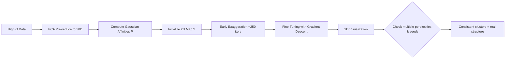

# t-SNE: t-Distributed Stochastic Neighbor Embedding

> *"Making the invisible visible — t-SNE reveals hidden structure in high-dimensional data through the lens of probability."*

A complete guide to understanding, implementing, and interpreting t-SNE for dimensionality reduction and data visualization. Designed for ML interns, students, and practitioners looking to build real intuition — not just run a function.

---

## Table of Contents

1. [What is t-SNE?](#what-is-t-sne)
2. [Mathematical Formulation](#mathematical-formulation)
3. [The Crowding Problem (Why the t-Distribution)](#the-crowding-problem-why-the-t-distribution)
4. [How It Works (Step-by-Step)](#how-it-works-step-by-step)
5. [The Optimization Loop in Detail](#the-optimization-loop-in-detail)
6. [Key Assumptions](#key-assumptions)
7. [When to Use / When NOT to Use](#when-to-use--when-not-to-use)
8. [Implementation Guide](#implementation-guide)
9. [Advanced Variants](#advanced-variants)
10. [Production & Performance Considerations](#production--performance-considerations)
11. [Comparison with Other Methods](#comparison-with-other-methods)
12. [Interview Questions](#interview-questions)
13. [Quick Reference](#quick-reference)
14. [References](#references)

---

## What is t-SNE?

### The Simple Idea

Imagine you have a city map — but it exists in 500 dimensions. t-SNE is like a master cartographer who takes that incomprehensible 500-dimensional map and folds it down into a 2D poster you can actually read, while trying to keep **neighbors close together** and **strangers far apart**.

More precisely, t-SNE (pronounced "tee-snee") is a **non-linear dimensionality reduction algorithm** developed by Laurens van der Maaten and Geoffrey Hinton in 2008. Its primary purpose is **visualization** — it transforms data with hundreds or thousands of features into 2 or 3 dimensions while preserving the local structure (clusters and neighborhoods) of the original data.

### PCA vs t-SNE — Satellite Photo vs Hand-Drawn Map

What sets t-SNE apart from linear techniques like PCA is its ability to capture **complex, non-linear relationships**:

- **PCA** gives you a satellite photo of a city — accurate distances, clear scale, but you can't see what's happening at street level.
- **t-SNE** gives you a hand-drawn transit map — distances between stations are approximate, but the neighborhood groupings and connections are clear.

PCA preserves global variance; t-SNE preserves local similarity.

### Why "t-SNE"?

The "t" refers to the **Student's t-distribution**, used in the low-dimensional space to avoid the "crowding problem" — a phenomenon where all points collapse into the center when projecting from high to low dimensions. The heavy-tailed t-distribution spreads points out more naturally, creating visually clear and interpretable clusters.

### Key Intuitions at a Glance

| Concept | What It Means |
|---------|---------------|
| **Neighbor preservation** | Points close in high-d should be close in low-d |
| **Probabilistic similarity** | Distances are converted to probabilities (0 to 1) |
| **KL Divergence** | Measures how poorly the 2D map represents the true similarity structure |
| **Heavy tails** | t-distribution gives more room for dissimilar points in 2D |
| **Non-convex optimization** | Different runs can yield different maps — always check consistency |

---

## Mathematical Formulation

t-SNE works by converting distances into **probabilities** in both the original high-dimensional space and the new low-dimensional space, then minimizing the difference between these two probability distributions.

### High-Dimensional Space: Gaussian Similarity

For each pair of high-dimensional points $x_i, x_j$, we compute a similarity score:

$$p_{j|i} = \frac{\exp\left(-\|x_i - x_j\|^2 / 2\sigma_i^2\right)}{\sum_{k \neq i} \exp\left(-\|x_i - x_k\|^2 / 2\sigma_i^2\right)}$$

This is then symmetrized to get a **joint probability**:

$$p_{ij} = \frac{p_{j|i} + p_{i|j}}{2n}$$

| Symbol | Meaning |
|--------|---------|
| $x_i, x_j$ | Data points in the original high-dimensional space |
| $\sigma_i$ | Bandwidth of the Gaussian centered on point $i$ (set by perplexity) |
| $p_{j\|i}$ | Conditional probability that $x_i$ picks $x_j$ as its neighbor |
| $p_{ij}$ | Symmetrized joint similarity (symmetric + more stable) |
| $n$ | Total number of data points |

**Intuition:** A high $p_{ij}$ means points $i$ and $j$ are close in the original space. This creates a "contract" — they must also be close in the 2D map.

### How Is $\sigma_i$ Determined? (Perplexity)

Each point $i$ gets its own $\sigma_i$, tuned via **binary search** such that the perplexity of the conditional distribution $P_i$ matches a user-specified value.

**Perplexity** is defined as:
$$\text{Perp}(P_i) = 2^{H(P_i)}$$

where $H(P_i) = -\sum_j p_{j|i} \log_2 p_{j|i}$ is the Shannon entropy of $P_i$.

**Intuition:** Perplexity controls the effective number of neighbors. For a uniform distribution over $k$ neighbors, perplexity = $k$. High perplexity (50) = wide Gaussian, considers many neighbors. Low perplexity (5) = narrow Gaussian, considers only very close neighbors.

The binary search finds $\sigma_i$ such that:
$$H(P_i) = \log_2(\text{perplexity})$$

### Low-Dimensional Space: Student's t-Distribution

In the low-dimensional (2D/3D) space, we use a **Student's t-distribution with 1 degree of freedom** (Cauchy distribution):

$$q_{ij} = \frac{(1 + \|y_i - y_j\|^2)^{-1}}{\sum_{k \neq l} (1 + \|y_k - y_l\|^2)^{-1}}$$

| Symbol | Meaning |
|--------|---------|
| $y_i, y_j$ | Points in the low-dimensional (2D/3D) map |
| $q_{ij}$ | Similarity between points in the low-dimensional space |

### Cost Function: Kullback-Leibler Divergence

We measure how poorly $Q$ approximates $P$ using KL divergence:

$$C = KL(P \| Q) = \sum_{i \neq j} p_{ij} \log \frac{p_{ij}}{q_{ij}}$$

#### Key Property: Asymmetry of KL Divergence

KL divergence is **not symmetric**:

$$\text{KL}(P\|Q) \neq \text{KL}(Q\|P)$$

t-SNE minimizes $\text{KL}(P\|Q)$ (forward KL), which has a critical behavior:

| Scenario | Penalty | Effect |
|----------|---------|--------|
| Two close points ($p_{ij}$ high) placed far apart ($q_{ij}$ low) | Heavy penalty ($p_{ij} \log \frac{p_{ij}}{q_{ij}}$ is large) | Nearby points are pulled together |
| Two distant points ($p_{ij}$ low) placed close ($q_{ij}$ moderately low) | Small penalty | Distant points may appear artificially close |

**Consequence:** t-SNE prioritizes making nearby points in high-d stay nearby in low-d. Global structure (distances between clusters) is sacrificed. Clusters that are far apart in high-d may appear at any distance in the t-SNE plot — **do not interpret inter-cluster distances**.

---

## The Crowding Problem (Why the t-Distribution)

### The Problem

In high dimensions, the volume of a ball grows as $r^d$ (exponential in $d$). In 2D, the area grows as $r^2$. 

**Consequence:** A given point in high-d has many moderate-distance neighbors — all lying on a "surface" of a hypersphere. In 2D, there simply isn't enough area to faithfully place all these neighbors at moderate distances. The result is the **crowding problem**: points collapse inward, forming an indistinguishable blob.

| Dimension | Volume scaling | Moderate-distance neighbors can be placed at... |
|-----------|----------------|-------------------------------------------------|
| 2D | $r^2$ | Moderate distances — plenty of room |
| 100D | $r^{100}$ | They blow up! Very little room for all of them |

### The Solution: Heavy Tails

t-SNE replaces the Gaussian in low-d with Student's t (df=1):

- **Gaussian (SNE):** $\exp(-\|y_i - y_j\|^2)$ — decays exponentially. Moderate differences → tiny similarity.
- **t-distribution (t-SNE):** $(1 + \|y_i - y_j\|^2)^{-1}$ — decays polynomially (like $1/d^2$). Moderate differences → moderate similarity.

**Heavy tails** mean that points that are moderately far in high-d can be placed far apart in low-d without a huge penalty. This naturally "inflates" the 2D map, giving breathing room between clusters.

> **Physical analogy:** The t-distribution acts like a hydrophobic coating on points — it pushes them apart, preventing the crowding that occurs with a Gaussian. The result is cleanly separated clusters.

---

## The Optimization Loop in Detail

### Gradient of t-SNE

The gradient of the KL divergence with respect to the map point $y_i$ is:

$$\frac{\partial C}{\partial y_i} = 4 \sum_j (p_{ij} - q_{ij})(y_i - y_j)(1 + \|y_i - y_j\|^2)^{-1}$$

**Interpretation:**
- $(p_{ij} - q_{ij})$: The **mismatch** — positive if points should be closer ($p_{ij} > q_{ij}$), negative if they should be farther apart.
- $(y_i - y_j)$: The **direction** of the force.
- $(1 + \|y_i - y_j\|^2)^{-1}$: The **t-distribution weighting** — prevents very far points from exerting strong forces.

This gradient is essentially a **spring system**: if two points are too far apart in 2D relative to their high-d similarity, a spring pulls them together. If they're too close, the spring pushes them apart.

### Gradient Descent with Momentum

$$\mathcal{Y}^{(t)} = \mathcal{Y}^{(t-1)} + \eta \frac{\partial C}{\partial \mathcal{Y}} + \alpha(t) \left( \mathcal{Y}^{(t-1)} - \mathcal{Y}^{(t-2)} \right)$$

- $\eta$: Learning rate (step size)
- $\alpha(t)$: Momentum coefficient (typically 0.5 for early iterations, 0.8 for later)

Momentum helps escape local minima and accelerates convergence across the non-convex landscape.

### The Two Phases of Optimization

#### Phase 1: Early Exaggeration (first ~250 iterations)

$p_{ij}$ values are multiplied by a factor (default: 12). This **artificially inflates** the similarity between nearby points, creating tight clusters early in optimization.

**Effect:** Points that belong together get strongly pulled together, forming well-separated clusters that persist through the rest of the run.

**Why it works:** Starting from a random initialization, there's no structure. Early exaggeration creates it artificially, then the exaggeration is removed and fine-tuning takes over.

#### Phase 2: Fine-Tuning (remaining iterations)

Early exaggeration is removed (factor returns to 1). The algorithm refines cluster shapes and positions based on the real $p_{ij}$ values.

### Complete Algorithm

```
1. Compute pairwise distances in high-d space
2. For each point i, binary-search σ_i such that Perp(P_i) = target
3. Compute symmetrized probabilities p_ij
4. Initialize Y with PCA (or random)
5. For iteration t = 1 to N:
   a. Compute q_ij from current Y using t-distribution
   b. Compute gradient dC/dY
   c. If t <= early_exaggeration_iters:
        Multiply gradient by exaggeration_factor
   d. Update Y using gradient descent with momentum
6. Return final Y
```

---

## Step-by-Step Walkthrough

```
High-Dimensional Data
       │
       ▼
┌───────────────────────────────────────────┐
│ STEP 1: Compute Pairwise Distances        │
│  Euclidean distance for every pair (i, j) │
│  O(n²) — the bottleneck for large n       │
└───────────────────┬───────────────────────┘
                    │
                    ▼
┌───────────────────────────────────────────┐
│ STEP 2: Build P Distribution              │
│  Convert distances → Gaussian probs       │
│  Tune σ per point via binary search       │
│  Symmetrize: p_ij = (p_i|j + p_j|i) / 2n │
└───────────────────┬───────────────────────┘
                    │
                    ▼
┌───────────────────────────────────────────┐
│ STEP 3: Initialize Low-d Map Y            │
│  Use PCA, then add small random noise     │
│  PCA init makes results more stable       │
└───────────────────┬───────────────────────┘
                    │
                    ▼
┌───────────────────────────────────────────┐
│ STEP 4: Optimization Loop                 │
│  For each iteration:                      │
│    - Compute q_ij (t-distribution)        │
│    - Compute gradient dC/dY_𝑖             │
│    - Early exaggeration (first ~250 iters)│
│    - Update Y with momentum               │
└───────────────────┬───────────────────────┘
                    │
                    ▼
         2D/3D Visualization
```

---

## Key Assumptions

Understanding these assumptions prevents misinterpretation of t-SNE plots:

### 1. Local Structure > Global Structure
t-SNE is designed to preserve neighborhoods, not global geometry. The distances *between* clusters in a t-SNE plot are **not meaningful**. Don't conclude that two clusters are more related just because they appear closer on the 2D map.

### 2. Cluster Sizes Are Meaningless
t-SNE tends to expand dense clusters and compress sparse ones for visual clarity. A smaller cluster on the plot is not necessarily a smaller cluster in reality.

### 3. Non-Deterministic Results
Different random seeds produce different plots. Always run multiple times and compare. Use `random_state` for reproducibility of a single run, but try several seeds.

### 4. Perplexity Must Be < n_samples
Typical values: 5–50. Perplexity close to `n_samples` causes degenerate results.

### 5. Visualization Only, Not Feature Engineering
The 2D output components have no real-world meaning. Don't feed t-SNE output directly into a downstream ML model.

### 6. Noise Can Look Like Structure
With inappropriate hyperparameters, uniform random noise can appear as structured clusters. Always validate with quantitative methods.

---

## When to Use / When NOT to Use

### Use t-SNE When:

| Scenario | Why t-SNE Helps |
|----------|-----------------|
| Exploring clusters in high-d data | Reveals natural groupings visually |
| Visualizing embeddings (word2vec, BERT, etc.) | Shows semantic similarity between items |
| Sanity-checking learned representations | Helps debug neural network embeddings |
| EDA on datasets with 10–1000+ features | Provides 2D summary of data structure |
| Comparing pre/post preprocessing effects | Visual diff of data distributions |

### Do NOT Use t-SNE When:

| Scenario | Why It Fails |
|----------|-------------|
| You need to transform new/unseen data | t-SNE has no `transform()` — must refit from scratch |
| You want interpretable axes | t-SNE axes have no meaning |
| Doing feature reduction before ML | Distances aren't preserved reliably; use PCA or UMAP instead |
| Dataset > 100K points | Very slow; use UMAP or PCA first |
| You need deterministic results | Non-deterministic by nature |
| Global structure matters | t-SNE sacrifices global geometry for local |

---

## Implementation Guide

### From Scratch (Conceptual)

```python
def tsne_from_scratch(X, perplexity=30, n_iter=1000, lr=200):
    # Step 1: Pairwise distances
    D = pairwise_euclidean_distances(X)

    # Step 2: Compute P (high-dim probabilities)
    # Binary search sigma_i such that H(P_i) = log(perplexity)
    P = compute_joint_probabilities(D, perplexity)

    # Step 3: Random initialization in 2D
    Y = random_init(n_samples=X.shape[0], n_dims=2)

    # Step 4-5: Gradient descent loop
    for iteration in range(n_iter):
        Q = compute_q_distribution(Y)          # t-dist in 2D
        grad = compute_kl_gradient(P, Q, Y)    # dC/dY
        Y = Y - lr * grad                      # Update positions

    return Y

# Complexity: O(N²) time and space
```

### With Scikit-learn

```python
from sklearn.manifold import TSNE

tsne = TSNE(
    n_components=2,
    perplexity=30,
    learning_rate=200,
    n_iter=1000,
    early_exaggeration=12,
    init='pca',           # PCA init → more stable
    random_state=42       # For reproducibility
)

X_embedded = tsne.fit_transform(X)  # (n_samples, 2)
```

### Visualizing Multiple Perplexity Values

```python
import matplotlib.pyplot as plt
from sklearn.manifold import TSNE

perplexities = [5, 10, 30, 50, 100]
fig, axes = plt.subplots(1, 5, figsize=(20, 4))

for i, perp in enumerate(perplexities):
    tsne = TSNE(n_components=2, perplexity=perp, random_state=42)
    Z = tsne.fit_transform(X)
    axes[i].scatter(Z[:, 0], Z[:, 1], s=5, c=y, cmap='tab10')
    axes[i].set_title(f'perplexity={perp}')
    axes[i].set_xticks([]); axes[i].set_yticks([])

plt.show()
```

**If clusters appear consistently across multiple perplexity values, they are likely real structure.**

### Key Hyperparameters

| Hyperparameter | Default | Effect | Range |
|----------------|---------|--------|-------|
| `perplexity` | 30 | Effective number of neighbors | 5–50 (sqrt(n) for medium data) |
| `learning_rate` | 200 | Step size for gradient descent | 10–1000 |
| `n_iter` | 1000 | Total optimization iterations | 250–5000 |
| `early_exaggeration` | 12 | Cluster separation force | 4–20 |
| `init` | 'pca' | Initialization method | 'pca' or 'random' |
| `method` | 'barnes_hut' | Approximation algorithm | 'barnes_hut' or 'exact' |
| `angle` | 0.5 | Barnes-Hut trade-off (speed vs accuracy) | 0.1–0.9 |

### Hyperparameter Tuning Strategy

1. **Start with defaults** (perplexity=30, lr=200, n_iter=1000)
2. **Try multiple perplexities** — [5, 10, 30, 50] is standard
3. **If plot looks like a "fuzzy ball"**: perplexity is too low for the dataset size, or learning rate is too high
4. **If plot shows a single dense blob**: perplexity may be too high, or the data has very little structure
5. **Always run 3-5 different random seeds** — structure that persists is likely real

### PCA Pre-Reduction for Large Datasets

```python
from sklearn.decomposition import PCA

# Reduce to 50 dimensions first (speeds up t-SNE dramatically)
X_pca50 = PCA(n_components=50).fit_transform(X)

# Then run t-SNE on the reduced data
tsne = TSNE(n_components=2, perplexity=30)
X_tsne = tsne.fit_transform(X_pca50)
```

This is **strongly recommended** when original dimensionality > 100.

---

## Advanced Variants

### Barnes-Hut t-SNE

Standard t-SNE is $O(n^2)$, which is impractical for $n > 10,\!000$. The **Barnes-Hut approximation** reduces this to $O(n \log n)$.

**How it works:**
- Build a quadtree (2D) or octree (3D) over the embedding points
- Points far from $i$ are grouped into cells and treated as a single "center of mass"
- Nearby points are computed exactly; far points are approximated

Scikit-learn uses this by default (`method='barnes_hut'`). Works for up to ~100k points.

### Open-tSNE (Multicore)

`openTSNE` is a faster, more flexible implementation that supports:
- Multicore computation
- Partial initializations
- Seeding new points into existing embeddings
- Affinity matrix precomputation

```python
# pip install openTSNE
from openTSNE import TSNE as OpenTSNE

tsne = OpenTSNE(perplexity=30, n_jobs=-1)
X_embedded = tsne.fit(X)
```

### Parametric t-SNE

Trains a neural network to learn the mapping $f_\theta: X \to Y$, enabling out-of-sample embedding. The network is trained to minimize the same KL divergence, but can then `transform()` new data.

**Limitation:** The mapping quality depends heavily on the network architecture and training data coverage.

### FIt-SNE

Faster interpolation-based t-SNE. Uses Fourier transforms and interpolation to accelerate the gradient computation. Can handle up to millions of points.

---

## Production & Performance Considerations

### Scalability Guide

| Dataset Size | Technique | Time/Memory | Notes |
|---|---|---|---|
| < 5,000 | Exact t-SNE | $O(n^2)$ | Use `method='exact'` |
| 5k–50k | Barnes-Hut | $O(n \log n)$ | Default sklearn |
| 50k–100k | Barnes-Hut + PCA pre-reduce | $O(n \log n)$ | Reduce to 50 dims first |
| 100k–1M | FIt-SNE or openTSNE | $O(n \log n)$ | May need subsampling |
| > 1M | UMAP or subsample first | Faster | t-SNE is impractical |

### Memory Considerations

- Pairwise distance matrix requires $O(n^2)$ floats
- For 50k points: $50,\!000^2 \times 8$ bytes ≈ **20 GB** — will not fit in RAM
- Barnes-Hut avoids storing the full matrix but still needs $O(n)$ memory for the tree
- Always use 64-bit floats (default) for stability; 32-bit may cause precision issues in gradients

### Reproducibility Checklist

- [ ] Set `random_state` (t-SNE will still be non-deterministic across different `random_state` values — this sets the seed)
- [ ] Store both the t-SNE coordinates and the parameters used (perplexity, lr, n_iter)
- [ ] Run 3-5 seeds and save all plots
- [ ] If clusters appear in all runs, they are likely real
- [ ] If clusters appear in some but not others, they may be artifacts of initialization

### Automated Perplexity Selection

```python
def suggest_perplexity(n_samples):
    """Heuristic: smaller of 50 or sqrt(n_samples) rounded up"""
    return min(50, max(5, int(np.sqrt(n_samples))))
```

---

## Comparison with Other Methods

| Feature | PCA | t-SNE | UMAP |
|---------|-----|-------|------|
| **Linear?** | Yes | No | No |
| **Preserves** | Global variance | Local structure | Local + some global |
| **Speed** | Very fast ($O(nd^2)$) | Slow ($O(n^2)$ or $O(n \log n)$) | Fast ($O(n \log n)$) |
| **New data?** | Yes (`transform`) | No (must refit) | Yes (`transform`) |
| **Deterministic?** | Yes | No (try multiple seeds) | No (but more stable) |
| **Output meaning** | Variance directions | Cluster membership only | Cluster membership + approx. distances |
| **Invertible?** | Yes | No | Approx. (via inverse_transform) |
| **Best for** | Preprocessing, noise removal | Visualization of < 10k points | Visualization + downstream use |
| **Scalability** | Excellent | Poor | Good |
| **Hyperparameters** | None (n_components only) | Perplexity, lr, exaggeration | n_neighbors, min_dist |

### t-SNE vs UMAP in Practice

| Aspect | t-SNE | UMAP |
|--------|-------|------|
| **Global structure** | Sacrificed | Partially preserved |
| **Run-to-run variation** | High | Low |
| **Scalability (100k pts)** | ~15 minutes | ~30 seconds |
| **New data embedding** | Requires full refit | `transform()` available |
| **Output for ML** | Not recommended | Feasible if careful |
| **Theoretical foundation** | Statistical divergence | Topological data analysis |

**When to pick t-SNE over UMAP:** When you have < 10k points, need the most finely detailed local structure visualization, and are willing to tune hyperparameters.

**When to pick UMAP over t-SNE:** When you have > 10k points, need fast iteration, want to embed new data, or care about global structure.

---

## Interview Questions

### Beginner

**Q1: What problem does t-SNE solve, and how is it different from PCA?**

t-SNE visualizes high-dimensional data in 2D/3D by preserving local neighborhood structure. PCA is linear and preserves global variance; t-SNE is non-linear and preserves local similarity. PCA is deterministic, interpretable, and invertible — ideal for preprocessing. t-SNE is stochastic, non-invertible, and for visualization only. Use PCA to reduce dimensions before modeling; use t-SNE to visually explore data structure.

**Q2: What is perplexity in t-SNE, and how do you choose it?**

Perplexity controls the effective number of neighbors each point considers. It determines the Gaussian kernel bandwidth $\sigma_i$ via binary search: higher perplexity → wider kernel → more neighbors considered. Typical range: 5–50. A common heuristic is $\sqrt{n}$ for medium datasets. Always run t-SNE with multiple perplexity values — structure that appears across runs is likely real.

**Q3: Why does t-SNE use a t-distribution in low dimensions instead of a Gaussian?**

This solves the **crowding problem**. In high dimensions, volume grows as $r^d$ — there are many moderately-distant neighbors. In 2D, area grows as $r^2$ — there's not enough room to place all of them at moderate distances. The t-distribution's heavy tails (polynomial decay $1/d^2$ instead of exponential decay $e^{-d^2}$) allow moderately dissimilar points to be placed far apart in 2D, naturally inflating the embedding and creating clean cluster separation.

**Q4: Can you use t-SNE output as features for a downstream ML model?**

Generally **no**, because:
1. t-SNE has no `transform()` — cannot embed new data
2. Non-deterministic — different runs give different embeddings
3. Distances between clusters are not meaningful
4. t-SNE can create spurious clusters that mislead downstream models
Use PCA, UMAP, or autoencoders for feature reduction before ML.

**Q5: What are common pitfalls when interpreting t-SNE plots?**

1. **Cluster sizes are meaningless** — t-SNE expands dense clusters, compresses sparse ones
2. **Inter-cluster distances are meaningless** — only within-cluster distances are preserved
3. **Noise can look like clusters** — validate with quantitative methods and multiple seeds

### Intermediate

**Q6: Explain the KL divergence gradient in t-SNE. What does each term represent?**

$$\frac{\partial C}{\partial y_i} = 4 \sum_j (p_{ij} - q_{ij})(y_i - y_j)(1 + \|y_i - y_j\|^2)^{-1}$$

- $(p_{ij} - q_{ij})$: Mismatch signal. Positive → points should be closer. Negative → should be farther.
- $(y_i - y_j)$: Force direction.
- $(1 + \|y_i - y_j\|^2)^{-1}$: t-distribution weighting — prevents distant points from exerting strong forces (unlike SNE, where far points could still attract).

This makes t-SNE behave like a spring system — "short-range attraction, long-range repulsion."

**Q7: What is early exaggeration and why does it work?**

Early exaggeration multiplies all $p_{ij}$ values by a factor (default 12) for the first ~250 iterations. This artificially inflates similarity between nearby points, creating tight cluster structures early in optimization. Once removed (factor returns to 1), the fine-tuning phase refines the now-well-separated clusters. Without it, t-SNE often converges to a uniform "fuzzy ball."

**Q8: What happens if perplexity is too small vs too large?**

- **Too small** (e.g., 2): Each point considers only its closest neighbors. The embedding shows many tiny, isolated clusters and no global structure.
- **Too large** (e.g., 100+): Each point considers almost all other points as "neighbors." The embedding becomes a dense, structureless blob.
- **Just right** (5–50): Reveals meaningful clusters at multiple scales.

**Q9: Why does t-SNE initialize with PCA rather than random?**

PCA initialization places points roughly according to global structure, which gives the gradient descent a much better starting point. Random initialization often converges to a worse local minimum. Empirically, PCA initialization produces more interpretable and reproducible results.

**Q10: How does the Barnes-Hut approximation work for t-SNE?**

Instead of computing all $O(n^2)$ pairwise interactions, Barnes-Hut builds a quadtree (2D) or octree (3D) spatial index over the embedding. For each point, nearby points are computed exactly, and far-away clusters are approximated using their center-of-mass. This reduces time from $O(n^2)$ to $O(n \log n)$ with minimal quality loss for visualization.

### Advanced

**Q11: Derive the gradient of the t-SNE cost function.**

Starting from $C = \sum_{ij} p_{ij} \log \frac{p_{ij}}{q_{ij}}$, with $q_{ij} = w_{ij} / \sum_{kl} w_{kl}$ where $w_{ij} = (1 + \|y_i - y_j\|^2)^{-1}$:

The gradient involves $\partial C / \partial y_i = \sum_j \frac{\partial C}{\partial q_{ij}} \frac{\partial q_{ij}}{\partial w_{ij}} \frac{\partial w_{ij}}{\partial y_i}$. Working through the chain rule and symmetrizing terms yields:

$$\frac{\partial C}{\partial y_i} = 4 \sum_j (p_{ij} - q_{ij})(y_i - y_j)(1 + \|y_i - y_j\|^2)^{-1}$$

The key insight: the gradient naturally decomposes into an attractive force ($p_{ij} > q_{ij}$) and a repulsive force ($p_{ij} < q_{ij}$), with the t-distribution weighting controlling the range.

**Q12: Compare the objective functions of SNE, t-SNE, and UMAP mathematically.**

| Method | High-d similarity | Low-d similarity | Objective | Key property |
|--------|-------------------|------------------|-----------|--------------|
| **SNE** | Gaussian $p_{j\|i}$ | Gaussian $q_{j\|i}$ | $\sum_i KL(P_i \| Q_i)$ | Asymmetric; no crowding fix |
| **t-SNE** | Sym. Gaussian $p_{ij}$ | t-dist (df=1) $q_{ij}$ | $KL(P \| Q)$ | Crowding solved via heavy tails |
| **UMAP** | Fuzzy set $p_{ij}$ | Fuzzy set $q_{ij}$ | $CE(P, Q)$ (cross-entropy) | Preserves both local + global |

UMAP's cross-entropy includes a term $(1-p_{ij})\log\frac{1-p_{ij}}{1-q_{ij}}$ that penalizes pushing apart points that should be close AND pulling together points that should be far. The second term gives UMAP its global structure preservation.

**Q13: The t-SNE cost function is non-convex. How does this affect results?**

Non-convexity means the algorithm can converge to different local minima from different starting points. This explains t-SNE's sensitivity to:
- **Random seed**: Different seeds → different maps
- **Initialization**: PCA init vs random init
- **Learning rate**: Large steps may overshoot good minima; small steps may get stuck

**Practical implication:** t-SNE results should always be checked across multiple runs. Structure that appears consistently is likely real.

**Q14: Can t-SNE be used for more than 3 dimensions?**

Technically yes — the gradient computation works for any $k$. But practically:
- The t-distribution's tail heaviness becomes less effective in higher dimensions
- The crowding problem shifts to the new target dimension
- Barnes-Hut acceleration relies on tree structures that degrade in higher dimensions
- Visualization is the primary use case, so > 3D defeats the purpose

**Q15: How does t-SNE relate to the broader family of manifold learning methods?**

t-SNE is part of the **neighbor embedding family**, which includes:
- **SNE** (Hinton & Roweis, 2002): Original; Gaussian in both spaces
- **t-SNE** (van der Maaten & Hinton, 2008): t-distribution in low-d
- **NeRV** (Venna et al., 2010): Weighted combination of KL(P||Q) and KL(Q||P)
- **JSE** (Lee & Verleysen, 2010): Symmetric version of NeRV
- **UMAP** (McInnes et al., 2018): Cross-entropy + fuzzy topology

All share the same paradigm: define pairwise similarities in high-d, then match them in low-d via divergence minimization.

### Quick Reference Questions

| Question | One-Sentence Answer |
|---|---|
| What does t-SNE do? | Maps high-d data to 2D/3D preserving neighborhood structure |
| Why t-distribution? | Heavy tails solve the crowding problem |
| What is perplexity? | Effective number of neighbors per point |
| t-SNE vs PCA? | PCA = global variance (linear); t-SNE = local structure (non-linear) |
| t-SNE vs UMAP? | t-SNE = slower, local-only; UMAP = faster, local+global, inductive |
| Can t-SNE embed new data? | No — must refit from scratch |
| What is early exaggeration? | Boosts cluster separation early; removed for fine-tuning |
| Is KL divergence symmetric? | No — t-SNE prioritizes preserving close points over distant ones |
| What is the crowding problem? | No room in 2D for all moderate-distance high-d neighbors |
| Barnes-Hut vs Exact? | B-H is $O(n \log n)$, uses spatial tree; Exact is $O(n^2)$ |

---

## My Understanding

t-SNE clicked for me when I understood the KL divergence asymmetry. The algorithm really doesn't care if it puts far-apart points close together in 2D — it only penalizes nearby points being placed far apart. That's why cluster distances are meaningless in t-SNE plots. The crowding problem also made much more sense after I worked through a simple example: in 100 dimensions, a point has room for tons of moderately-distant neighbors, but in 2D there's no space for all of them. The t-distribution's heavy tails solve this by effectively saying "it's okay to put those moderate-distance points far away." Perplexity finally made sense when I realized it's just controlling how many neighbors each point considers — like adjusting the zoom level on a map.

## How I Use These Methods

I use t-SNE primarily for exploring and debugging embeddings. When I train a neural network and want to check if the learned representations separate classes meaningfully, t-SNE on the penultimate layer activations is my go-to sanity check. I always run it with multiple perplexity values (5, 15, 30, 50) and multiple random seeds — structure that persists across all runs is real. For speed, I always PCA-pre-reduce to 50 dimensions first. I've learned the hard way never to use t-SNE output as features for downstream models or to compare cluster sizes. For anything above 10k points, I switch to UMAP.

## Visual Summary



---

## Quick Reference

| Property | Value |
|---|---|
| **Type** | Non-linear, unsupervised dimensionality reduction |
| **Primary Use** | Data visualization (2D/3D) |
| **Time Complexity** | $O(n^2)$ exact; $O(n \log n)$ Barnes-Hut |
| **Space Complexity** | $O(n^2)$ exact; $O(n)$ Barnes-Hut |
| **Output** | Low-dimensional coordinates (no feature interpretation) |
| **Invertible?** | No |
| **Handles New Data?** | No (must refit) |
| **Deterministic?** | No (set random_state for reproducibility) |
| **Key Parameters** | perplexity (5–50), learning_rate (10–1000), n_iter ($\geq 250$) |
| **Ideal Dataset Size** | < 100K samples (use UMAP for larger) |
| **sklearn Class** | `sklearn.manifold.TSNE` |
| **Paper** | van der Maaten & Hinton, JMLR 2008 |

---

## References

### Papers
1. **Original Paper**: van der Maaten, L. & Hinton, G. (2008). *Visualizing Data using t-SNE.* Journal of Machine Learning Research, 9, 2579–2605. [Link](https://jmlr.org/papers/v9/vandermaaten08a.html)
2. **SNE (predecessor)**: Hinton, G. & Roweis, S. (2002). *Stochastic Neighbor Embedding.* NeurIPS.
3. **Barnes-Hut t-SNE**: van der Maaten, L. (2014). *Accelerating t-SNE using Tree-Based Algorithms.* JMLR.
4. **FIt-SNE**: Linderman, G. et al. (2019). *Fast Interpolation-based t-SNE for Large-Scale Data.* Nature Methods.
5. **Parametric t-SNE**: van der Maaten, L. (2009). *Learning a Parametric Embedding by Preserving Local Structure.* AISTATS.

### Interactive Tutorials
6. **Distill.pub — How to Use t-SNE Effectively**: Wattenberg, M., Viégas, F., & Johnson, I. (2016). [Link](https://distill.pub/2016/misread-tsne/) — **Must read before interpreting any t-SNE plot.**
7. **Scikit-learn Documentation**: [Link](https://scikit-learn.org/stable/modules/generated/sklearn.manifold.TSNE.html)

### Videos
8. **StatQuest — t-SNE, Clearly Explained!!!**: [YouTube](https://www.youtube.com/watch?v=NEaUSP4YerM) — Best video for beginners.
9. **3Blue1Brown — KL Divergence Intuition**: [YouTube](https://www.youtube.com/watch?v=XJc9I1eHJvY)

### Comparisons
10. **UMAP Paper**: McInnes, L., Healy, J., & Melville, J. (2018). [arXiv](https://arxiv.org/abs/1802.03426)
11. **t-SNE vs UMAP Benchmark**: Kobak, D. & Berens, P. (2019). *The art of using t-SNE for single-cell transcriptomics.* Nature Communications.
