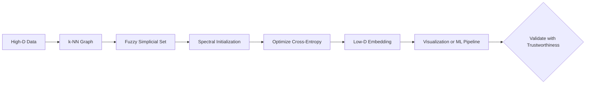

# UMAP: Uniform Manifold Approximation and Projection

> *"UMAP finds the shape of your data — not just its spread — and faithfully redraws it in 2D."*

A complete guide to understanding, implementing, and interpreting UMAP for dimensionality reduction and data visualization. Built for ML interns, students, and practitioners who want real intuition, not just a `fit_transform()` call.

---

## Table of Contents

1. [What is UMAP?](#what-is-umap)
2. [Mathematical Formulation](#mathematical-formulation)
3. [The Fuzzy Union Explained](#the-fuzzy-union-explained)
4. [Spectral Initialization](#spectral-initialization)
5. [How It Works (Step-by-Step)](#how-it-works-step-by-step)
6. [Key Assumptions](#key-assumptions)
7. [When to Use / When NOT to Use](#when-to-use--when-not-to-use)
8. [Implementation Guide](#implementation-guide)
9. [Advanced Variants](#advanced-variants)
10. [Production & Performance Considerations](#production--performance-considerations)
11. [Comparison with Other Methods](#comparison-with-other-methods)
12. [Interview Questions](#interview-questions)
13. [Quick Reference](#quick-reference)
14. [References](#references)

---

## What is UMAP?

### The Simple Idea

Imagine you have a crumpled piece of paper in 3D space. The paper itself is 2D — it has a flat, intrinsic structure — but because it's crumpled, it exists in 3D. UMAP is the algorithm that *uncrumples* that paper: it finds the true underlying low-dimensional shape hiding inside a high-dimensional mess. Formally, this underlying shape is called a **manifold**, and UMAP's core insight is that real-world high-dimensional data (images, text embeddings, gene expression) almost always lives on a low-dimensional manifold embedded in a high-dimensional space.

UMAP (Uniform Manifold Approximation and Projection) was introduced by Leland McInnes, John Healy, and James Melville in 2018. It is grounded in **algebraic topology** and **Riemannian geometry**, making it theoretically the most principled dimensionality reduction algorithm commonly used in practice. But you don't need to know topology to use it — UMAP can be summarized as:

> *"Build a weighted graph capturing who is close to whom in the original space, then find a low-dimensional layout that preserves that graph as faithfully as possible."*

### What Sets UMAP Apart

What sets UMAP apart from t-SNE is its speed, scalability, and ability to **preserve both local and global structure**:

- **t-SNE** collapses everything into tight local clusters and destroys global geometry
- **UMAP** maintains a meaningful sense of how clusters relate to each other

UMAP also supports `transform()`, meaning it can embed **new, unseen data points** without refitting — something t-SNE cannot do. These properties make UMAP suitable not just for visualization but also as a preprocessing step before clustering or supervised learning.

### Key Intuitions at a Glance

| Concept | What It Means |
|---------|---------------|
| **Manifold hypothesis** | Data lies on or near a low-dimensional surface |
| **k-NN graph** | Captures local neighborhood relationships |
| **Fuzzy union** | Soft (probabilistic) graph connecting similar points |
| **Spectral init** | Start from a globally coherent layout (not random) |
| **Cross-entropy** | Penalizes both false positives and false negatives |
| **Attractive + repulsive forces** | Push/pull optimization to balance local and global structure |

---

## Mathematical Formulation

UMAP operates in two phases: building a **high-dimensional fuzzy graph**, then finding a **low-dimensional layout** that matches it.

### Phase 1 — High-Dimensional Fuzzy Graph

For each point $i$, find its $k$ nearest neighbors. Compute the distance $d(x_i, x_j)$ to each neighbor $j$.

**Directed edge weight (fuzzy membership):**

$$v_{j|i} = \exp\!\left(\frac{-(d(x_i, x_j) - \rho_i)}{\sigma_i}\right)$$

$$v_{ij} = v_{j|i}$$

| Symbol | Meaning |
|--------|---------|
| $d(x_i, x_j)$ | Distance between point $i$ and neighbor $j$ in original space |
| $\rho_i$ | Distance from $i$ to its nearest neighbor (ensures local connectivity) |
| $\sigma_i$ | Per-point bandwidth — calibrated so $\sum_j v_{j\|i} = \log_2(k)$ |
| $v_{j\|i}$ | Directed fuzzy probability that $j$ is a neighbor of $i$ |

**Why subtract $\rho_i$?** This ensures every point has at least one neighbor at "distance 0," making the graph connected even in sparse regions where distances to the nearest neighbor are large.

**Symmetrized edge weight (fuzzy union):**

$$w_{ij} = v_{j|i} + v_{i|j} - v_{j|i} \cdot v_{i|j}$$

| Symbol | Meaning |
|--------|---------|
| $w_{ij}$ | Undirected weight — probability that at least one direction considers them neighbors |

**Why fuzzy union (not average)?** The fuzzy union $a + b - ab$ corresponds to the probabilistic OR: the probability that either $i$ considers $j$ a neighbor OR $j$ considers $i$ a neighbor. This ensures that if even one direction sees a strong connection, the edge weight is high. Averaging would dilute strong one-way connections.

---

### Phase 2 — Low-Dimensional Embedding

**Low-dimensional similarity (adjusted t-distribution):**

$$q_{ij} = \left(1 + a \cdot \|y_i - y_j\|^{2b}\right)^{-1}$$

| Symbol | Meaning |
|--------|---------|
| $y_i, y_j$ | Coordinates in the low-dimensional embedding |
| $a, b$ | Shape parameters automatically fit from `min_dist` |
| $q_{ij}$ | Fuzzy similarity in the low-dimensional space |

**How $a$ and $b$ are fit:** Given `min_dist` (a user parameter), the algorithm finds $a, b$ that minimize:

$$\left(\frac{1}{1 + a \cdot d^{2b}}\right) - \text{desired\_curve}(d)$$

where $\text{desired\_curve}(d)$ is 1 for $d < \text{min\_dist}$ and decays smoothly to 0 after.

- **Low min_dist (0.0):** Tight clusters, $a, b$ create a steep curve
- **High min_dist (0.5+):** Spread-out embedding, $a, b$ create a gradual curve
- **Default (0.1):** Balanced between tight clusters and global spread

### Cross-Entropy Loss (Optimization Objective)

$$C = \sum_{(i,j)} \left[ w_{ij} \log\frac{w_{ij}}{q_{ij}} + (1 - w_{ij}) \log\frac{1 - w_{ij}}{1 - q_{ij}} \right]$$

| Symbol | Meaning |
|---|---|
| $C$ | Total cross-entropy loss to minimize |
| $w_{ij}$ | Target edge weight from the high-dimensional graph |
| $q_{ij}$ | Predicted edge weight in the low-dimensional embedding |

#### Cross-Entropy vs KL Divergence

This is the **critical difference** from t-SNE:

| Loss | t-SNE (KL only) | UMAP (Cross-entropy) |
|------|-----------------|---------------------|
| First term | $p_{ij} \log \frac{p_{ij}}{q_{ij}}$ | $w_{ij} \log \frac{w_{ij}}{q_{ij}}$ |
| Second term | — | $(1-w_{ij}) \log \frac{1-w_{ij}}{1-q_{ij}}$ |
| Similar points far apart | ❌ Heavily penalized | ❌ Heavily penalized |
| Dissimilar points close | ✅ Weakly penalized | ❌ Strongly penalized |

**UMAP's second term penalizes putting dissimilar points too close together.** This gives UMAP its balanced attractive + repulsive forces and preserves global structure.

### Gradient Structure

The gradient naturally decomposes into attractive and repulsive forces:

$$\frac{\partial C}{\partial y_i} = \underbrace{2a b \sum_j w_{ij} \, q_{ij}^{1+1/b} \, (y_i - y_j)}_{\text{Attractive (pull close neighbors)}} - \underbrace{2a b \sum_j (1 - w_{ij}) \, q_{ij}^{1+1/b} \, (y_i - y_j)}_{\text{Repulsive (push apart non-neighbors)}}$$

- **Attractive term** ($w_{ij}$ high): pulls points that are close in high-d together
- **Repulsive term** ($1 - w_{ij}$ high): pushes points that are far in high-d apart

The balance between these forces is what preserves both local and global structure.

---

## Spectral Initialization

Unlike t-SNE (which starts from random positions or PCA), UMAP uses **spectral initialization** based on **Laplacian Eigenmaps**.

### What Is Spectral Initialization? (Beginner)

Think of the data graph as a network of rubber bands (edges) connecting points (nodes). Spectral initialization:
1. Builds the weighted neighborhood graph $W$
2. Computes the **graph Laplacian**: $L = D - W$ (where $D$ is the degree matrix)
3. Solves the generalized eigenproblem: $Lv = \lambda D v$
4. The bottom eigenvectors (excluding the trivial constant) give the initial coordinates

**Why this matters:** The graph Laplacian captures global connectivity structure. The first non-trivial eigenvector splits the graph into its two main clusters; the next splits those, and so on. This means UMAP's **initial layout already has meaningful global structure** — unlike t-SNE, which starts from noise and must discover structure through optimization.

### Why Spectral Init Beats Random Init

| Property | Random Init (t-SNE) | Spectral Init (UMAP) |
|----------|---------------------|----------------------|
| **Global structure** | None at start | Coherent from the beginning |
| **Convergence** | Needs early exaggeration to form clusters | Already approximately correct |
| **Reproducibility** | Different layouts per seed | More stable across runs |
| **Local minima** | Many — easy to get stuck | Fewer — starts in a good basin |

---

## How It Works (Step-by-Step)

```
High-Dimensional Data (N samples × D features)
              │
              ▼
┌──────────────────────────────────────────────────┐
│  STEP 1: Find k Nearest Neighbors                │
│  For each of N points, find k closest            │
│  neighbors using approximate NN search           │
│  (PyNNDescent) — O(N^1.14), far faster           │
│  than the naive O(N²) brute-force search.        │
│  Controlled by: n_neighbors                      │
└─────────────────────┬────────────────────────────┘
                      │
                      ▼
┌──────────────────────────────────────────────────┐
│  STEP 2: Build Fuzzy Simplicial Set              │
│  For each point, compute local bandwidth σ_i     │
│  via binary search such that Σ v_ij = log₂(k).   │
│  Convert distances to fuzzy weights v_ij.        │
│  Symmetrize via fuzzy union:                     │
│  w_ij = v_ij + v_ji - v_ij * v_ji               │
│  This graph encodes the manifold topology.       │
└─────────────────────┬────────────────────────────┘
                      │
                      ▼
┌──────────────────────────────────────────────────┐
│  STEP 3: Spectral Initialization                 │
│  Initialize embedding using Laplacian            │
│  Eigenmaps on the graph W.                       │
│  Advantage over t-SNE's random init:             │
│  global structure is coherent from start.        │
└─────────────────────┬────────────────────────────┘
                      │
                      ▼
┌──────────────────────────────────────────────────┐
│  STEP 4: Optimize via SGD                        │
│  Minimize cross-entropy C over n_epochs.         │
│  Attractive forces: pull true neighbors close.   │
│  Repulsive forces: push non-neighbors apart.     │
│  Controlled by: min_dist, n_epochs, lr           │
└─────────────────────┬────────────────────────────┘
                      │
                      ▼
        Low-Dimensional Embedding (N × 2)
        (Can also transform new data!)
```

---

## Key Assumptions

1. **Data lies on a low-dimensional manifold.** If your data is pure noise with no intrinsic low-dimensional structure, UMAP output is arbitrary.

2. **The manifold is locally connected.** The $\rho_i$ correction guarantees each point connects to at least one neighbor, but in very sparse datasets this can create artificial bridges between disconnected clusters.

3. **Data is uniformly sampled on the manifold.** UMAP assumes the data covers the manifold approximately uniformly. If density varies dramatically, UMAP's normalization adjusts for this, but extreme density differences (e.g., a dense cluster + sparse outliers) can cause artifacts.

4. **n_neighbors defines the manifold resolution.** Small values reveal fine local structure (possibly noisy). Large values give a smoother, more global manifold. Neither is correct for all situations.

5. **min_dist affects density, not topology.** It controls how tightly points are packed visually — an aesthetic choice, not a structural one. It should NOT be used to infer cluster density in the original data.

6. **Metric choice matters.** Euclidean is the default but not always ideal. For text embeddings, use `metric='cosine'`. For count data (RNA-seq), consider `metric='correlation'`. For high-dimensional data, consider `metric='euclidean'` with PCA pre-reduction.

---

## When to Use / When NOT to Use

### Use UMAP When:

| Scenario | Why UMAP Excels |
|----------|-----------------|
| Large datasets (>10K samples) | 10–100× faster than t-SNE |
| Need to embed new/unseen data | `transform()` works without refitting |
| Both local and global structure matter | Better global preservation than t-SNE |
| Preprocessing before clustering | UMAP + HDBSCAN is a leading pipeline |
| Single-cell RNA-seq or genomics | Industry standard for bioinformatics EDA |
| 3D visualization | Works cleanly with `n_components=3` |
| Dimensionality reduction before ML | Inductive — can embed train and test sets |

### Do NOT Use UMAP When:

| Scenario | Why It Fails |
|----------|-------------|
| You need interpretable axes | UMAP axes have no unit or meaning |
| Tiny datasets (<50 points) | k-NN graph is too sparse to be reliable |
| You need perfectly reproducible results | Stochastic — always set `random_state` |
| You need a linear transformation | Use PCA (faster, invertible, interpretable) |
| You need to explain components to stakeholders | Axes are uninterpretable without labels |
| Data has no/low manifold structure | UMAP imposes structure on noise |

---

## Implementation Guide

### With umap-learn (Production)

```python
import umap

reducer = umap.UMAP(
    n_neighbors=15,
    min_dist=0.1,
    n_components=2,
    metric='euclidean',
    random_state=42
)

# Fit and transform training data
X_embedded = reducer.fit_transform(X_train)

# Transform new data (t-SNE cannot do this!)
X_new_embed = reducer.transform(X_test)
```

### UMAP in a sklearn Pipeline

```python
from sklearn.pipeline import Pipeline
from sklearn.ensemble import RandomForestClassifier

pipe = Pipeline([
    ('umap', umap.UMAP(n_components=20, random_state=42)),
    ('clf', RandomForestClassifier())
])

pipe.fit(X_train, y_train)
pipe.score(X_test, y_test)
```

### UMAP + HDBSCAN Clustering Pipeline

```python
import umap
import hdbscan

reducer = umap.UMAP(n_components=50, n_neighbors=15, min_dist=0.0)
Z = reducer.fit_transform(X)

clusterer = hdbscan.HDBSCAN(min_cluster_size=10)
labels = clusterer.fit_predict(Z)
```

### Hyperparameter Guide

| Parameter | Default | Range | Effect |
|-----------|---------|-------|--------|
| `n_neighbors` | 15 | 5–200 | Manifold resolution: low = fine local, high = smooth global |
| `min_dist` | 0.1 | 0.0–0.99 | Visual packing: low = tight clusters, high = spread out |
| `n_components` | 2 | 2–50+ | Output dimensions (2–3 for viz, 10–50 for ML input) |
| `metric` | 'euclidean' | any sklearn metric | Distance measure in input space |
| `n_epochs` | auto (~300) | 200–500 | Optimization iterations |
| `init` | 'spectral' | 'spectral','random','pca' | Initialization strategy |
| `learning_rate` | 1.0 | 0.1–10 | SGD step size |

### Parameter Tuning Strategy

1. **For visualization (n_components=2):**
   - Start with `n_neighbors=15`, `min_dist=0.1`
   - If you see excessive fragmentation: increase `n_neighbors` (30–50)
   - If you see a structureless blob: decrease `n_neighbors` (5–10) or decrease `min_dist`
   - Try multiple `n_neighbors` values and compare

2. **For ML preprocessing (n_components=10–50):**
   - Set `min_dist=0.0` (don't constrain the embedding)
   - Use higher `n_neighbors` (30–50) for smoother global representation
   - Validate against downstream task performance

3. **For very large datasets (>100K):**
   - Set `n_neighbors` to 25–50
   - Use `umap.UMAP(verbose=True)` to monitor progress
   - Consider `init='spectral'` (default, works well at scale)

### Saving and Loading

```python
import joblib

# Save
joblib.dump(reducer, 'umap_reducer.joblib')

# Load and transform new data
reducer = joblib.load('umap_reducer.joblib')
X_new_embed = reducer.transform(X_new)
```

### Validating Embedding Quality

```python
from sklearn.manifold import trustworthiness

# Trustworthiness: do neighbors in high-d remain neighbors in low-d?
trust = trustworthiness(X, Z, n_neighbors=15)

# Continuity: do neighbors in low-d correspond to neighbors in high-d?
# (Use the inverse neighbor preservation)
```

---

## Advanced Variants

### Supervised UMAP

Uses label information to guide the embedding, pulling same-class points together and pushing different-class points apart.

```python
reducer = umap.UMAP(
    n_neighbors=15,
    min_dist=0.1,
    target_metric='categorical',  # or 'euclidean' for regression
    target_weight=0.5             # How much to trust labels (0-1)
)
Z = reducer.fit_transform(X, y)   # Pass labels during training
```

**When to use:** You have labeled data and want the embedding to reflect known classes. Useful for visualization of classification datasets.

### Parametric UMAP

Trains a neural network to learn $f_\theta: X \to Y$, enabling very fast out-of-sample embedding and the ability to embed mini-batches.

```python
from umap.parametric_umap import ParametricUMAP

reducer = ParametricUMAP(n_components=2, n_epochs=50)
Z = reducer.fit_transform(X)

# Very fast transform (single forward pass)
Z_new = reducer.transform(X_new)
```

### UMAP for Anomaly Detection

Fit UMAP on "normal" data, then measure reconstruction error for new points:

```python
reducer = umap.UMAP().fit(X_normal)

# For new point, compute reconstruction error
Z = reducer.transform(X_new)
X_recon = reducer.inverse_transform(Z)
error = np.mean((X_new - X_recon)**2, axis=1)

# High error → potential anomaly
```

### Aligned UMAP

Aligns multiple UMAP embeddings so that corresponding points (e.g., same cell across time points in a biological experiment) are placed at the same coordinates.

### Metric Learning with UMAP

UMAP supports any metric that sklearn's NearestNeighbors supports, including:
- `'euclidean'` — default, good for most data
- `'cosine'` — text embeddings, normalized vectors
- `'correlation'` — gene expression, time series
- `'manhattan'` — high-dimensional sparse data
- `'mahalanobis'` — when features are correlated
- Precomputed distance matrices

---

## Production & Performance Considerations

### Scalability Guide

| Dataset Size | Time (100 dims) | Notes |
|---|---|---|
| < 1,000 | < 1 second | Instant |
| 1k–10k | 1–5 seconds | Default parameters work well |
| 10k–100k | 5–60 seconds | Set `verbose=True`, consider `init='spectral'` |
| 100k–1M | 1–5 minutes | Use PCA pre-reduction to 50 dims |
| 1M+ | 5–30 minutes | Approx NN with PyNNDescent; GPU recommended |

### GPU Acceleration

```python
# cuML UMAP (RAPIDS) — 10-50× speedup on GPU
import cuml
reducer = cuml.UMAP(n_components=2)
Z = reducer.fit_transform(X)
```

### Memory Considerations

- UMAP stores the k-NN graph: $O(n \cdot k)$ (far less than t-SNE's $O(n^2)$)
- For $n=100k$, $k=15$: ~12 MB (vs 80 GB for t-SNE's pairwise matrix)
- UMAP uses float32 internally by default — half the memory of float64

### Production Checklist

- [ ] Set `random_state` for reproducibility
- [ ] Save the trained reducer with `joblib.dump()`
- [ ] Choose `n_neighbors` based on dataset size and structure
- [ ] For ML pipelines, use `n_components=10–50` (not 2)
- [ ] Validate embedding quality with trustworthiness/continuity
- [ ] Monitor for drift: periodically check reconstruction error on new data
- [ ] Use `metric` appropriate for your data type
- [ ] If using UMAP + clustering, run multiple seeds and compare cluster assignments

---

## Comparison with Other Methods

| Feature | PCA | t-SNE | UMAP |
|---------|-----|-------|------|
| **Linear?** | Yes | No | No |
| **Preserves** | Global variance | Local structure | Local + global |
| **Speed** | Very fast ($O(nd^2)$) | Slow ($O(n^2)$/Barnes-Hut $O(n \log n)$) | Fast ($O(n^{1.14})$ NN + SGD) |
| **New data?** | Yes (`transform`) | No (must refit) | Yes (`transform`) |
| **Deterministic?** | Yes | No | No (more stable) |
| **Use in ML pipeline?** | Yes | No | Yes |
| **Interpretable axes?** | Yes (loadings) | No | No |
| **Best dataset size** | Any | < 50K | Any |
| **Invertible?** | Yes (exact) | No | Approximate |
| **Theoretical basis** | Linear algebra | Information theory | Topology + Riemannian geometry |

### UMAP vs t-SNE: When to Pick Each

| Scenario | Pick UMAP | Pick t-SNE |
|----------|-----------|------------|
| Dataset > 10k points | ✅ | ❌ |
| Need `transform()` for new data | ✅ | ❌ |
| Global structure matters | ✅ | ❌ |
| ML preprocessing | ✅ | ❌ |
| Finest possible local detail | ❌ (slightly coarser) | ✅ |
| Small dataset (< 1k) | ✅ (fast anyway) | ✅ (equally fine) |
| Easy-to-tune visualization | ✅ (fewer parameters) | ❌ (perplexity matters more) |

### UMAP vs PCA: When to Pick Each

| Scenario | Pick PCA | Pick UMAP |
|----------|----------|-----------|
| Need interpretable components | ✅ | ❌ |
| Data is roughly linear | ✅ | Overkill |
| Non-linear structure | ❌ | ✅ |
| Very high dimensions (10k+) | ✅ (fast) | ✅ with pre-reduction |
| Visualization | ❌ (often boring) | ✅ (revealing) |

---

## Interview Questions

### Beginner

**Q1: How does UMAP differ from t-SNE? When would you choose one?**

Four key differences:
1. **Speed** — UMAP is 10–100× faster
2. **Global structure** — UMAP preserves inter-cluster relationships via cross-entropy loss
3. **New data** — UMAP has `transform()`, t-SNE requires refitting
4. **Theory** — UMAP is grounded in Riemannian geometry; t-SNE in KL divergence

Pick t-SNE for very small datasets (<5k) where local detail is paramount. Pick UMAP for everything else — large data, ML pipelines, global structure, or when you need to embed new points.

**Q2: What do n_neighbors and min_dist control?**

- **n_neighbors** controls the scale of manifold estimation. Low (5): fine details, possibly noisy. High (100): smooth global structure, loses local detail. Default 15 balances both.
- **min_dist** controls visual packing density in the 2D output. Low (0.0): tight compact clusters. High (0.5): spread-out embedding.

Think of `n_neighbors` as the structural parameter (it changes the embedding's topology) and `min_dist` as the aesthetic parameter (it changes visual appearance without changing cluster membership).

**Q3: Why does UMAP preserve global structure better than t-SNE?**

Two reasons:
1. **Loss function:** t-SNE's KL divergence only penalizes putting close points far apart (one-sided). UMAP's cross-entropy penalizes both putting similar points far apart AND putting dissimilar points close together — balanced attractive and repulsive forces.
2. **Initialization:** UMAP uses spectral initialization (Laplacian Eigenmaps) which gives a globally coherent starting layout. t-SNE starts random (or PCA) and must discover structure.

**Q4: Can UMAP output be used for downstream ML tasks?**

Yes — a key advantage over t-SNE. Because UMAP has `transform()`, you can embed training data, then embed test data in the same space. Common uses:
- UMAP (n_components=10–50) → HDBSCAN clustering
- UMAP → classification (SVM, Random Forest, etc.)
- UMAP → anomaly detection (reconstruction error)

Always validate that UMAP + model outperforms simpler approaches like PCA + model.

**Q5: What is a fuzzy simplicial set and why does UMAP use it?**

A fuzzy simplicial set is UMAP's mathematical representation of the data's topological structure — an undirected weighted graph where edge weights $w_{ij} \in [0,1]$ represent the fuzzy probability that points $i$ and $j$ are mutual neighbors. Unlike a binary graph, every pair has a continuous degree of membership. The symmetrization $w_{ij} = v_{ij} + v_{ji} - v_{ij}v_{ji}$ implements the **fuzzy union** (probabilistic OR). UMAP uses this because it captures continuous manifold structure better than binary approaches and gives the algorithm its strong theoretical foundations in algebraic topology.

### Intermediate

**Q6: Explain UMAP's spectral initialization and why it matters.**

Spectral initialization builds the weighted neighborhood graph $W$, computes the graph Laplacian $L = D - W$, and solves $Lv = \lambda D v$ for the bottom eigenvectors. These eigenvectors capture the global connectivity structure — the first non-trivial one splits the graph into two main clusters, the next splits those, and so on. UMAP uses these as the initial embedding coordinates.

**Why it matters:** The initial layout already has meaningful global structure. t-SNE starts from noise and must form clusters through optimization (requiring early exaggeration). UMAP starts closer to the final answer, reducing optimization time and avoiding poor local minima.

**Q7: How does UMAP handle density variations across the dataset?**

UMAP assumes the data is uniformly sampled on the manifold. In practice, real data has varying density. UMAP handles this via the per-point bandwidth $\sigma_i$ — each point gets its own scale, calibrated to the local neighborhood. This effectively normalizes for density: dense regions have small $\sigma_i$ (narrow focus), sparse regions have large $\sigma_i$ (wider view). The $\rho_i$ correction (distance to nearest neighbor) further ensures connectivity across regions of varying density.

**Q8: What are the a and b parameters in UMAP, and how are they determined?**

$a$ and $b$ are shape parameters for the low-dimensional similarity function $q_{ij} = (1 + a \cdot d^{2b})^{-1}$. They are automatically fit to match a target curve defined by `min_dist`:

- $a$ controls the overall scale
- $b$ controls the tail heaviness (how quickly similarity decays with distance)

When `min_dist` is small, $a$ is large and $b$ is close to 1 → steep drop-off → tight clusters. When `min_dist` is large, $a$ is small and $b$ approaches 2 → gradual decay → spread-out embedding. Users should not tune $a, b$ directly — use `min_dist`.

**Q9: How does UMAP's gradient compare to t-SNE's gradient?**

| Aspect | t-SNE | UMAP |
|--------|-------|------|
| Attractive force | $(p - q)(y_i - y_j)(1 + d^2)^{-1}$ | $w \cdot q^{1+1/b} (y_i - y_j)$ |
| Repulsive force | Only implicit (through denominator) | Explicit: $(1-w) \cdot q^{1+1/b} (y_i - y_j)$ |
| Balance | Heavily local | Adjustable (via n_neighbors, min_dist) |
| Range | Short-range (exponential decay) | Adjustable (polynomial decay via a, b) |

UMAP's explicit repulsive force is what gives it global structure preservation. The attractive and repulsive terms are balanced by design, while t-SNE's repulsion is weaker.

**Q10: What happens when n_neighbors is very small vs very large?**

- **Very small (2–5):** Only immediate neighbors are connected. The graph is sparse, revealing fine-grained local patterns. Can be noisy and fragment clusters.
- **Small (5–10):** Good for finding small, tight clusters. May overfit to local noise.
- **Default (15):** Balanced — captures most structure types.
- **Large (50–100):** Smooth, global view. Smaller clusters may merge. Good for exploring coarse data structure.
- **Very large (200+):** Approaches global structure. The fuzzy graph approximates the full distance matrix. Lower-quality local detail.

### Advanced

**Q11: Explain the theoretical foundations of UMAP in Riemannian geometry.**

UMAP assumes data points $\{x_i\}$ are sampled from a Riemannian manifold $\mathcal{M}$ embedded in $\mathbb{R}^d$. The manifold has a Riemannian metric $g$ that defines local distances. UMAP approximates this metric as constant in each neighborhood (the $k$-th neighbor distance defines the local scale). The fuzzy graph is a discrete approximation of the manifold's topological structure. The optimization finds an embedding that preserves this topological structure, which corresponds to finding a low-dimensional representation with minimal topological distortion.

In simpler terms: UMAP assumes that at a local scale, the data "looks like" flat Euclidean space (that's what a manifold is), and it stitches together these local views into a global topological representation.

**Q12: Derive the fuzzy union formula $w_{ij} = v_{ij} + v_{ji} - v_{ij}v_{ji}$ and explain why it's used.**

The directed weight $v_{j|i}$ is the probability that $j$ is a neighbor of $i$ in the fuzzy set sense. For the undirected graph, we want the probability that $i$ and $j$ are connected — i.e., the probability that at least one considers the other a neighbor. Assuming "independence" of the two directed relationships:

$$P(i \leftrightarrow j) = P(v_{j|i}) + P(v_{i|j}) - P(v_{j|i} \wedge v_{i|j}) = v_{j|i} + v_{i|j} - v_{j|i} \cdot v_{i|j}$$

This is the **fuzzy union** (t-conorm), corresponding to the probabilistic OR. It's preferred over averaging because:
- If $v_{j|i} = 1$ and $v_{i|j} = 0$, averaging gives 0.5 (weak connection), but fuzzy union gives 1 (strong connection)
- This ensures one-way strong relationships are preserved

**Q13: UMAP vs t-SNE for single-cell RNA-seq data — why is UMAP the standard?**

Single-cell RNA-seq data has:
- **Thousands of cells** (samples) — t-SNE is too slow
- **Tens of thousands of genes** (features) — requires PCA pre-reduction anyway
- **Hierarchical structure** (cell types → subtypes → states) — needs both local and global preservation
- **Continuous trajectories** (differentiation paths) — needs topological structure preservation
- **New data** (new experiments) — needs `transform()` for integration

UMAP handles all of these. The UMAP + HDBSCAN pipeline has become the de facto standard in single-cell analysis (Becht et al., 2019).

**Q14: How does UMAP's approximate nearest neighbor search work, and why is it so fast?**

UMAP uses **PyNNDescent**, which builds a k-NN graph by:
1. Starting with a random graph (each node connected to random others)
2. Iteratively improving by exploring "neighbors of neighbors" (if A is near B and B is near C, A is likely near C)
3. Using a heap structure to track the best candidates

This achieves $O(n^{1.14})$ complexity on typical data — nearly linear in practice. By contrast, naive k-NN is $O(n^2 d)$ and even k-d trees degrade in high dimensions.

**Q15: Compare the objectives of PCA, t-SNE, and UMAP mathematically.**

| Method | Objective | What it preserves | Key property |
|--------|-----------|-------------------|-------------|
| **PCA** | $\max_w w^T \Sigma w$ s.t. $\|w\|=1$ | Global variance (linear) | Deterministic, closed-form |
| **t-SNE** | $\min KL(P\|Q) = \sum p_{ij} \log(p_{ij}/q_{ij})$ | Local neighbor probabilities | Asymmetric; one-sided |
| **UMAP** | $\min CE(P,Q) = \sum [w \log(w/q) + (1-w)\log((1-w)/(1-q))]$ | Fuzzy topological structure | Symmetric; two-sided |

The key insight: PCA is a purely geometric projection, t-SNE is a statistical divergence minimization, and UMAP is a topological structure preservation problem. Each encodes a different assumption about what "important" structure means in the data.

### Quick Reference Questions

| Question | One-Sentence Answer |
|---|---|
| What does UMAP do? | Builds a fuzzy neighborhood graph and finds a 2D layout preserving its topology |
| UMAP vs t-SNE? | UMAP: faster, global structure, `transform()`, cross-entropy. t-SNE: slower, local-only, no `transform()`, KL divergence |
| What is n_neighbors? | Number of nearest neighbors used to estimate local manifold structure |
| What is min_dist? | Minimum distance between points in the 2D embedding (visual packing) |
| Can UMAP embed new data? | Yes — `transform()` without refitting |
| What is spectral initialization? | Starting layout from graph Laplacian eigenvectors (global structure from start) |
| Why fuzzy union (not average)? | Ensures one-way strong connections are preserved |
| UMAP for ML pipeline? | Yes — inductive, use n_components=10–50 |
| What is parametric UMAP? | Neural network approximation of UMAP for fast transform |
| How does UMAP handle density differences? | Per-point $\sigma_i$ normalizes local density |

---

## My Understanding

What made UMAP click for me was the cross-entropy loss. Unlike t-SNE's KL divergence (which only penalizes putting close points far apart), UMAP also penalizes putting distant points close together. This second term is what preserves global structure. The spectral initialization also blew my mind — starting from graph Laplacian eigenvectors means the embedding already has meaningful global structure before optimization even begins. The fuzzy union formula $w_{ij} = v_{ij} + v_{ji} - v_{ij}v_{ji}$ made sense when I thought of it as the "probabilistic OR": if either point considers the other a neighbor, the connection is strong. That's much more intuitive than averaging.

## How I Use These Methods

UMAP has become my default visualization tool for everything above 5k points. I typically start with `n_neighbors=15` and `min_dist=0.1`, then adjust based on what I see. For ML preprocessing, I use `n_components=10-50` with `min_dist=0.0` (no visual packing constraint) and validate against downstream task performance. The UMAP + HDBSCAN pipeline is fantastic for exploratory clustering. I also use `transform()` to embed test data in the same space as training data — a feature t-SNE simply doesn't have. For very large datasets (>100k), I use the cuML GPU version for 10-50x speedup.

## Visual Summary



---

## Quick Reference

| Property | Value |
|---|---|
| **Full Name** | Uniform Manifold Approximation and Projection |
| **Authors** | McInnes, Healy, Melville (2018) |
| **Type** | Non-linear, unsupervised dimensionality reduction |
| **Primary Uses** | Visualization + ML preprocessing |
| **Theory basis** | Riemannian geometry + fuzzy topology |
| **Time Complexity** | $O(n^{1.14})$ NN search + $O(n \cdot \text{epochs})$ SGD |
| **Space Complexity** | $O(n \cdot k)$ (k-NN graph) |
| **Invertible?** | No (approximate `inverse_transform()` available) |
| **Handles New Data?** | Yes — `transform()` |
| **Deterministic?** | No — always set `random_state` |
| **Install** | `pip install umap-learn` |
| **GPU Version** | `cuml.UMAP` (RAPIDS) |
| **Key Parameters** | `n_neighbors` (5–200), `min_dist` (0–0.99) |
| **sklearn-like** | Yes — full fit/transform API |

---

## References

### Papers
1. **Original Paper**: McInnes, L., Healy, J., & Melville, J. (2018). *UMAP: Uniform Manifold Approximation and Projection for Dimension Reduction.* [arXiv:1802.03426](https://arxiv.org/abs/1802.03426)
2. **How UMAP Works** (by the author): [umap-learn docs](https://umap-learn.readthedocs.io/en/latest/how_umap_works.html)
3. **Becht et al. (2019)**: *Dimensionality reduction for single-cell data using UMAP.* Nature Biotechnology. [Link](https://www.nature.com/articles/nbt.4314)
4. **Laplacian Eigenmaps**: Belkin, M. & Niyogi, P. (2003). *Laplacian Eigenmaps for Dimensionality Reduction and Data Representation.* Neural Computation.
5. **PyNNDescent**: Dong, W. et al. (2011). *Efficient K-Nearest Neighbor Graph Construction for Generic Similarity Measures.* WWW.

### Documentation & Code
6. **umap-learn Documentation**: [Link](https://umap-learn.readthedocs.io/en/latest/)
7. **cuML UMAP (GPU)**: [RAPIDS docs](https://docs.rapids.ai/api/cuml/stable/api.html#umap)

### Visualization & Interpretation
8. **Distill — How to Use t-SNE Effectively**: Same interpretability lessons apply to UMAP. [Link](https://distill.pub/2016/misread-tsne/)
9. **StatQuest — UMAP Clearly Explained**: [YouTube](https://www.youtube.com/watch?v=eN0wFzBA4Sc)

### Benchmarking
10. **t-SNE vs UMAP Benchmark**: Kobak, D. & Berens, P. (2019). *The art of using t-SNE for single-cell transcriptomics.* Nature Communications.
