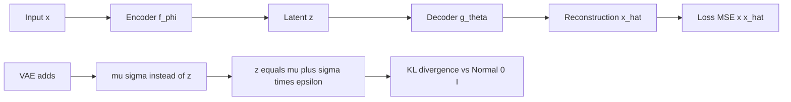

# Autoencoders & Variational Autoencoders (VAE)

> *"Teaching a neural network to forget just enough — and remember what matters."*

---

## Table of Contents

1. [What is an Autoencoder?](#what-is-an-autoencoder)
2. [What is a VAE?](#what-is-a-vae)
3. [Mathematical Formulation](#mathematical-formulation)
4. [The Reparameterization Trick](#the-reparameterization-trick)
5. [How Autoencoder Works (Step-by-Step)](#how-autoencoder-works-step-by-step)
6. [How VAE Works (Step-by-Step)](#how-vae-works-step-by-step)
7. [Variants of Autoencoders](#variants-of-autoencoders)
8. [Key Assumptions](#key-assumptions)
9. [When to Use / When NOT to Use](#when-to-use--when-not-to-use)
10. [Implementation Guide](#implementation-guide)
11. [Production & Practical Considerations](#production--practical-considerations)
12. [Comparison with Other Methods](#comparison-with-other-methods)
13. [Interview Questions](#interview-questions)
14. [Quick Reference](#quick-reference)
15. [References](#references)

---

## What is an Autoencoder?

### The Packing Analogy

Imagine you're going on a trip and can only carry a small backpack. You have to decide what's *essential* to pack (encoder), and when you arrive, you unpack and try to recreate your full wardrobe from just what you brought (decoder). The better your packing strategy, the closer your reconstructed wardrobe is to the original.

An Autoencoder works the same way:
- **Encoder $f_\phi$**: Compresses input data $x$ into a small "bottleneck" representation $z$
- **Bottleneck (Latent Space) $z$**: The compressed representation — much smaller than the original
- **Decoder $g_\theta$**: Reconstructs the original input from the compressed form: $\hat{x} = g_\theta(z)$

The model trains by minimizing the **reconstruction error** — how different the output $\hat{x}$ is from the input $x$.

### Architectural Diagram

```
Input x  →  [Encoder f_φ]  →  z (latent)  →  [Decoder g_θ]  →  Output x̂
   ↑                                                              |
   └────────────────── MSE Loss (x - x̂)² ────────────────────────┘
```

### Key Intuition

If the autoencoder can reconstruct the input well from a very small $z$, then $z$ must capture the most important information in the data. The latent space $z$ is the **dimensionality-reduced representation**.

---

## What is a VAE?

### The Sketch Artist Analogy

A regular autoencoder memorizes exact compressions — like a photocopier. A VAE instead learns the *rules of the style* — like a sketch artist who doesn't just copy a face but understands facial structure well enough to draw a brand-new, realistic face.

Instead of encoding input as a **single point**, VAEs encode it as a **probability distribution** (mean $\mu$ and variance $\sigma^2$). During generation, we *sample* from this distribution, so every run can produce something slightly different yet valid.

**Why this matters:**
- **Autoencoder** latent space: Points are scattered with no structure between them — gaps may map to garbage when decoded
- **VAE latent space**: Organized, continuous, and smooth — interpolating between two points gives meaningful intermediate results

### AE vs VAE Latent Space

| Property | Autoencoder | VAE |
|----------|-------------|-----|
| Encoder output | Single vector $z$ | Two vectors: $\mu$, $\log \sigma^2$ |
| Latent representation | Point | Distribution $\mathcal{N}(\mu, \sigma^2 I)$ |
| Sampling | Deterministic | Stochastic: $z = \mu + \sigma \cdot \epsilon$ |
| Generation | Cannot generate new data | Can generate new data |
| Latent space continuity | Often discontinuous | Smooth and continuous |

---

## Mathematical Formulation

### Autoencoder Loss

$$\mathcal{L}_{\text{AE}} = \frac{1}{n} \sum_{i=1}^n \|x_i - g_\theta(f_\phi(x_i))\|^2$$

This is the **Mean Squared Error (MSE)** between input and reconstruction. For binary data (e.g., MNIST pixels), Binary Cross-Entropy (BCE) is used instead.

### VAE Loss: The ELBO

A VAE optimizes the **Evidence Lower Bound (ELBO)**:

$$\log p(x) \geq \mathbb{E}_{q_\phi(z|x)}[\log p_\theta(x|z)] - D_{KL}(q_\phi(z|x) \| p(z))$$

$$\mathcal{L}_{\text{VAE}} = \underbrace{\mathbb{E}_{q_\phi(z|x)}[\log p_\theta(x|z)]}_{\text{Reconstruction}} - \underbrace{D_{KL}(q_\phi(z|x) \| p(z))}_{\text{KL Regularization}}$$

### Derivation of the ELBO (Professor-Level)

Starting from the marginal likelihood:

$$\log p(x) = \log \int p_\theta(x|z) p(z) dz$$

Introduce the variational distribution $q_\phi(z|x)$:

$$\log p(x) = \log \int q_\phi(z|x) \frac{p_\theta(x|z) p(z)}{q_\phi(z|x)} dz$$

Apply Jensen's inequality (since $\log$ is concave):

$$\log p(x) \geq \int q_\phi(z|x) \log \frac{p_\theta(x|z) p(z)}{q_\phi(z|x)} dz$$

Split the log:

$$\log p(x) \geq \underbrace{\int q_\phi(z|x) \log p_\theta(x|z) dz}_{\text{Expected log-likelihood}} - \underbrace{\int q_\phi(z|x) \log \frac{q_\phi(z|x)}{p(z)} dz}_{\text{KL divergence}}$$

$$= \mathbb{E}_{q_\phi(z|x)}[\log p_\theta(x|z)] - D_{KL}(q_\phi(z|x) \| p(z))$$

**Interpretation:**
- Maximizing the first term → better reconstructions
- Minimizing the second term (KL) → latent distribution stays close to the prior $\mathcal{N}(0, I)$

### Why KL Divergence Works as a Regularizer

The KL divergence $D_{KL}(q_\phi(z|x) \| \mathcal{N}(0, I))$ pushes each point's latent distribution toward the standard normal. This has two effects:

1. **Continuity**: Overlapping distributions mean nearby points in latent space decode to similar outputs
2. **Completeness**: Sampling from $\mathcal{N}(0, I)$ at generation time lands in regions that decode to valid data

Without KL, the encoder would learn to assign every point a tiny variance (collapsing to a deterministic AE-like encoding), and the latent space would have holes.

### The $\beta$-VAE Extension

$$\mathcal{L}_{\beta\text{-VAE}} = \mathbb{E}_{q_\phi(z|x)}[\log p_\theta(x|z)] - \beta \cdot D_{KL}(q_\phi(z|x) \| p(z))$$

- $\beta = 1$: Standard VAE
- $\beta > 1$: Stronger regularization → more disentangled latent factors, but lower reconstruction quality
- $\beta < 1$: Weaker regularization → better reconstructions, but less structured latent space

---

## The Reparameterization Trick

### The Problem

During training, we need to sample $z \sim \mathcal{N}(\mu, \sigma^2)$. But sampling is a stochastic operation — gradients cannot flow through a random node. Backpropagation would break.

### The Solution

Instead of sampling $z$ directly, we:
1. Sample noise $\epsilon \sim \mathcal{N}(0, I)$ (from a fixed distribution)
2. Compute $z = \mu + \sigma \odot \epsilon$ (deterministic transformation)

Now gradients can flow through $\mu$ and $\sigma$ because the randomness is isolated in $\epsilon$:

```
μ ──────────┐
            ├── z = μ + σ ⊙ ε   →   Decoder   →   x̂
σ ──────────┘
            ↑
        ε ~ N(0, I)   ←─── Random (no gradients through this)
```

**Gradient flow:**
- $\frac{\partial \mathcal{L}}{\partial \mu}$: flows through $z = \mu + \sigma\epsilon$
- $\frac{\partial \mathcal{L}}{\partial \sigma}$: flows through $z = \mu + \sigma\epsilon$
- $\frac{\partial \mathcal{L}}{\partial \epsilon}$: not needed (epsilon is input noise)

This is the **reparameterization trick** — one of the key innovations of the VAE.

---

## How Autoencoder Works (Step-by-Step)

1. **Input**: Feed raw data $x$ (e.g., image of digit "7")
2. **Encode**: Pass through encoder layers → compress to latent vector $z = f_\phi(x)$
3. **Bottleneck**: $z$ is much smaller than input (e.g., 2D instead of 784D pixels)
4. **Decode**: Pass $z$ through decoder → reconstruct $\hat{x} = g_\theta(z)$
5. **Loss**: Compute reconstruction error $\|x - \hat{x}\|^2$; backpropagate
6. **Repeat**: Network learns which features to preserve in the bottleneck

---

## How VAE Works (Step-by-Step)

1. **Input**: Feed raw data $x$
2. **Encode**: Encoder outputs **two vectors**: $\mu$ (mean) and $\log \sigma^2$ (log-variance)
3. **Sample**: Use reparameterization: $z = \mu + \sigma \cdot \epsilon$ where $\epsilon \sim \mathcal{N}(0, I)$
4. **Decode**: Decoder reconstructs $\hat{x}$ from sampled $z$
5. **Loss**: Reconstruction loss + KL divergence loss (ELBO)
6. **Generate**: At inference, sample $z \sim \mathcal{N}(0, I)$ directly to create new data

---

## Variants of Autoencoders

### Denoising Autoencoder (DAE)
Corrupt the input with noise, train to reconstruct the clean original. Learns robust features that are invariant to noise.

$$\mathcal{L} = \|x - g_\theta(f_\phi(\tilde{x}))\|^2 \quad \text{where } \tilde{x} = x + \text{noise}$$

### Sparse Autoencoder (SAE)
Adds a sparsity penalty on the latent activations, forcing the encoder to use only a few active neurons per input.

$$\mathcal{L} = \|x - \hat{x}\|^2 + \lambda \sum_j KL(\rho \| \hat{\rho}_j)$$

### Contractive Autoencoder (CAE)
Adds a penalty on the Jacobian of the encoder, encouraging the latent representation to be locally invariant to small input changes.

$$\mathcal{L} = \|x - \hat{x}\|^2 + \lambda \left\| \frac{\partial f_\phi(x)}{\partial x} \right\|_F^2$$

### Convolutional Autoencoder
Uses convolutional layers instead of dense layers. Best for images.

### Linear Autoencoder
A single-layer autoencoder with linear activation learns the **PCA solution** exactly. The weights span the same subspace as the top principal components, and the latent representation is equivalent to PCA scores (up to rotation).

### VQ-VAE (Vector Quantized VAE)
Discretizes the latent space using vector quantization. Used in high-quality generative models (DALL-E, VQ-GAN). The discrete latent space avoids the "posterior collapse" problem.

### Conditional VAE (CVAE)
Conditions both encoder and decoder on a label $y$:
- Encoder: $q_\phi(z|x, y)$
- Decoder: $p_\theta(x|z, y)$
Enables controlled generation (e.g., generate a specific digit).

---

## Key Assumptions

- Autoencoders assume the **important features live in a lower-dimensional space** (the manifold hypothesis)
- VAEs assume the **latent space follows a standard normal distribution** $\mathcal{N}(0, I)$
- VAEs assume **the data-generating process is smooth and continuous** in the latent space
- Both assume **the encoder-decoder architecture is expressive enough** to capture meaningful structure
- VAEs assume **conditional independence of latent dimensions** (diagonal covariance)

### Common Failure Modes

| Issue | Symptom | Cause |
|-------|---------|-------|
| **Posterior collapse** | Latent $z$ is ignored; decoder ignores encoder | KL term dominates; decoder is too powerful |
| **Overfitting** | Low train loss, high test loss | Bottleneck is too large |
| **Poor reconstructions** | Blurry outputs | Bottleneck is too small |
| **Discontinuous latent** | Interpolation produces garbage | No KL regularization (plain AE) |
| **Mode collapse** | VAE generates only a few types | Insufficient capacity or bad hyperparameters |

---

## When to Use / When NOT to Use

### Use When:

| Scenario | Why |
|----------|-----|
| Dimensionality reduction (non-linear) | Captures complex manifolds better than PCA |
| Anomaly detection | Reconstruction error flags outliers |
| Data generation (VAE) | Sample new data from the latent space |
| Denoising (DAE) | Learn robust, noise-invariant features |
| Representation learning | Pre-train encoder for downstream tasks |
| Interpolation | Smooth transitions between data points |

### Do NOT Use When:

| Scenario | Why |
|----------|-----|
| Exact data retrieval is needed | AE is lossy; VAE is lossy + stochastic |
| Interpretability is critical | Latent dimensions are not semantically meaningful (unless using $\beta$-VAE) |
| Labeled data is abundant for classification | Supervised models usually outperform |
| Dataset is tiny (< 1000 samples) | Neural networks need data to train well |
| Data has very high-frequency detail | VAEs produce blurry outputs; GANs or diffusion models are better |
| Linear structure suffices | PCA is faster, deterministic, and simpler |

---

## Implementation Guide

### Autoencoder (PyTorch)

```python
import torch
import torch.nn as nn

class Autoencoder(nn.Module):
    def __init__(self, input_dim, latent_dim):
        super().__init__()
        self.encoder = nn.Sequential(
            nn.Linear(input_dim, 128), nn.ReLU(),
            nn.Linear(128, 64), nn.ReLU(),
            nn.Linear(64, latent_dim)
        )
        self.decoder = nn.Sequential(
            nn.Linear(latent_dim, 64), nn.ReLU(),
            nn.Linear(64, 128), nn.ReLU(),
            nn.Linear(128, input_dim), nn.Sigmoid()
        )

    def forward(self, x):
        z = self.encoder(x)
        return self.decoder(z), z

# Train
model = Autoencoder(input_dim=784, latent_dim=32)
optimizer = torch.optim.Adam(model.parameters(), lr=1e-3)
for x, _ in dataloader:
    x_hat, _ = model(x)
    loss = nn.MSELoss()(x_hat, x)
    loss.backward(); optimizer.step()
```

### VAE (PyTorch)

```python
class VAE(nn.Module):
    def __init__(self, input_dim, latent_dim):
        super().__init__()
        self.encoder = nn.Sequential(
            nn.Linear(input_dim, 128), nn.ReLU(),
            nn.Linear(128, 64), nn.ReLU(),
        )
        self.mu = nn.Linear(64, latent_dim)
        self.logvar = nn.Linear(64, latent_dim)
        self.decoder = nn.Sequential(
            nn.Linear(latent_dim, 64), nn.ReLU(),
            nn.Linear(64, 128), nn.ReLU(),
            nn.Linear(128, input_dim), nn.Sigmoid()
        )

    def reparameterize(self, mu, logvar):
        std = torch.exp(0.5 * logvar)
        eps = torch.randn_like(std)
        return mu + eps * std

    def forward(self, x):
        h = self.encoder(x)
        mu, logvar = self.mu(h), self.logvar(h)
        z = self.reparameterize(mu, logvar)
        return self.decoder(z), mu, logvar

def vae_loss(x, x_hat, mu, logvar):
    recon = nn.MSELoss()(x_hat, x) * x.shape[1]  # Per-pixel
    kl = -0.5 * torch.sum(1 + logvar - mu.pow(2) - logvar.exp())
    return recon + kl, recon, kl
```

### Tips for Training

- **Gradual KL annealing**: Start $\beta = 0$, gradually increase to 1 over epochs. Prevents posterior collapse.
- **Free bits**: Ensure KL doesn't drop below a threshold (e.g., 0.5 nats per dimension).
- **Use $\log \sigma^2$** instead of $\sigma$ for numerical stability (avoids negative variance).
- **Monitor both reconstruction and KL separately** — not just the combined loss.

### Anomaly Detection with Autoencoders

```python
# Fit on "normal" data
model = Autoencoder(input_dim=X.shape[1], latent_dim=16)
train(model, X_normal)

# Score new points by reconstruction error
X_recon, _ = model(X_test)
scores = torch.mean((X_test - X_recon)**2, dim=1)

# High score → anomaly
threshold = torch.quantile(scores, 0.95)
anomalies = X_test[scores > threshold]
```

---

## Production & Practical Considerations

### Architecture Design Guidelines

| Bottleneck Size | Effect | When to Use |
|----------------|--------|-------------|
| Too small (1–2) | Underfitting, blurry | Extreme compression |
| Good (8–64) | Captures meaningful features | General DR tasks |
| Too large (> 256) | Overfitting, learns identity | High-dimensional data with lots of structure |

- **Latent dimension rule of thumb**: Start with $d/10$ for the bottleneck, adjust based on reconstruction error
- **Width**: Encoder should taper down; decoder should mirror (symmetric or not)
- **Depth**: 2–3 hidden layers per side is sufficient for most tasks

### Handling Different Data Types

| Data Type | Architecture | Output Activation | Loss |
|-----------|-------------|-------------------|------|
| Images (continuous) | Conv AE | Linear | MSE |
| Images (binary MNIST) | Conv AE | Sigmoid | BCE |
| Text / sequences | RNN/LSTM/Transformer AE | Softmax | Categorical CE |
| Tabular (mixed types) | Dense AE | Linear + Softmax | MSE + CE |
| Graph data | GNN AE | Variable | Graph-specific |

### Posterior Collapse

VAEs sometimes learn to ignore the latent variable $z$ entirely — the decoder becomes powerful enough to model $p_\theta(x|z) \approx p_\theta(x)$, and the KL term drops to zero. This is **posterior collapse**.

**Solutions:**
1. **KL annealing**: Gradually increase KL weight
2. **Free bits**: Reserve minimum KL budget
3. **Weak decoder**: Limit decoder capacity (e.g., fewer layers)
4. **$\beta$-TCVAE**: Penalize total correlation
5. **VQ-VAE**: Discrete latents (bypass the issue)

### Saving & Loading

```python
# Save
torch.save({
    'model_state_dict': model.state_dict(),
    'latent_dim': latent_dim,
    'input_dim': input_dim
}, 'vae.pt')

# Load
checkpoint = torch.load('vae.pt')
model = VAE(checkpoint['input_dim'], checkpoint['latent_dim'])
model.load_state_dict(checkpoint['model_state_dict'])
```

---

## Comparison with Other Methods

| Method | Linear? | Generative? | DR Quality | Speed | Notes |
|--------|---------|-------------|-----------|-------|-------|
| **PCA** | Yes | No | Good (linear only) | Very fast | Deterministic, interpretable |
| **Autoencoder** | No | No | Excellent (non-linear) | Moderate | Needs tuning, lots of data |
| **VAE** | No | Yes | Very good | Moderate | Probabilistic latent space |
| **t-SNE** | No | No | Excellent (local) | Slow | Visualization only |
| **UMAP** | No | No | Very good | Fast | Inductive |
| **GAN** | No | Yes | — | Hard | Better quality, harder to train |

### Autoencoder vs PCA

- **Linear AE** (no activations, 1 layer) = PCA (learns same subspace)
- **Deep AE** > PCA when data has non-linear structure
- PCA is deterministic, fast, and interpretable; AE requires training
- AE can be **stacked** (learn hierarchical features)

### VAE vs GAN

| Aspect | VAE | GAN |
|--------|-----|-----|
| **Training** | Stable, ELBO objective | Unstable, adversarial min-max |
| **Sample quality** | Blurry, smooth | Sharp, realistic |
| **Latent space** | Structured, continuous | Often less structured |
| **Mode coverage** | Good (covers all modes) | Poor (mode collapse) |
| **Likelihood** | Tractable lower bound | Intractable |
| **Use case** | DR + generation | High-quality generation |

---

## Interview Questions

### Beginner

**Q1: What is the difference between an Autoencoder and a VAE?**

An autoencoder compresses an input to a fixed latent vector $z$ and reconstructs it. It learns a deterministic mapping. A VAE instead encodes the input to a probability distribution $q(z|x)$ (parameterized by $\mu$ and $\sigma$) and samples $z$ from it. The KL regularization forces the latent space to be continuous and organized, enabling generation of new data. Autoencoders can compress but not generate; VAEs can do both.

**Q2: Why do we need the reparameterization trick in VAEs?**

VAEs need to sample $z \sim \mathcal{N}(\mu, \sigma^2)$ during training. But sampling is a stochastic operation — gradients cannot flow through a random node. The reparameterization trick rewrites $z = \mu + \sigma \odot \epsilon$ where $\epsilon \sim \mathcal{N}(0, I)$. Now gradients can flow through $\mu$ and $\sigma$ (the deterministic path) while the randomness comes only from $\epsilon$, which is an input. This makes the VAE trainable with standard backpropagation.

**Q3: What does the KL divergence do in a VAE loss function?**

It regularizes the latent space by penalizing the difference between $q(z|x)$ and the prior $p(z) = \mathcal{N}(0, I)$. This:
- Encourages overlapping distributions (continuity)
- Ensures no "gaps" in the latent space (completeness)
- Allows sampling from $\mathcal{N}(0, I)$ at generation time to produce valid outputs

**Q4: How can an Autoencoder be used for anomaly detection?**

Train the autoencoder on "normal" data only. At inference, compute reconstruction error $\|x - \hat{x}\|^2$ for new points. Normal data (similar to training distribution) should reconstruct well → low error. Anomalies (different from training data) will reconstruct poorly → high error. Set a threshold on reconstruction error to flag anomalies.

**Q5: Why is the latent space of a VAE more useful for generation than a plain AE?**

A plain AE's latent space may have holes (regions that decode to garbage) because there's no constraint on how points are organized. A VAE's latent space is regularized by the KL term to follow $\mathcal{N}(0, I)$, creating overlapping distributions that ensure smooth interpolation — any point near the origin decodes to something meaningful.

### Intermediate

**Q6: Derive the ELBO. Start from $\log p(x)$.**

$$\log p(x) = \log \int p_\theta(x|z) p(z) dz$$

Introduce $q_\phi(z|x)$:

$$\log p(x) = \log \int q_\phi(z|x) \frac{p_\theta(x|z) p(z)}{q_\phi(z|x)} dz \geq \int q_\phi(z|x) \log \frac{p_\theta(x|z) p(z)}{q_\phi(z|x)} dz$$

$$= \mathbb{E}_{q(z|x)}[\log p(x|z)] - D_{KL}(q(z|x) \| p(z))$$

The inequality is Jensen's: $\log \mathbb{E}[Y] \geq \mathbb{E}[\log Y]$. The gap between $\log p(x)$ and the ELBO is exactly $D_{KL}(q(z|x) \| p(z|x))$ — the difference between our approximation and the true posterior.

**Q7: What is posterior collapse in VAEs, and how do you fix it?**

Posterior collapse occurs when the decoder learns to ignore $z$, causing the KL term to drop to zero and the VAE to behave like a standard autoencoder. The encoder outputs $\mu \approx 0$, $\sigma \approx 1$, and $z$ conveys no information.

**Fixes:**
- KL annealing: gradually increase KL weight from 0 to 1
- Free bits: set a minimum KL per dimension
- Weak decoder: reduce decoder capacity
- $\beta$-TCVAE: target specific KL components
- VQ-VAE: discrete latents resist collapse

**Q8: What does the $\beta$ parameter control in $\beta$-VAE?**

$\beta$ controls the trade-off between reconstruction quality and latent space disentanglement:
- $\beta = 1$: Standard VAE
- $\beta > 1$: Stronger pressure toward independent latent factors → more disentangled representations → blurrier reconstructions
- $\beta < 1$: Less regularization → sharper reconstructions → less structured latent space

Higher $\beta$ forces each latent dimension to capture independent factors of variation (e.g., one dimension for rotation, one for thickness of digits).

**Q9: How does a linear autoencoder relate to PCA?**

A linear autoencoder (single hidden layer, no activation, MSE loss) learns the same projection as PCA. The weight matrix of the encoder spans the PCA subspace (the top eigenvectors of the covariance matrix). However:
- PCA gives components in order of variance (orthogonal); AE gives an arbitrary basis
- PCA is deterministic and closed-form; AE is iterative
- PCA components are interpretable (loadings); AE weights are not
- Deep AE (non-linear) can learn more complex representations than PCA.

**Q10: What is the difference between a VAE and a GAN for generation?**

| Aspect | VAE | GAN |
|--------|-----|-----|
| **Training** | Optimizes ELBO (stable) | Adversarial min-max (unstable) |
| **Sample quality** | Blurry, smooth | Sharp, realistic |
| **Latent space** | Structured, meaningful | Less structured |
| **Mode coverage** | Good — covers all data modes | Poor — mode collapse common |
| **Likelihood** | Lower bound | No tractable likelihood |
| **Latent space useful?** | Yes (DR + interpolation) | Less useful for encoding |

Recent hybrid models (VAE-GANs, VQ-GANs) combine VAE's structured latent space with GAN's sharp generation.

### Advanced

**Q11: Derive the gradient of the VAE loss with respect to the encoder parameters. Explain how the reparameterization trick enables this.**

Standard VAE loss for a single point:

$$\mathcal{L} = \underbrace{\mathbb{E}_{q_\phi(z|x)}[-\log p_\theta(x|z)]}_{\text{Negative log-likelihood}} + \underbrace{D_{KL}(q_\phi(z|x) \| p(z))}_{\text{KL}}$$

The KL term has a closed form for Gaussian $q$ and Gaussian $p$:

$$D_{KL}(q\|p) = -\frac{1}{2} \sum_{j=1}^k \left(1 + \log \sigma_j^2 - \mu_j^2 - \sigma_j^2\right)$$

This is differentiable w.r.t. $\mu$ and $\sigma$ directly.

The reconstruction term requires $\nabla_\phi \mathbb{E}_{q_\phi(z|x)}[-\log p_\theta(x|z)]$. Without reparameterization, this requires the score function estimator (high variance). With reparameterization, $z = \mu + \sigma \odot \epsilon$, so:

$$\nabla_\phi \mathbb{E}_{q_\phi(z|x)}[-\log p_\theta(x|z)] = \mathbb{E}_{p(\epsilon)}[\nabla_{z} (-\log p_\theta(x|z)) \cdot \nabla_\phi z]$$

$z$ is now a deterministic function of $\phi$, and the expectation is over the fixed distribution $p(\epsilon)$. This enables low-variance SGD.

**Q12: What is the information bottleneck perspective on autoencoders?**

The autoencoder objective can be viewed through the **Information Bottleneck** principle: find a representation $Z$ that maximizes $I(Z; X)$ (preserves information about the input) while minimizing $I(Z; X)$ (compresses). The AE's bottleneck forces compression; the reconstruction loss ensures information preservation.

For VAEs, the ELBO can be rewritten as:

$$\mathcal{L} = -\underbrace{I_q(Z; X)}_{\text{Preserve info}} + \underbrace{D_{KL}(q(Z) \| p(Z))}_{\text{Compress}} + \text{const.}$$

where $q(Z) = \mathbb{E}_{p_{\text{data}}(x)}[q(Z|x)]$ is the aggregate posterior. The KL term pushes $q(Z)$ toward the prior, acting as a compression penalty on the mutual information.

**Q13: Describe the VQ-VAE architecture and why it addresses posterior collapse.**

VQ-VAE (Vector Quantized VAE) replaces the continuous Gaussian latent with a **discrete** latent code:
1. Encoder outputs a continuous vector $z_e(x)$
2. $z_e(x)$ is mapped to the nearest vector in a learned codebook $\{e_1, \dots, e_K\}$: $z_q(x) = e_k$ where $k = \arg\min_j \|z_e(x) - e_j\|$
3. Decoder receives $z_q(x)$ (the discrete code)
4. The straight-through estimator copies gradients from $z_q$ back to $z_e$ (ignoring the argmin)

VQ-VAE resists posterior collapse because: discrete latents have limited capacity per code, and the codebook is updated to make meaningful use of each code. Used in DALL-E, VQ-GAN, and audio generation.

**Q14: How does the manifold hypothesis relate to autoencoders?**

The manifold hypothesis states that real-world high-dimensional data concentrates near a low-dimensional manifold $\mathcal{M}$ embedded in $\mathbb{R}^d$. Autoencoders learn this manifold:

- The encoder $f_\phi: \mathbb{R}^d \to \mathbb{R}^k$ maps data points to their **latent coordinates** on the manifold
- The decoder $g_\theta: \mathbb{R}^k \to \mathbb{R}^d$ maps latent coordinates back to the ambient space
- The reconstruction error measures deviation from the manifold

For a perfect autoencoder, the image of the decoder $g_\theta(\mathbb{R}^k)$ is the learned manifold, and $z$ coordinates parametrize it. This connects autoencoders to the mathematical theory of manifolds.

**Q15: What are the trade-offs between using an autoencoder vs PCA vs UMAP for dimensionality reduction?**

| Criterion | PCA | UMAP | Autoencoder |
|-----------|-----|------|-------------|
| **Linearity** | Linear | Non-linear | Non-linear |
| **Training required** | No | Yes (fast) | Yes (slow) |
| **Data requirements** | Any | Moderate | Large |
| **Interpretability** | High | Low | Low |
| **Deterministic** | Yes | No | No |
| **Out-of-sample** | Yes | Yes | Yes |
| **Reconstruction** | Yes | Approximate | Yes |
| **Generation** | No | No | Yes (VAE) |
| **Best for** | Simple structure, speed | Large-scale viz, clusters | Complex structure, generation |

Choose PCA for speed and interpretability, UMAP for visualization and clustering, Autoencoders for complex non-linear data and when you need generation capability.

### Quick Reference Questions

| Question | One-Sentence Answer |
|---|---|
| What's the difference between AE and VAE? | AE encodes to a point; VAE encodes to a distribution and can generate new data |
| What is the reparameterization trick? | Rewrites $z = \mu + \sigma \epsilon$ so gradients flow through $\mu, \sigma$ |
| What does KL divergence do in VAE? | Regularizes latent space to follow $\mathcal{N}(0, I)$ |
| What is the ELBO? | Evidence Lower Bound: reconstruction - KL, a lower bound on $\log p(x)$ |
| What is posterior collapse? | Decoder ignores latent $z$; KL drops to zero |
| What is $\beta$ in $\beta$-VAE? | Controls strength of KL regularization; higher = more disentangled |
| Linear AE vs PCA? | Linear AE learns PCA subspace but with arbitrary basis |
| Autoencoder for anomaly detection? | High reconstruction error → anomaly |
| VAE vs GAN? | VAE: stable, blurry, structured latent. GAN: unstable, sharp, less structured |
| What is VQ-VAE? | Discrete latent codebook; avoids posterior collapse |

---

## My Understanding

The moment autoencoders clicked for me was when I realized the bottleneck forces the network to learn what's essential — like being forced to summarize a book in one paragraph. The encoder learns to extract features, and the decoder learns to reconstruct from those features. VAEs took longer to click, but the reparameterization trick was the key: by separating the randomness ($\epsilon$) from the learned parameters ($\mu, \sigma$), gradients can flow through the sampling process. The KL term finally made sense when I saw it as a "regularization tax" — it prevents the latent space from developing holes by pushing all distributions toward the prior. The $\beta$ parameter gives direct control over the trade-off between reconstruction quality and latent space structure.

## How I Use These Methods

I use autoencoders primarily for anomaly detection — training on "normal" data and flagging points with high reconstruction error. For dimensionality reduction, I use them when the data has clear non-linear structure that PCA misses (like image data or sensor signals). For VAEs, I use them when I need both a good latent representation AND the ability to generate new samples. A practical tip: I always monitor reconstruction loss and KL loss separately (not just the combined ELBO), and I use KL annealing (starting $\beta=0$ and gradually increasing to 1) to prevent posterior collapse. For most practical DR tasks, I start with PCA or UMAP before reaching for autoencoders — they need more data and tuning.




---

## Quick Reference

| Property | Autoencoder | VAE |
|----------|-------------|-----|
| **Type** | Non-linear, unsupervised DR | Non-linear, unsupervised DR + generative |
| **Latent Space** | Fixed point $z$ | Distribution $\mathcal{N}(\mu, \sigma^2)$ |
| **Loss** | Reconstruction (MSE/BCE) | ELBO: Reconstruction + KL |
| **Generative?** | No | Yes |
| **Training** | Standard backprop | Reparameterization trick required |
| **Complexity** | Low-moderate | Moderate |
| **Key Hyperparameters** | Latent dim, layer sizes | Latent dim, $\beta$, layer sizes |
| **Inference** | Single forward pass | Single forward pass (reconstruction) or sample $\mathcal{N}(0,I)$ (generation) |
| **Best for** | Compression, denoising, feature learning | Generation, representation learning, interpolation |
| **Framework support** | PyTorch, TF, Keras | PyTorch, TF, Keras |

---

## References

### Papers
1. **Autoencoders**: Rumelhart, D. E., Hinton, G. E., & Williams, R. J. (1986). *Learning representations by back-propagating errors.* Nature.
2. **VAE (original)**: Kingma, D. P. & Welling, M. (2013). *Auto-Encoding Variational Bayes.* ICLR. [arXiv:1312.6114](https://arxiv.org/abs/1312.6114)
3. **$\beta$-VAE**: Higgins, I. et al. (2017). *$\beta$-VAE: Learning Basic Visual Concepts with a Constrained Variational Framework.* ICLR.
4. **VQ-VAE**: van den Oord, A. et al. (2017). *Neural Discrete Representation Learning.* NeurIPS.
5. **Denoising AE**: Vincent, P. et al. (2008). *Extracting and Composing Robust Features with Denoising Autoencoders.* ICML.
6. **Contractive AE**: Rifai, S. et al. (2011). *Contractive Auto-Encoders: Explicit Invariance During Feature Extraction.* ICML.

### Tutorials
7. **Doersch (2016)**: *Tutorial on Variational Autoencoders.* [arXiv:1606.05908](https://arxiv.org/abs/1606.05908)
8. **TensorFlow VAE Tutorial**: [Link](https://www.tensorflow.org/tutorials/generative/cvae)
9. **PyTorch VAE Example**: [Link](https://github.com/pytorch/examples/tree/main/vae)

### Books
10. *Deep Learning* — Goodfellow, Bengio & Courville. Chapter 14 (Autoencoders), Chapter 20 (Generative Models)
11. *Pattern Recognition and Machine Learning* — Bishop. Chapter 10 (Variational Inference)

### Videos
12. **3Blue1Brown — Neural Networks**: Background on backpropagation
13. **StatQuest — Autoencoders**: [YouTube](https://www.youtube.com/watch?v=3o9aM1M4Z8k)
14. **Arxiv Insights — VAE Explained**: [YouTube](https://www.youtube.com/watch?v=9zKuYvjFFS8)
