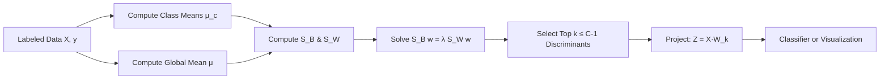

# Linear Discriminant Analysis (LDA)

> *"Finding the best angle to separate your classes — like adjusting a spotlight to tell friends apart."*

---

## Table of Contents

1. [What is LDA?](#what-is-lda)
2. [Mathematical Formulation](#mathematical-formulation)
3. [The C-1 Bound: Why LDA Has Limited Components](#the-c-1-bound-why-lda-has-limited-components)
4. [How LDA Works (Step-by-Step)](#how-lda-works-step-by-step)
5. [Worked Numerical Example](#worked-numerical-example)
6. [LDA as a Classifier](#lda-as-a-classifier)
7. [Key Assumptions](#key-assumptions)
8. [When to Use / When NOT to Use](#when-to-use--when-not-to-use)
9. [Implementation Guide](#implementation-guide)
10. [Advanced Variants](#advanced-variants)
11. [Comparison with Other Methods](#comparison-with-other-methods)
12. [Interview Questions](#interview-questions)
13. [Quick Reference](#quick-reference)
14. [References](#references)

---

## What is LDA?

### The Spotlight Analogy

Imagine you're in a dark room with three groups of people standing in different clusters. You shine a flashlight at the floor to cast their shadows. Most angles create overlapping shadows — you can't tell the groups apart. LDA finds the **one perfect angle** where the shadows of each group are as far apart as possible, with minimal overlap within each group.

That "perfect angle" is the **Linear Discriminant** — a new axis in the data space that maximizes class separability.

### Supervised Dimensionality Reduction

LDA is **supervised** — it uses class labels during training. This is the key difference from PCA, which is unsupervised:

- **PCA**: Find directions of maximum variance (ignoring labels)
- **LDA**: Find directions of maximum class separation (using labels)

### Two Roles of LDA

1. **Dimensionality reduction**: Project data to a lower-dimensional space that separates classes
2. **Classifier**: Predict class labels for new data points using a linear decision boundary

---

## Mathematical Formulation

### The Fisher Criterion

LDA finds the projection vector $w$ that maximizes the ratio:

$$J(w) = \frac{w^T S_B w}{w^T S_W w}$$

| Symbol | Meaning |
|--------|---------|
| $S_B$ | Between-class scatter matrix |
| $S_W$ | Within-class scatter matrix |
| $w$ | Projection direction (discriminant) |

**Intuition:** We want $w$ that makes the numerator **large** (classes far apart) and denominator **small** (each class tightly packed).

### Scatter Matrices

For $C$ classes, with $n_c$ samples in class $c$:

**Within-class scatter** (sum of covariances of each class):

$$S_W = \sum_{c=1}^C \sum_{i \in c} (x_i - \mu_c)(x_i - \mu_c)^T$$

**Between-class scatter** (weighted sum of distances from class means to global mean):

$$S_B = \sum_{c=1}^C n_c (\mu_c - \mu)(\mu_c - \mu)^T$$

| Symbol | Meaning |
|--------|---------|
| $\mu_c$ | Mean vector of class $c$ |
| $\mu$ | Global mean vector of all data |
| $n_c$ | Number of samples in class $c$ |
| $C$ | Total number of classes |

### Generalized Eigenvalue Problem

Maximizing the Fisher criterion $J(w)$ leads to:

$$S_B w = \lambda S_W w$$

This is a **generalized eigenvalue problem**. The eigenvectors corresponding to the largest eigenvalues are the Linear Discriminants — the directions that best separate the classes.

### Projection

$$Z = X_{\text{centered}} \cdot W_k$$

where $W_k$ contains the top $k$ discriminant vectors as columns.

### Connection to Bayes' Theorem

LDA has a probabilistic interpretation: it assumes each class $c$ has a Gaussian distribution $\mathcal{N}(\mu_c, \Sigma)$ with a **shared covariance matrix** $\Sigma$. The posterior probability of class $c$ given $x$ is:

$$P(c|x) = \frac{\pi_c \cdot \exp\left(-\frac{1}{2}(x - \mu_c)^T \Sigma^{-1} (x - \mu_c)\right)}{\sum_{k=1}^C \pi_k \cdot \exp\left(-\frac{1}{2}(x - \mu_k)^T \Sigma^{-1} (x - \mu_k)\right)}$$

where $\pi_c$ is the prior probability of class $c$. The decision boundary between any two classes is **linear** — hence the name Linear Discriminant Analysis.

---

## The C-1 Bound: Why LDA Has Limited Components

LDA can produce at most $C-1$ discriminant components. Here's why:

The between-class scatter matrix $S_B$ is a sum of $C$ rank-1 matrices (one per class mean). However, these $C$ mean vectors sum to the global mean:

$$\sum_{c=1}^C n_c \mu_c = n \mu$$

This means the $C$ vectors $\mu_c - \mu$ are linearly dependent — any one is a linear combination of the other $C-1$. Therefore, $S_B$ has rank at most $C-1$.

Since the solution to $S_B w = \lambda S_W w$ depends on $S_B$, there are at most $C-1$ non-zero eigenvalues and $C-1$ meaningful discriminant directions.

**Example:**
- 2 classes → at most 1 LDA component (a single axis separating the two groups)
- 3 classes → at most 2 LDA components (a plane separating three groups)
- 10 classes → at most 9 LDA components

This bound applies regardless of how many original features there are. Even with 1000 features, a 3-class problem gives at most 2 LDA dimensions.

---

## How LDA Works (Step-by-Step)

| Step | Action | Why |
|------|--------|-----|
| **1. Compute class means** | $\mu_c$ for each class $c$ | Find the center of each class |
| **2. Compute global mean** | $\mu$ of all data | Reference point for between-class scatter |
| **3. Compute $S_W$** | Sum of (co)variances within each class | Measures how spread out each class is |
| **4. Compute $S_B$** | Weighted distances from $\mu_c$ to $\mu$ | Measures how separated the classes are |
| **5. Solve $S_B w = \lambda S_W w$** | Generalized eigenvalue problem | Find directions maximizing $S_B / S_W$ |
| **6. Select top $k$ discriminants** | Keep $k \leq C-1$ eigenvectors | Reduce dimensions while preserving separation |
| **7. Project data** | $Z = X \cdot W_k$ | Get reduced representation |

---

## Worked Numerical Example

Let's walk through a simple 2D binary classification problem.

```
Class A: (1,2), (2,3), (3,3)
Class B: (7,6), (8,7), (9,8)
```

**Step 1: Class means**
- $\mu_A = (2.0, 2.67)$
- $\mu_B = (8.0, 7.0)$

**Step 2: Global mean**
- $\mu = (5.0, 4.83)$

**Step 3: Within-class scatter $S_W$**

For class A: subtract mean from each point, sum outer products.
$$S_W^A = \begin{bmatrix} 2.0 & 1.0 \\ 1.0 & 0.67 \end{bmatrix}$$

For class B:
$$S_W^B = \begin{bmatrix} 2.0 & 1.0 \\ 1.0 & 0.67 \end{bmatrix}$$

Total $S_W = S_W^A + S_W^B = \begin{bmatrix} 4.0 & 2.0 \\ 2.0 & 1.34 \end{bmatrix}$

**Step 4: Between-class scatter $S_B$**
$$S_B = 3 \cdot (\mu_A - \mu)(\mu_A - \mu)^T + 3 \cdot (\mu_B - \mu)(\mu_B - \mu)^T$$

$$S_B = \begin{bmatrix} 54.0 & 39.0 \\ 39.0 & 28.2 \end{bmatrix}$$

**Step 5: Solve $S_B w = \lambda S_W w$**

The top eigenvector is approximately $w = [0.86, 0.51]^T$.

**Step 6: Project data**

$Z = X \cdot w$ gives:
- Class A: ~2.31, ~3.21, ~4.07
- Class B: ~9.08, ~10.35, ~11.62

The two classes are now well-separated along a single axis. The within-class variance is small; the between-class distance is large.

---

## LDA as a Classifier

LDA can classify new points without an additional model. For a new point $x_{\text{new}}$:

1. Project onto the discriminant axis (if using reduction)
2. Compute the **discriminant function** for each class $c$:

$$\delta_c(x) = x^T \Sigma^{-1} \mu_c - \frac{1}{2} \mu_c^T \Sigma^{-1} \mu_c + \log \pi_c$$

3. Predict the class with the highest $\delta_c(x)$

This is equivalent to computing the posterior probability $P(c|x)$ and picking the maximum. The decision boundary is **linear** — a straight line (or hyperplane in higher dimensions).

### Decision Boundary Geometry

For two classes, the decision boundary is where $P(c_1|x) = P(c_2|x)$:

$$x^T \Sigma^{-1} (\mu_1 - \mu_2) = \frac{1}{2} (\mu_1 + \mu_2)^T \Sigma^{-1} (\mu_1 - \mu_2) + \log \frac{\pi_2}{\pi_1}$$

This is a **linear equation** in $x$ — a hyperplane.

---

## Key Assumptions

| Assumption | What It Means | What Breaks It |
|---|---|---|
| **Normality** | Each class follows a Gaussian distribution | Non-Gaussian data (e.g., multimodal classes) |
| **Equal covariance** | All classes share the same $\Sigma$ | Classes with very different spreads |
| **Independence** | Features are not perfectly correlated | Multicollinearity causes numerical instability |
| **Sufficient samples** | $n > p$ (more samples than features) | High-dimensional data ($p \gg n$) — use Regularized LDA |
| **Class balance** | Priors $\pi_c$ are reasonable | Extreme imbalance can bias the boundary |

### Robustness

LDA is **fairly robust** to mild violations of normality and equal covariance. However:

| Violation | Effect |
|-----------|--------|
| Mild non-normality | Decision boundary still approximately correct |
| Unequal covariances | Decision boundary slightly off; use QDA instead |
| Multicollinearity | $S_W$ becomes singular; use shrinkage or PLS first |
| High-dimensional ($p \gg n$) | $S_W$ is singular; use Regularized LDA |

---

## When to Use / When NOT to Use

### Use LDA When:

| Scenario | Why |
|----------|-----|
| You have labeled class data | LDA is supervised — uses labels explicitly |
| Classes are approximately Gaussian | LDA's probabilistic model fits well |
| You want both reduction AND classification | Single model serves both purposes |
| You need a fast, interpretable baseline | Much simpler than neural networks |
| Feature count is moderate ($n > p$) | Standard LDA works well |
| Classes have similar spreads | Equal covariance assumption holds |

### Do NOT Use LDA When:

| Scenario | Why |
|----------|-----|
| You have no labels | LDA requires labels; use PCA |
| Data has complex non-linear boundaries | LDA is linear; use SVM with RBF kernel or neural nets |
| Classes have very different covariance shapes | Use QDA (quadratic discriminant) |
| You have more features than samples | $S_W$ is singular; use Regularized LDA |
| Data is highly imbalanced (10:1+) | Prior correction needed; boundary may be biased |
| You need more than $C-1$ components | LDA is fundamentally limited by the number of classes |

---

## Implementation Guide

### With Scikit-learn (Dimensionality Reduction)

```python
from sklearn.discriminant_analysis import LinearDiscriminantAnalysis
from sklearn.preprocessing import StandardScaler

# Scale features (important, just like PCA)
scaler = StandardScaler()
X_scaled = scaler.fit_transform(X_train)
X_test_scaled = scaler.transform(X_test)

# Apply LDA
lda = LinearDiscriminantAnalysis(n_components=2)
X_train_lda = lda.fit_transform(X_scaled, y_train)  # Note: y required!
X_test_lda = lda.transform(X_test_scaled)

# Explained variance ratio
print(lda.explained_variance_ratio_)
```

### With Scikit-learn (Classifier)

```python
# LDA as a classifier (no need to specify n_components)
clf = LinearDiscriminantAnalysis()
clf.fit(X_train_scaled, y_train)

# Predict
y_pred = clf.predict(X_test_scaled)
probs = clf.predict_proba(X_test_scaled)  # Posterior probabilities

# Decision boundary coefficients
print(clf.coef_)   # Shape: (n_classes, n_features)
print(clf.intercept_)
```

### Pipeline Integration

```python
from sklearn.pipeline import Pipeline
from sklearn.svm import SVC

pipe = Pipeline([
    ('scaler', StandardScaler()),
    ('lda', LinearDiscriminantAnalysis(n_components=2)),
    ('clf', SVC(kernel='linear'))
])

pipe.fit(X_train, y_train)
pipe.score(X_test, y_test)
```

### Interpreting LDA Components

```python
# Loadings — how each feature contributes to each discriminant
loadings = pd.DataFrame(
    lda.scalings_,
    index=feature_names,
    columns=[f'LD{i+1}' for i in range(lda.scalings_.shape[1])]
)

# Features with largest absolute loading on LD1 drive class separation
loadings['LD1'].abs().sort_values(ascending=False).head(10)
```

### Visualizing LDA Projection

```python
import matplotlib.pyplot as plt

X_lda = lda.fit_transform(X_scaled, y)
plt.scatter(X_lda[:, 0], X_lda[:, 1], c=y, cmap='tab10', edgecolors='k')
plt.xlabel('LD1')
plt.ylabel('LD2')
plt.title('LDA Projection')
plt.show()
```

---

## Advanced Variants

### Regularized LDA (RLDA)

When $n < p$ (more features than samples), $S_W$ is singular and cannot be inverted. RLDA adds a regularization term:

$$S_W' = S_W + \lambda I$$

where $\lambda$ is a shrinkage parameter. This makes $S_W$ invertible and stabilizes the solution. sklearn's `LinearDiscriminantAnalysis` with `shrinkage='auto'` implements this:

```python
lda = LinearDiscriminantAnalysis(solver='lsqr', shrinkage='auto')
```

### Quadratic Discriminant Analysis (QDA)

Relaxes the equal covariance assumption — each class gets its own covariance matrix $\Sigma_c$:

$$\delta_c(x) = -\frac{1}{2} \log |\Sigma_c| - \frac{1}{2} (x - \mu_c)^T \Sigma_c^{-1} (x - \mu_c) + \log \pi_c$$

The decision boundary becomes **quadratic** (curved). QDA is more flexible but requires more data (estimates $C$ covariance matrices instead of 1).

| Aspect | LDA | QDA |
|--------|-----|-----|
| Covariance | Shared $\Sigma$ | Per-class $\Sigma_c$ |
| Boundary | Linear | Quadratic |
| Parameters | $O(p^2)$ | $O(C \cdot p^2)$ |
| Data required | Less | More |
| Bias-variance | Higher bias, lower variance | Lower bias, higher variance |

### Diagonal LDA

Assumes a diagonal covariance matrix (independent features). Useful for high-dimensional data like text classification. Implemented as `sklearn.discriminant_analysis.LinearDiscriminantAnalysis` with `solver='eigen'`.

### Flexible Discriminant Analysis (FDA)

Extends LDA to non-linear boundaries using basis expansions (splines, kernels). Implemented in `sklearn` as part of the MDA (Mixture Discriminant Analysis) family.

### LDA for Multi-Class Classification

For $C > 2$, LDA finds $C-1$ discriminant axes and projects data into this $(C-1)$-dimensional subspace. Classification is done by computing the Mahalanobis distance to each class mean in this space:

$$\delta_c(x) = -\frac{1}{2} \|x - \mu_c\|_{\Sigma^{-1}}^2 + \log \pi_c$$

---

## Comparison with Other Methods

### LDA vs PCA

| Feature | PCA | LDA |
|---------|-----|-----|
| **Type** | Unsupervised | Supervised |
| **Uses Labels?** | No | Yes |
| **Goal** | Maximize variance | Maximize class separation |
| **Max Components** | $n_{\text{features}}$ | $n_{\text{classes}} - 1$ |
| **Assumes Gaussian?** | No | Yes |
| **Also a Classifier?** | No | Yes |
| **Linear?** | Yes | Yes |
| **Interpretability** | Loadings per PC | Loadings per LD (separation meaning) |

**When PCA outperforms LDA:** Unlabeled data, linearity only, variance matters more than class boundaries.

**When LDA outperforms PCA:** Labeled data, classification is the goal, classes are separable.

### LDA vs Logistic Regression

| Aspect | LDA | Logistic Regression |
|--------|-----|---------------------|
| **Model type** | Generative (models $P(x\|y)$) | Discriminative (models $P(y\|x)$) |
| **Assumptions** | Gaussian features, equal covariance | Fewer distributional assumptions |
| **Parameters** | $\mu_c, \Sigma, \pi_c$ | $\beta$ coefficients |
| **Multi-class** | Natural extension | Softmax (multinomial logistic) |
| **Efficiency** | Very fast | Fast |
| **Small sample** | Better (Gaussian prior helps) | Can overfit |

LDA converges to the true boundary faster with fewer samples when the Gaussian assumption holds. Logistic regression is more robust to distributional violations.

### LDA vs SVM

| Aspect | LDA | SVM (linear) |
|--------|-----|-------------|
| **Boundary** | Based on class means + covariance | Based on support vectors |
| **Objective** | Maximize Fisher ratio | Maximize margin |
| **Probabilities** | Natural ($P(c\|x)$) | Platt scaling needed |
| **Outliers** | Sensitive (means affected) | Robust (only SVs matter) |
| **Multi-class** | Natural | One-vs-one or one-vs-rest |

SVM typically has better accuracy on complex datasets. LDA is faster and provides calibrated probabilities.

### Comparison Table

| Method | Supervised? | Linear? | Max Components | Also Classifier? | Handles $p \gg n$? |
|--------|-------------|---------|---------------|-----------------|-------------------|
| **PCA** | No | Yes | $p$ | No | Yes (SVD) |
| **LDA** | Yes | Yes | $C-1$ | Yes | No (use RLDA) |
| **QDA** | Yes | No (quadratic) | $C-1$ | Yes | No |
| **Logistic Regression** | Yes | Yes | $C$ (one-hot) | Yes | Yes (with $L_1$/$L_2$) |
| **SVM (linear)** | Yes | Yes | $p$ | Yes | Yes |
| **t-SNE/UMAP** | No | No | 2–3 typical | No | Yes |

---

## Interview Questions

### Beginner

**Q1: What is the key difference between PCA and LDA?**

PCA is unsupervised — it maximizes total variance without using labels. LDA is supervised — it uses class labels to maximize class separation (ratio of between-class to within-class scatter). LDA is better for preprocessing before classification; PCA is better for general compression and noise reduction.

**Q2: What is the maximum number of LDA components for a problem with 4 classes and 50 features?**

Maximum = $C - 1 = 3$ components. This is because the between-class scatter matrix $S_B$ has rank at most $C-1$ — the class means lie in a $(C-1)$-dimensional subspace. No matter how many original features exist, LDA can extract at most $C-1$ meaningful discriminants.

**Q3: What are the main assumptions of LDA?**

1. **Normality**: Each class follows a Gaussian distribution
2. **Equal covariance**: All classes share the same covariance matrix
3. **Independence**: Features are not perfectly correlated (no multicollinearity)
4. **Sufficient samples**: Need more samples than features ($n > p$)

LDA is robust to mild violations but breaks under large violations.

**Q4: Can LDA be used for classification directly?**

Yes. LDA's probabilistic model computes $P(c|x)$ for each class via Bayes' theorem (assuming Gaussian class distributions with shared covariance). The decision boundary is linear. sklearn's `LinearDiscriminantAnalysis` includes both `predict()` and `predict_proba()`.

**Q5: When would you prefer LDA over PCA for dimensionality reduction?**

When class labels are available and classification is the goal. LDA often gives better downstream classification accuracy because it uses label information to preserve class separability. PCA may discard low-variance directions that are actually critical for class discrimination.

### Intermediate

**Q6: Explain the Fisher criterion mathematically. What does it optimize?**

$$J(w) = \frac{w^T S_B w}{w^T S_W w}$$

$S_B$ is the between-class scatter matrix (distance between class means). $S_W$ is the within-class scatter matrix (spread within each class). The criterion finds a projection direction $w$ that maximizes the ratio — making classes far apart while keeping each class tight. The solution is the generalized eigenvector $S_B w = \lambda S_W w$ with the largest eigenvalue.

**Q7: What happens when the equal covariance assumption of LDA is violated?**

The linear decision boundary becomes suboptimal. If classes have very different covariance structures:
- The Bayes optimal boundary becomes quadratic (curved)
- LDA's linear approximation will misclassify points near the boundary
- Solution: use **QDA** (Quadratic Discriminant Analysis), which learns a separate $\Sigma_c$ per class

**Q8: How does LDA relate to Bayes' theorem?**

LDA is a **generative classifier**: it models $P(x|y)$ (the class-conditional distribution) and uses Bayes' theorem to compute $P(y|x)$:

$$P(c|x) = \frac{P(x|c) \cdot P(c)}{P(x)}$$

where $P(x|c) \sim \mathcal{N}(\mu_c, \Sigma)$. The decision boundary is derived from the log-ratio of these posteriors, and because the covariance $\Sigma$ is shared, the log-ratio simplifies to a linear function of $x$ — hence the name Linear Discriminant Analysis.

**Q9: How does LDA handle multi-class problems?**

LDA finds $C-1$ discriminant axes (for $C$ classes). It projects data into this $(C-1)$-dimensional subspace, then classifies by computing the Mahalanobis distance to each class mean in this space:

$$\delta_c(x) = -\frac{1}{2} (x - \mu_c)^T \Sigma^{-1} (x - \mu_c) + \log \pi_c$$

The class with the largest $\delta_c(x)$ is predicted. This is equivalent to finding the nearest class mean in the whitened space.

**Q10: What is Regularized LDA and when would you use it?**

Regularized LDA (RLDA) adds a shrinkage term $\lambda I$ to the within-class scatter matrix:

$$S_W' = S_W + \lambda I$$

This makes $S_W$ invertible when $p > n$ (more features than samples) and stabilizes the solution in the presence of multicollinearity. Use RLDA when:
- $p \gg n$ (e.g., genomics with 20k genes but 100 samples)
- Features are highly correlated
- Standard LDA produces unstable results

### Advanced

**Q11: Derive LDA as a solution to maximizing the Fisher criterion. Show that it reduces to a generalized eigenvalue problem.**

We seek $w$ maximizing $J(w) = (w^T S_B w) / (w^T S_W w)$.

Take the derivative w.r.t. $w$ and set to zero:

$$\frac{\partial J}{\partial w} = \frac{2 S_B w (w^T S_W w) - 2 S_W w (w^T S_B w)}{(w^T S_W w)^2} = 0$$

$$S_B w (w^T S_W w) = S_W w (w^T S_B w)$$

Since $w^T S_W w$ and $w^T S_B w$ are scalars, let $\lambda = (w^T S_B w) / (w^T S_W w) = J(w)$:

$$S_B w = \lambda S_W w$$

This is a **generalized eigenvalue problem**. The $w$ that maximizes $J(w)$ is the eigenvector corresponding to the largest generalized eigenvalue $\lambda$.

**Q12: Prove that LDA can extract at most $C-1$ features.**

$S_B = \sum_{c=1}^C n_c (\mu_c - \mu)(\mu_c - \mu)^T$ where $\mu = \frac{1}{n} \sum_{c=1}^C n_c \mu_c$.

The $C$ vectors $\mu_c - \mu$ sum to zero:

$$\sum_{c=1}^C n_c (\mu_c - \mu) = \sum n_c \mu_c - n\mu = n\mu - n\mu = 0$$

Thus $\mu_C - \mu = -\frac{1}{n_C} \sum_{c=1}^{C-1} n_c (\mu_c - \mu)$ — any one vector is a linear combination of the other $C-1$. So the set $\{\mu_c - \mu\}_{c=1}^C$ spans at most a $(C-1)$-dimensional space.

Since $S_B$ is a sum of $C$ rank-1 matrices built from these vectors, $\text{rank}(S_B) \leq C-1$. The generalized eigenvalue problem $S_B w = \lambda S_W w$ has at most $C-1$ non-zero eigenvalues, hence at most $C-1$ meaningful discriminant directions.

**Q13: How does LDA compare to logistic regression in terms of efficiency and assumptions?**

LDA is a **generative** model (models $P(x|y)$); logistic regression is a **discriminative** model (models $P(y|x)$ directly).

| Aspect | LDA | Logistic Regression |
|--------|-----|---------------------|
| Assumptions | Gaussian $x\|y$, equal covariance | Fewer (only linear log-odds) |
| Parameters | $Cp + p(p+1)/2$ | $p$ (for binary) |
| Asymptotic accuracy | Worse if assumptions violated | Better with enough data |
| Small sample | Better (prior information from Gaussian) | Can overfit |
| Computational cost | Closed-form (eigendecomposition) | Iterative (IRLS) |

**Efron's theorem (1975):** LDA can require 3x fewer parameters than logistic regression to achieve the same error when the Gaussian assumption holds. But logistic regression is more robust when it doesn't.

**Q14: What is the difference between LDA and QDA, and when would you choose each?**

LDA assumes a **shared** covariance matrix $\Sigma$ for all classes. QDA allows each class its own $\Sigma_c$.

| Criterion | LDA | QDA |
|-----------|-----|-----|
| Decision boundary | Linear | Quadratic |
| Parameters | $O(p^2)$ | $O(C \cdot p^2)$ |
| Data required | Moderate | More (estimates $C$ covariances) |
| Bias | Higher (assumes equal $\Sigma$) | Lower (flexible) |
| Variance | Lower | Higher |

**Choose LDA when:** Classes have similar spread, or you have limited data.

**Choose QDA when:** Classes have clearly different covariance structures, and you have enough data to estimate $C$ covariance matrices reliably.

**Q15: How would you use LDA for feature selection?**

LDA components (discriminants) are linear combinations of original features. The **loadings** (coefficients) indicate feature importance for class separation:

```python
# Feature importance = sum of absolute loadings across discriminants
feature_importance = np.sum(np.abs(lda.scalings_), axis=1)
top_features = np.argsort(feature_importance)[-10:]  # Top 10
```

However, this measures contribution to class separation, not individual feature quality. For true feature selection, consider:
- **Forward selection**: Add features one at a time, measure LDA accuracy
- **Regularized LDA with $L_1$**: Some coefficients become zero (feature elimination)
- **ANOVA F-test**: Univariate feature ranking before LDA

### Quick Reference Questions

| Question | One-Sentence Answer |
|---|---|
| What does LDA do? | Finds linear projections that maximize class separation |
| PCA vs LDA? | PCA = max variance (unsupervised); LDA = max separation (supervised) |
| Max LDA components? | At most $C-1$ (number of classes minus one) |
| LDA assumptions? | Gaussian classes, equal covariance, $n > p$ |
| LDA as classifier? | Yes — computes $P(c|x)$ via Bayes' theorem |
| When to use QDA instead? | When classes have different covariance shapes |
| What is Regularized LDA? | Adds shrinkage to $S_W$ for $p \gg n$ problems |
| LDA vs Logistic Regression? | LDA: generative, Gaussian assumption. Logistic: discriminative, robust |
| What does Fisher criterion maximize? | Ratio of between-class to within-class scatter |
| How to interpret LDA components? | Loadings show feature contribution to class separation |

---

## My Understanding

LDA clicked for me when I understood the Fisher criterion as a simple ratio: "distance between class centers divided by spread within each class." It's like designing a zoom lens that makes groups look as far apart as possible while keeping each group in sharp focus. The $C-1$ bound surprised me at first, but the proof is elegant: the between-class scatter matrix is built from $C$ mean vectors that sum to zero, so they span at most $C-1$ dimensions. The connection to Bayes' theorem also helped — LDA isn't just a geometric trick; it's a full probabilistic model that assumes Gaussian classes with shared covariance. This means it naturally gives class probabilities, not just a decision boundary.

## How I Use These Methods

When I have labeled data and classification is the goal, LDA is my first choice for dimensionality reduction. It often beats PCA + classifier on the same data because it explicitly optimizes for class separation. I always standardize first (same as PCA), and I check the explained variance ratio to see how many discriminants are actually useful. For high-dimensional data where $p > n$ (like text or genomics), I use Regularized LDA with shrinkage. For binary classification, the single LDA component gives a clean 1D projection that I can threshold and explain to stakeholders. When classes have very different covariance structures, I switch to QDA.

## Visual Summary



---

## Quick Reference

| Property | Detail |
|---|---|
| **Type** | Supervised, linear dimensionality reduction + classifier |
| **Max Components** | $C-1$ (classes minus one) |
| **Assumptions** | Gaussian classes, equal covariance, $n > p$ |
| **Strengths** | Fast, interpretable, closed-form, provides probabilities |
| **Limitations** | Linear boundary, limited components, assumes equal covariance |
| **sklearn Class** | `sklearn.discriminant_analysis.LinearDiscriminantAnalysis` |
| **Key Parameters** | `n_components`, `solver` ('svd', 'lsqr', 'eigen'), `shrinkage` |
| **Must-Do Before** | `StandardScaler` — always, as with PCA |
| **Related Methods** | PCA, QDA, Regularized LDA, Logistic Regression, SVM |

---

## References

### Papers
1. **Fisher, R.A. (1936)**: *The Use of Multiple Measurements in Taxonomic Problems.* Annals of Eugenics — the original LDA paper
2. **Rao, C.R. (1948)**: *The Utilization of Multiple Measurements in Problems of Biological Classification.* — Multi-class LDA extension

### Books
3. **Pattern Recognition and Machine Learning** — Bishop. Chapter 4 (Linear Models for Classification)
4. **The Elements of Statistical Learning** — Hastie, Tibshirani, Friedman. Chapter 4 (Linear Methods for Classification)
5. **Machine Learning: A Probabilistic Perspective** — Murphy. Chapter 4 (Gaussian Models)

### Documentation
6. **Scikit-learn LDA/QDA Documentation**: [Link](https://scikit-learn.org/stable/modules/lda_qda.html)
7. **Scikit-learn LDA API**: [Link](https://scikit-learn.org/stable/modules/generated/sklearn.discriminant_analysis.LinearDiscriminantAnalysis.html)

### Videos
8. **StatQuest — LDA Clearly Explained**: [YouTube](https://www.youtube.com/watch?v=azXCzI57Yfc)
9. **StatQuest — QDA Clearly Explained**: [YouTube](https://www.youtube.com/watch?v=Yr36e2E48B0)

### Comparisons
10. **LDA vs Logistic Regression** — Efron, B. (1975). *The Efficiency of Logistic Regression Compared to Normal Discriminant Analysis.* JASA.
