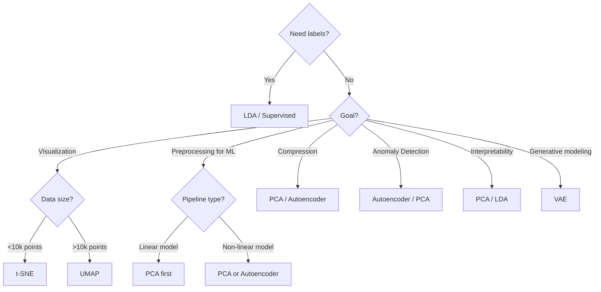
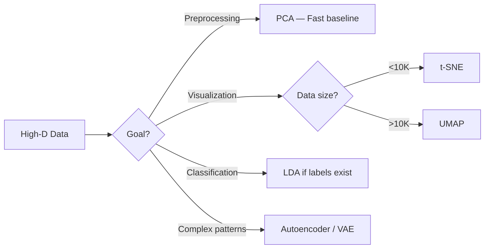

# Dimensionality Reduction

Reducing the number of features while keeping the most important information.

---

## Table of Contents

1. [What is Dimensionality Reduction?](#what-is-dimensionality-reduction)
2. [The Curse of Dimensionality](#the-curse-of-dimensionality)
3. [Types of Dimensionality Reduction](#types-of-dimensionality-reduction)
4. [Techniques Deep Dive](#techniques-deep-dive)
   - [PCA (Principal Component Analysis)](#pca-principal-component-analysis)
   - [t-SNE (t-distributed Stochastic Neighbor Embedding)](#t-sne-t-distributed-stochastic-neighbor-embedding)
   - [UMAP (Uniform Manifold Approximation and Projection)](#umap-uniform-manifold-approximation-and-projection)
   - [Autoencoders & VAE](#autoencoders--vae)
   - [LDA (Linear Discriminant Analysis)](#lda-linear-discriminant-analysis)
5. [Comparison Table](#comparison-table)
6. [When to Use Which?](#when-to-use-which)
7. [Production Considerations](#production-considerations)
8. [Mathematical Foundations](#mathematical-foundations)
9. [Interview Questions](#interview-questions)
10. [References & Further Reading](#references--further-reading)

---

## What is Dimensionality Reduction?

Dimensionality reduction is the process of converting data with many features (high-dimensional) into a representation with fewer features (low-dimensional) while preserving as much meaningful structure as possible.

### Intuition / Analogies

**Packing a Suitcase (Beginner):** You have 20 items of clothing but your bag fits only 10. You pick the most important and versatile clothes — those that cover the most scenarios. Dimensionality reduction similarly picks/compresses the most informative features.

**Book Summary:** Instead of reading every page of a 500-page book, you read a 5-page summary. The essence is preserved; details are dropped.

**Shadow of a 3D Object:** A 3D sphere casts a 2D shadow — a circle. The 3D → 2D projection loses the depth axis but preserves the circular shape. Different lighting angles (projection directions) produce different shadows; we want the shadow that best reveals the object's structure.

**Photograph of a Mountain Range:** A 2D photo of a 3D landscape loses elevation data, but you can still identify ridges, valleys, and peaks. Dimensionality reduction does the same — it projects high-dimensional data into 2D or 3D for human interpretation.

### Formal Definition

Given a dataset $X \in \mathbb{R}^{n \times d}$ (n samples, d features), dimensionality reduction finds a transformation $f: \mathbb{R}^d \to \mathbb{R}^k$ where $k \ll d$, producing $Z \in \mathbb{R}^{n \times k}$ such that the information loss is minimized:

$$Z = f(X)$$

The optimal transformation $f$ depends on the technique and the definition of "information" (variance, neighborhood structure, class separability, etc.).

### Why Reduce Dimensions?

| Reason | Explanation |
|--------|-------------|
| **Combat the Curse of Dimensionality** | As dimensions increase, data becomes sparse; distance metrics break down; models require exponentially more samples |
| **Reduce Overfitting** | Fewer features → fewer parameters → simpler models that generalize better |
| **Speed Up Training** | Less data to process → faster training and inference |
| **Visualization** | Humans can only perceive 2D/3D; reduce to these dimensions for plotting |
| **Denoising** | Low-variance dimensions often contain noise; removing them improves SNR |
| **Feature Engineering** | Reduced features can be used as input to downstream models |
| **Storage Efficiency** | Less memory required to store transformed data |

---

## The Curse of Dimensionality

The Curse of Dimensionality (Bellman, 1961) refers to various phenomena that arise when analyzing data in high-dimensional spaces that do not occur in low-dimensional settings.

### Key Effects

1. **Sparsity:** Data points become exponentially far apart as dimensions increase. In 1D, 100 points densely cover [0,1]; in 100D, they're lost in an empty hypercube.

2. **Distance Concentration:** In high dimensions, the ratio of nearest-neighbor distance to farthest-neighbor distance approaches 1. Distances become meaningless.

   > For i.i.d. random data in $\mathbb{R}^d$:
   > $$\frac{\text{dist}_{\text{max}} - \text{dist}_{\text{min}}}{\text{dist}_{\text{min}}} \to 0 \text{ as } d \to \infty$$

3. **Volume Explosion:** The volume of a unit hypercube grows exponentially. Sampling a d-dimensional space requires $n \propto (1/\epsilon)^d$ points for a fixed density.

4. **Overfitting Risk:** With $d$ binary features, there are $2^d$ possible combinations; most will be unobserved at any reasonable sample size.

> **Intuition:** Imagine a 1D line of length 1. You need 10 evenly spaced points to cover it. In 2D, you need 100 points (10x10 grid). In 3D, 1000 points. In d-dimensions: $10^d$ points. This exponential explosion is the curse.

### Mitigation via Dimensionality Reduction

DR techniques are the primary weapon against the curse. By projecting data onto a lower-dimensional manifold (the **Manifold Hypothesis** — see below), we side-step the sparsity problem.

---

## Types of Dimensionality Reduction

### 1. Feature Selection
Select a subset of the *original* features based on importance criteria.

- **Filter Methods:** Variance threshold, correlation, mutual information
- **Wrapper Methods:** Recursive Feature Elimination (RFE), forward/backward selection
- **Embedded Methods:** Lasso (L1 regularization), tree-based feature importance

**Pros:** Interpretable (features remain in original units). **Cons:** May discard feature interactions.

### 2. Feature Extraction
Project or transform original features into a new, lower-dimensional space.

- **Linear Methods:** PCA, LDA, Factor Analysis
- **Non-Linear Methods:** t-SNE, UMAP, Autoencoders, Kernel PCA, Isomap, LLE

**Pros:** Captures complex interactions. **Cons:** New features may lack interpretability.

---

## Techniques Deep Dive

---

### PCA (Principal Component Analysis)

**Type:** Linear, Unsupervised, Feature Extraction

**Core Idea:** Find orthogonal directions (principal components) that maximize the variance of the projected data. The first PC captures the most variance, the second captures the most remaining variance orthogonal to the first, and so on.

#### Mathematical Formulation (Professor-Level)

1. **Center the data** (mean-subtract):
   $$\tilde{X} = X - \mu \quad \text{where } \mu = \frac{1}{n}\sum_{i=1}^n x_i$$

2. **Compute covariance matrix:**
   $$S = \frac{1}{n-1} \tilde{X}^T \tilde{X} \in \mathbb{R}^{d \times d}$$

3. **Eigendecomposition:**
   $$S v_i = \lambda_i v_i \quad \text{for } i=1,\dots,d$$
   where $\lambda_1 \geq \lambda_2 \geq \dots \geq \lambda_d \geq 0$ are eigenvalues and $v_i$ are eigenvectors (principal components).

4. **Project onto top-k eigenvectors:**
   $$Z = \tilde{X} V_k \in \mathbb{R}^{n \times k}$$
   where $V_k = [v_1, v_2, \dots, v_k]$.

**Equivalently**, PCA can be derived via SVD of $\tilde{X}$:
$$\tilde{X} = U \Sigma V^T$$
The principal components $V$ are the right singular vectors, and the projected data is $Z = U_k \Sigma_k$.

#### Explained Variance Ratio

The proportion of total variance explained by the first $k$ components:
$$\text{Explained Variance} = \frac{\sum_{i=1}^k \lambda_i}{\sum_{i=1}^d \lambda_i}$$

**Rule of Thumb:** Choose $k$ such that explained variance $\geq 0.90$ or $0.95$.

#### Key Assumptions

- Features are linearly correlated
- Principal components are orthogonal
- PCA is sensitive to feature scaling (always standardize first!)
- Assumes Gaussian-like data (variance = information)

#### Code Example

```python
import numpy as np
from sklearn.decomposition import PCA
from sklearn.preprocessing import StandardScaler

# Standardize (critical!)
X_std = StandardScaler().fit_transform(X)

# PCA
pca = PCA(n_components=2)      # reduce to 2D
Z = pca.fit_transform(X_std)   # (n_samples, 2)

# Explained variance
print(pca.explained_variance_ratio_)  # [0.72, 0.18] for example
print(f"Total variance retained: {sum(pca.explained_variance_ratio_):.2%}")

# Get components
components = pca.components_  # shape (2, d)
```

#### Pros & Cons

| Pros | Cons |
|------|------|
| Fast, deterministic, closed-form solution | Assumes linear relationships |
| Scales to large datasets (via SVD) | Sensitive to outliers |
| Decorrelates features | Hard to interpret components |
| Excellent preprocessing step | Assumes variance = information |

#### Common Pitfalls

- ❌ Applying PCA without standardization
- ❌ Using PCA on categorical data
- ❌ Assuming PCA preserves cluster structure (it doesn't — it maximizes variance, not separability)
- ❌ Throwing away low-variance components that may be important for downstream tasks

---

### t-SNE (t-distributed Stochastic Neighbor Embedding)

**Type:** Non-Linear, Unsupervised, Feature Extraction (Visualization)

**Core Idea:** Preserve pairwise similarities between points. In high dimensions, similarity is Gaussian. In low dimensions, similarity is Student-t (heavy-tailed). Minimize the KL divergence between the two distributions.

#### Mathematical Intuition

1. **High-dimensional affinities** (Gaussian kernel):
   $$p_{j|i} = \frac{\exp(-\|x_i - x_j\|^2 / 2\sigma_i^2)}{\sum_{k \neq i} \exp(-\|x_i - x_k\|^2 / 2\sigma_i^2)}$$
   where $\sigma_i$ is set by the **perplexity** hyperparameter (typically 5–50).

2. **Symmetric joint distribution:**
   $$p_{ij} = \frac{p_{i|j} + p_{j|i}}{2n}$$

3. **Low-dimensional affinities** (Student-t with 1 df, i.e., Cauchy):
   $$q_{ij} = \frac{(1 + \|y_i - y_j\|^2)^{-1}}{\sum_{k \neq l} (1 + \|y_k - y_l\|^2)^{-1}}$$

4. **Cost function** (KL divergence):
   $$C = KL(P \| Q) = \sum_{i \neq j} p_{ij} \log \frac{p_{ij}}{q_{ij}}$$

The heavy-tailed Student-t distribution in low dimensions prevents the "crowding problem" — moderate distances in high-dim end up as large distances in the embedding, preventing points from collapsing.

#### Key Concepts

- **Perplexity:** Balances local vs. global structure. Low perplexity (5–10): focuses on very local neighborhoods. High perplexity (30–50): considers broader structure.
- **Crowding Problem:** In high dimensions, many points are equidistant. t-SNE uses the t-distribution to "stretch" moderate distances, resolving crowding.
- **KL Divergence is asymmetric:** $KL(P\|Q)$ penalizes putting points close when they're far (small $q_{ij}$ but large $p_{ij}$), but less so the reverse. So t-SNE preserves local structure at the expense of global structure.

#### Code Example

```python
from sklearn.manifold import TSNE

# t-SNE (use on reduced data for speed, e.g., PCA-50 first)
Z = TSNE(n_components=2, perplexity=30, random_state=42).fit_transform(X)

# Tips:
# - PCA pre-reduce to 30-50 dimensions for speed
# - perplexity should be < n_samples / 3
# - run multiple times with different random seeds
```

#### Pros & Cons

| Pros | Cons |
|------|------|
| Great for spotting patterns visually | Non-deterministic (different runs give different results) |
| Preserves local structure very well | Does NOT preserve distances/densities |
| Captures non-linear manifolds | Global structure may be meaningless |
| One of the best tools for 2D/3D visualization | Very slow on large datasets (O(n²)) |
| | Perplexity tuning required |
| | Not suitable as preprocessing for ML |

#### Critical Warnings

- t-SNE **does not preserve global structure**. Cluster sizes and distances between clusters are meaningless.
- The objective is non-convex; different runs produce different embeddings. Always run multiple times and check consistency.
- t-SNE cannot embed new data points (transductive, not inductive). Use parametric t-SNE or UMAP for out-of-sample extension.
- Sample size < 10,000 for practical use (beyond that, use Barnes-Hut approximation or UMAP).

---

### UMAP (Uniform Manifold Approximation and Projection)

**Type:** Non-Linear, Unsupervised, Feature Extraction

**Core Idea:** UMAP assumes data is uniformly sampled on a low-dimensional manifold. It constructs a fuzzy topological representation of the data in high dimensions, then finds a low-dimensional embedding that is as topologically similar as possible.

#### Mathematical High-Level

1. **Build a weighted k-nearest neighbor graph** in the original space.
2. **Convert to a fuzzy simplicial set** (a topological representation). Local connectivity is determined by the distance to the k-th nearest neighbor.
3. **Optimize the low-dimensional embedding** to minimize cross-entropy between the high- and low-dimensional fuzzy set representations:
   $$C = \sum_{i \neq j} \left[ p_{ij} \log \frac{p_{ij}}{q_{ij}} + (1 - p_{ij}) \log \frac{1 - p_{ij}}{1 - q_{ij}} \right]$$

Unlike t-SNE's KL divergence, UMAP's cross-entropy preserves both local (first term) and global (second term) structure.

#### UMAP vs t-SNE

| Aspect | t-SNE | UMAP |
|--------|-------|------|
| **Speed** | Slow (O(n²)) | Fast (O(n log n)) |
| **Global structure** | Poor | Better |
| **Determinism** | No | Approx. yes (with fixed seed) |
| **Embedding size** | Any | Any |
| **Out-of-sample** | No (need param. variant) | Yes (via `transform()`) |
| **Hyperparameters** | perplexity, learning rate | n_neighbors, min_dist |

#### Code Example

```python
import umap

# UMAP can handle high-d directly
reducer = umap.UMAP(n_neighbors=15, min_dist=0.1, random_state=42)
Z = reducer.fit_transform(X)

# Can also transform new data
Z_new = reducer.transform(X_new)
```

#### Pros & Cons

| Pros | Cons |
|------|------|
| Fast — scales to millions of points | Less established than t-SNE |
| Preserves global structure better | Sensitive to n_neighbors parameter |
| Inductive (can transform new data) | Theoretical foundations are complex |
| More deterministic than t-SNE | |
| Embeddings often comparable or better than t-SNE | |

---

### Autoencoders & VAE

**Type:** Non-Linear, Unsupervised, Feature Extraction (Neural Network)

#### Autoencoder

An autoencoder is a neural network trained to reconstruct its input. It consists of:
- **Encoder:** $f_\phi: \mathbb{R}^d \to \mathbb{R}^k$ (compresses)
- **Decoder:** $g_\theta: \mathbb{R}^k \to \mathbb{R}^d$ (reconstructs)
- **Bottleneck (latent space):** $z = f_\phi(x)$ — this is the reduced representation

**Loss function** (reconstruction error):
$$\mathcal{L} = \frac{1}{n} \sum_{i=1}^n \|x_i - g_\theta(f_\phi(x_i))\|^2$$

**Architecture choices:**
- Hidden layers can be wider than input for non-linear compression
- Linear autoencoder (no activations) learns PCA exactly
- Stacked/Deep autoencoders learn hierarchical features

#### Variational Autoencoder (VAE)

A generative model that learns a **probabilistic** latent space. Instead of encoding a point, VAE encodes a distribution:

$$z \sim \mathcal{N}(\mu_\phi(x), \sigma_\phi^2(x) I)$$

**Loss (ELBO — Evidence Lower Bound):**
$$\mathcal{L} = \underbrace{\mathbb{E}_{q_\phi(z|x)}[\log p_\theta(x|z)]}_{\text{Reconstruction}} - \underbrace{D_{KL}(q_\phi(z|x) \| p(z))}_{\text{KL Regularization}}$$

- Reconstruction term: decoder must reconstruct well
- KL term: latent distribution should be close to prior $\mathcal{N}(0, I)$
- The balance is controlled by $\beta$ in $\beta$-VAE

#### Why Use Autoencoders for DR?

- Non-linear (captures complex manifolds)
- Extremely flexible (many architectures)
- Inductive (transform new data)
- Can be very deep, learning hierarchies of features
- VAEs give a probabilistic latent space (uncertainty estimates)

#### Code Example

```python
import torch
import torch.nn as nn

class Autoencoder(nn.Module):
    def __init__(self, d, k):
        super().__init__()
        self.encoder = nn.Sequential(
            nn.Linear(d, 64), nn.ReLU(),
            nn.Linear(64, 32), nn.ReLU(),
            nn.Linear(32, k),              # bottleneck
        )
        self.decoder = nn.Sequential(
            nn.Linear(k, 32), nn.ReLU(),
            nn.Linear(32, 64), nn.ReLU(),
            nn.Linear(64, d),
        )

    def forward(self, x):
        z = self.encoder(x)
        return self.decoder(z), z

# Train on reconstruction loss (MSE)
model = Autoencoder(d=784, k=32)
optimizer = torch.optim.Adam(model.parameters())
for x in dataloader:
    x_hat, _ = model(x)
    loss = nn.MSELoss()(x_hat, x)
    loss.backward(); optimizer.step()

# Extract embeddings after training
_, embeddings = model(X)
```

#### Pros & Cons

| Pros | Cons |
|------|------|
| Non-linear, powerful representations | Requires lots of data |
| Flexible architecture | Hard to train (hyperparameters, overfitting) |
| Inductive | Not as interpretable as PCA |
| VAEs give probabilistic latents | Can overfit to reconstruction without learning useful features |

---

### LDA (Linear Discriminant Analysis)

**Type:** Linear, **Supervised**, Feature Extraction

**Core Idea:** Find the directions that **maximize class separability**. Unlike PCA which maximizes variance, LDA maximizes the ratio of between-class scatter to within-class scatter.

#### Mathematical Formulation

Define:
- **Between-class scatter matrix:** $S_B = \sum_{c=1}^C n_c (\mu_c - \mu)(\mu_c - \mu)^T$
- **Within-class scatter matrix:** $S_W = \sum_{c=1}^C \sum_{i \in c} (x_i - \mu_c)(x_i - \mu_c)^T$

LDA finds projection $w$ that maximizes the **Fisher criterion**:
$$J(w) = \frac{w^T S_B w}{w^T S_W w}$$

This is a generalized eigenvalue problem: $S_B w = \lambda S_W w$.

**Key constraint:** LDA can find at most $C-1$ dimensions (for $C$ classes). So for binary classification, LDA gives at most 1 dimension.

#### LDA vs PCA

| Aspect | PCA | LDA |
|--------|-----|-----|
| **Supervision** | Unsupervised | Supervised |
| **Goal** | Maximize variance | Maximize class separability |
| **Max components** | $d$ | $C-1$ |
| **Best for** | Reconstruction, compression | Classification preprocessing |
| **Label requirement** | None | Requires labels |

#### Code Example

```python
from sklearn.discriminant_analysis import LinearDiscriminantAnalysis

lda = LinearDiscriminantAnalysis(n_components=1)  # max = C-1
Z = lda.fit_transform(X, y)

# Explained variance-like ratio
print(lda.explained_variance_ratio_)
```

#### Pros & Cons

| Pros | Cons |
|------|------|
| Supervised → better for classification | Requires labels |
| Simple, fast | Assumes Gaussian per class, shared covariance |
| Interpretable directions | At most C-1 components |
| Works well when classes are well-separated | Sensitive to outliers |

---

## Comparison Table

| Method | Type | Linear? | Supervised? | # Components | Scalability | Preserves | Best Use Case |
|--------|------|---------|-------------|-------------|-------------|-----------|---------------|
| **PCA** | Extraction | Yes | No | Unlimited ($\leq d$) | Very high | Global variance | Preprocessing, compression |
| **t-SNE** | Extraction | No | No | 2-3 typical | Low (O(n²)) | Local structure | Visualization |
| **UMAP** | Extraction | No | No | Unlimited | High (O(n log n)) | Local + global | Visualization + general DR |
| **Autoencoder** | Extraction | No | No | Unlimited | Moderate | Reconstruction | Complex non-linear DR |
| **VAE** | Extraction | No | No | Unlimited | Moderate | Probabilistic reconstruction | Generative modeling + DR |
| **LDA** | Extraction | Yes | Yes | $\leq C-1$ | High | Class separability | Preprocessing for classification |

---

## When to Use Which?



### Practical Guidelines

- **Start with PCA.** It's fast, simple, and often sufficient.
- **For visualization:** UMAP > t-SNE (faster, more global structure preserved). Use t-SNE only when the UMAP embedding doesn't show expected structure.
- **For preprocessing:** PCA unless data is highly non-linear (then Autoencoder or UMAP).
- **For supervised tasks:** LDA if classes are well-separated and $C$ is small.
- **For generative modeling:** VAE.
- **For anomaly detection:** Autoencoder (reconstruction error as anomaly score).

---

## Production Considerations

### Scalability

| Method | Small (<10k) | Medium (10k-100k) | Large (100k-1M) | Huge (>1M) |
|--------|-------------|------------------|-----------------|------------|
| PCA | ✅ Direct SVD | ✅ Randomized SVD | ✅ Incremental PCA | ✅ Incremental PCA |
| t-SNE | ✅ Exact | ⚠️ Barnes-Hut | ❌ | ❌ |
| UMAP | ✅ | ✅ | ✅ | ✅ Approx. NN |
| Autoencoder | ✅ | ✅ (Mini-batch) | ✅ (Mini-batch) | ✅ (Mini-batch) |
| LDA | ✅ | ✅ | ⚠️ | ⚠️ |

### Preprocessing Checklist

- [ ] Standardize/Normalize features (critical for PCA, LDA)
- [ ] Handle missing values
- [ ] Remove constant / near-constant features
- [ ] For t-SNE/UMAP: consider PCA pre-reduction to 50 dims
- [ ] Set random_state for reproducibility
- [ ] If batch-processing: use IncrementalPCA or UMAP partial fit

### Common Pitfalls in Production

1. **Data leakage:** Fit PCA/StandardScaler on training data only, transform both train and test.
2. **Over-interpreting t-SNE plots:** Cluster positions, sizes, and distances are not meaningful.
3. **Ignoring explained variance:** Don't guess k; use the elbow plot or 90-95% threshold.
4. **Not re-running t-SNE:** Always run 3-5 times and check consistency.
5. **Using LDA with non-Gaussian data:** Assumes Gaussian class distributions with shared covariance.

---

## Mathematical Foundations

### The Manifold Hypothesis

Real-world high-dimensional data often lies on or near a low-dimensional **manifold** — a continuous surface embedded in the high-dimensional space.

> **Formally:** A $k$-dimensional manifold $\mathcal{M} \subseteq \mathbb{R}^d$ is a topological space where every point has a neighborhood homeomorphic to $\mathbb{R}^k$.

**Why this justifies DR:** If data lives on a $k$-manifold in $\mathbb{R}^d$, we can represent it with $k$ intrinsic coordinates.

**Example:** Images of faces (64x64 = 4096 pixels) vary along a few latent factors: pose, expression, lighting. The true degrees of freedom are far fewer than 4096.

### Eigenvalue-based Methods (PCA, LDA, MDS, Factor Analysis)

These solve generalized eigenvalue problems:
$$A w = \lambda B w$$

- PCA: $A = S$ (covariance), $B = I$
- LDA: $A = S_B$ (between-class), $B = S_W$ (within-class)
- MDS: $A = \tau(D)$ (double-centered distance matrix), $B = I$

### Graph-based Methods (t-SNE, UMAP, Isomap, LLE, Laplacian Eigenmaps)

These construct a neighborhood graph and compute an embedding that preserves graph properties:
- **Isomap:** Preserve geodesic distances (shortest paths on graph)
- **LLE:** Preserve local linear reconstruction weights
- **Laplacian Eigenmaps:** Preserve graph locality (solve $Lf = \lambda Df$, where $L$ is the graph Laplacian)
- **t-SNE / UMAP:** Preserve probabilistic neighbor relationships

### Autoencoder-based Methods

These parameterize the encoding and decoding functions as neural networks and optimize a reconstruction objective. VAEs add a probabilistic formulation with a KL regularization term derived from variational inference.

### Measures of Embedding Quality

| Metric | What it measures | Uses |
|--------|-----------------|------|
| Explained Variance Ratio | Variance retained | PCA |
| Reconstruction Error | How well original is recovered | PCA, Autoencoder |
| Trustworthiness | Are neighbors in low-d also neighbors in high-d? | Any embedding |
| Continuity | Are neighbors in high-d also neighbors in low-d? | Any embedding |
| KL Divergence | Distribution mismatch | t-SNE |
| Silhouette Score | Cluster separation | Any (with labels) |
| Downstream Task Accuracy | Utility for classification | Any |

---

## Interview Questions

### Beginner

**Q1: What is dimensionality reduction?**
A family of techniques that reduces the number of features in a dataset while preserving meaningful properties (variance, neighborhood structure, class separability). This helps combat the curse of dimensionality, speeds up models, and enables visualization.

**Q2: What is the curse of dimensionality?**
As the number of features increases, data becomes sparse, distances converge, and models require exponentially more samples. This degrades performance for most ML algorithms.

**Q3: Feature Selection vs Feature Extraction?**
- **Selection:** Picks a subset of original features (e.g., Lasso, mutual information)
- **Extraction:** Creates new features by transforming original ones (e.g., PCA, t-SNE, Autoencoders)

**Q4: How do you choose the number of PCA components?**
- Elbow method on the scree plot (explained variance vs components)
- Cumulative explained variance threshold (e.g., 95%)
- Kaiser criterion: keep eigenvalues > 1
- Cross-validation on downstream task performance

**Q5: Should you standardize before PCA? Why?**
Yes. PCA is variance-maximizing, so features with larger scales dominate. Standardizing (z-score) ensures each feature contributes equally.

### Intermediate

**Q6: Explain PCA step-by-step.**
1. Standardize the data (zero mean, unit variance)
2. Compute the covariance matrix
3. Compute eigenvalues and eigenvectors of the covariance matrix
4. Sort eigenvectors by descending eigenvalues
5. Select top-k eigenvectors
6. Project data: $Z = X V_k$

**Q7: Why does t-SNE use a Student-t distribution in low dimensions?**
To solve the **crowding problem**. In high dimensions, many points are moderately far from a given point. A Gaussian in low dimensions would try to place them at moderate distances, "crowding" the embedding. The heavy-tailed t-distribution puts these moderate-distance neighbors further away, giving more breathing room.

**Q8: What is perplexity in t-SNE? How does it affect results?**
Perplexity controls the effective number of neighbors for each point. Low perplexity (5–10) focuses on very local structure; high perplexity (30–50) incorporates broader neighborhoods. The embedding can change significantly with different perplexity values, so always try multiple values.

**Q9: How does UMAP differ from t-SNE?**
1. UMAP uses cross-entropy instead of KL divergence → preserves global structure better
2. UMAP constructs a fuzzy topological representation from k-NN graph
3. UMAP is faster (O(n log n) vs O(n²))
4. UMAP is inductive (can `transform()` new data)
5. UMAP is more deterministic
6. UMAP tends to preserve cluster density better

**Q10: What is the Manifold Hypothesis?**
Real-world high-dimensional data (images, text, speech) lies on or near a low-dimensional manifold embedded in the high-dimensional space. Dimensionality reduction finds and exploits this intrinsic low-dimensional structure.

### Advanced

**Q11: Derive PCA using SVD. Why is SVD preferred over eigendecomposition?**
SVD factorizes $X = U \Sigma V^T$. The right singular vectors $V$ are the principal components. SVD is preferred because:
- More numerically stable (avoids computing $X^TX$, which squares the condition number)
- Works for rectangular matrices directly
- Handles sparse matrices better
- SVD components are directly interpretable

**Q12: Why can LDA extract at most $C-1$ features?**
The between-class scatter matrix $S_B$ has rank at most $C-1$ (its columns are linear combinations of $C$ class means, and the means sum to the global mean). Since $S_B$ has rank $C-1$, the generalized eigenvalue problem yields at most $C-1$ non-zero eigenvalues.

**Q13: What is the ELBO in VAEs? Derive it.**
The Evidence Lower Bound (ELBO) is:
$$\log p(x) \geq \mathbb{E}_{q(z|x)}[\log p(x|z)] - D_{KL}(q(z|x) \| p(z))$$

Derivation:
$$\log p(x) = \log \int p(x|z)p(z) dz$$
$$= \log \int \frac{q(z|x)}{q(z|x)} p(x|z)p(z) dz$$
$$\geq \int q(z|x) \log \frac{p(x|z)p(z)}{q(z|x)} dz \quad \text{(Jensen's inequality)}$$
$$= \mathbb{E}_{q(z|x)}[\log p(x|z)] - D_{KL}(q(z|x) \| p(z))$$

Maximizing ELBO = maximizing reconstruction + minimizing KL divergence to the prior.

**Q14: Compare the objective functions of PCA, t-SNE, and UMAP.**
- **PCA:** $\max_w \text{Var}(X w) = \max_w w^T \Sigma w$ (global, linear, variance-based)
- **t-SNE:** $\min KL(P \| Q) = \sum p_{ij} \log(p_{ij}/q_{ij})$ (local, non-linear, neighbor-probability-based)
- **UMAP:** $\min CE(P, Q) = \sum [p_{ij} \log(p_{ij}/q_{ij}) + (1-p_{ij}) \log((1-p_{ij})/(1-q_{ij}))]$ (local+global, topological)

**Q15: How would you evaluate a dimensionality reduction?**
- **Explained variance** (PCA)
- **Reconstruction error** (PCA, Autoencoder)
- **Trustworthiness & Continuity** (neighborhood preservation in high vs low dimensions)
- **Downstream task performance** (classification/regression accuracy with reduced features)
- **Visual inspection** (for 2D/3D embeddings)
- **Shepard diagram** (correlation between high-d and low-d distances)
- **KL divergence** (for t-SNE)

**Q16: What happens if you apply PCA to data where each feature is a pixel of an image?**
Each principal component becomes a "basis image" (eigenface for faces). The first eigenface captures the most variance (e.g., overall brightness). Later eigenfaces capture finer details. Reconstructing with k components gives a rank-k approximation of the image.

**Q17: t-SNE vs UMAP for production ML pipeline?**
UMAP. It's faster, inductive (can transform new data), preserves more global structure, and is more deterministic. t-SNE is primarily a visualization tool and cannot embed new points.

### Quick Reference Questions & Answers

| Question | One-Sentence Answer |
|----------|-------------------|
| What is DR? | Reducing feature count while preserving meaningful structure |
| Name 5 DR techniques | PCA, t-SNE, UMAP, LDA, Autoencoders |
| What is the curse of dimensionality? | High dimensions cause sparsity and distance convergence |
| PCA vs LDA? | PCA maximizes variance (unsupervised); LDA maximizes class separation (supervised) |
| t-SNE vs UMAP? | t-SNE is slower, local-only; UMAP is faster, local+global, inductive |
| When to use LDA? | When labels exist and you want to maximize class separability |
| What is the manifold hypothesis? | High-d data lies on a low-d manifold |
| How many components for LDA? | At most C-1 |
| Can t-SNE embed new data? | No (transductive) — use parametric t-SNE or UMAP |
| What does perplexity control? | The effective neighborhood size in t-SNE |

---

## My Understanding

When I first started working with high-dimensional data, it felt like trying to navigate a city with a thousand streets and no map. Dimensionality reduction was the breakthrough that made everything click. The key insight was realizing that most real-world data doesn't actually need all its dimensions — there's a lot of redundancy. PCA showed me how to find the "main threads" in the data, t-SNE taught me that local neighborhoods matter more than global distances for visualization, and UMAP combined both ideas beautifully. The math looked intimidating at first (especially SVD and KL divergence), but once I connected each formula to a concrete intuition — like the shadow analogy for PCA — it all fell into place.

## How I Use These Methods

In my projects, I almost always start with PCA as a first pass — it's fast, deterministic, and the explained variance plot tells me immediately if there's low-dimensional structure worth exploiting. For visualization, I reach for UMAP first (it's faster and more stable than t-SNE), switching to t-SNE only when I need the finest possible local detail on smaller datasets. When I have labels, LDA is my go-to for preprocessing before classification. Autoencoders are what I use when the data has complex non-linear patterns that linear methods miss — but I only go this route when I have enough data to train a neural network properly. One practical tip I've learned the hard way: always standardize before PCA or LDA, and always split before fitting any transformer to avoid data leakage.

## Visual Summary



---

## References & Further Reading

### Papers
- Pearson (1901). *On Lines and Planes of Closest Fit to Systems of Points in Space.* — Original PCA paper
- Hotelling (1933). *Analysis of a complex of statistical variables into principal components.*
- Fisher (1936). *The Use of Multiple Measurements in Taxonomic Problems.* — Original LDA paper
- van der Maaten & Hinton (2008). *Visualizing Data using t-SNE.* — Journal of Machine Learning Research
- McInnes, Healy & Melville (2018). *UMAP: Uniform Manifold Approximation and Projection for Dimension Reduction.* — arXiv
- Kingma & Welling (2013). *Auto-Encoding Variational Bayes.* — ICLR
- Tipping & Bishop (1999). *Probabilistic Principal Component Analysis.* — Journal of the Royal Statistical Society
- Roweis & Saul (2000). *Nonlinear Dimensionality Reduction by Locally Linear Embedding.* — Science
- Tenenbaum, de Silva & Langford (2000). *A Global Geometric Framework for Nonlinear Dimensionality Reduction.* — Science
- Bellman (1961). *Adaptive Control Processes: A Guided Tour.* — Princeton University Press

### Books
- *Pattern Recognition and Machine Learning* – Christopher Bishop (Ch. 12: Continuous Latent Variables)
- *The Elements of Statistical Learning* – Hastie, Tibshirani & Friedman (Ch. 14: Unsupervised Learning)
- *Machine Learning: A Probabilistic Perspective* – Kevin Murphy (Ch. 12: Latent Variable Models)
- *Deep Learning* – Goodfellow, Bengio & Courville (Ch. 14: Autoencoders, Ch. 20: Generative Models)

### Courses & Videos
- Andrew Ng – Machine Learning (Coursera): PCA lecture
- StatQuest with Josh Starmer — PCA, t-SNE, UMAP playlists (YouTube)
- 3Blue1Brown — Essence of linear algebra (eigenvectors/values intuition)
- Mathematics of Machine Learning — MIT 18.065, lectures on SVD and PCA

### Libraries
- `sklearn.decomposition` — PCA, KernelPCA, SparsePCA, FactorAnalysis, NMF
- `sklearn.manifold` — t-SNE, MDS, Isomap, LLE, SpectralEmbedding
- `sklearn.discriminant_analysis` — LDA, QDA
- `umap-learn` — UMAP implementation
- `torch` / `tensorflow` — Autoencoders, VAEs
